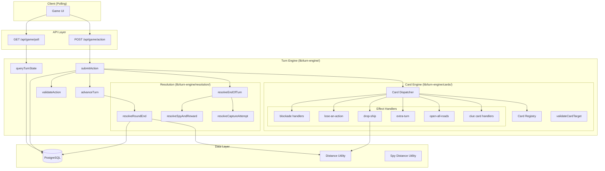
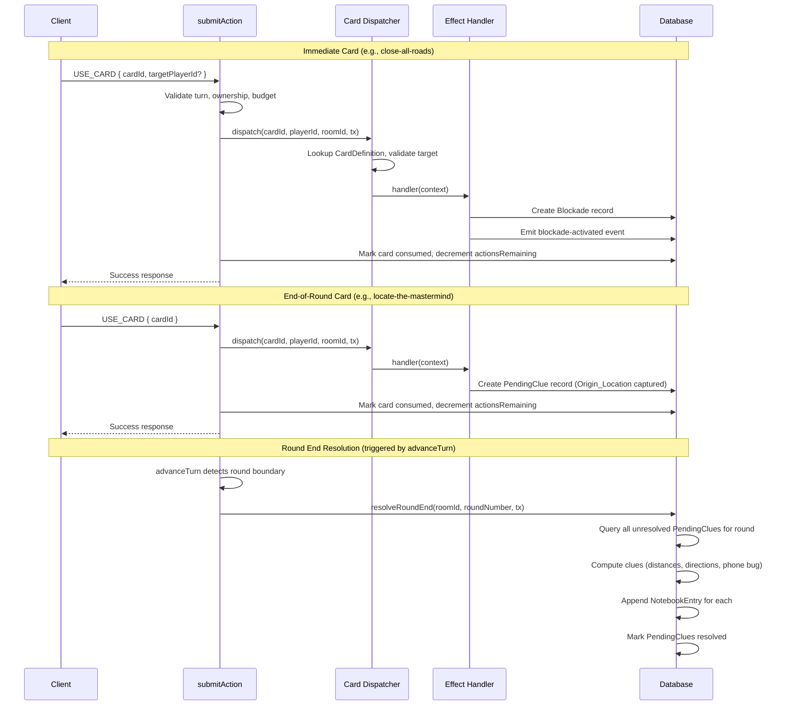

# Design Document: Action Cards

## Overview

The Action Cards system implements the MVP card subsystem for Shadow Hunt, replacing the existing `dispatchCardEffect` stub with a full Card Registry, per-turn action budget, global transport blockades, extra-turn mechanics, and a Round End Resolution phase for deferred clue delivery.

The system introduces 10 cards across three categories (Sabotage, Clue, Booster), each resolved through a declarative Card Registry that maps Card Identifiers to effect handlers. Three structural changes extend the turn engine: (1) a variable Action Budget replacing the hardcoded two-slot system, (2) an Extra Turn mechanism for granting consecutive turns, and (3) a Round End Resolver for deferred clue computation.

**Key design goals:**
- Server authority over all card outcomes, randomness, and hidden state
- Atomicity of card effects within existing Serializable transactions
- Extensibility through declarative Card Registry (add a card without touching submission flow)
- Separation of concerns: blockade evaluation lives in the Move Validator, card effects in handlers, clue resolution in the Round End Resolver

## Architecture



### Module Boundaries

| Module | Responsibility |
|--------|---------------|
| `lib/turn-engine/cards/registry.ts` | Static Card Registry (Map<CardIdentifier, CardDefinition>) |
| `lib/turn-engine/cards/dispatcher.ts` | Card dispatch: target validation + effect handler invocation |
| `lib/turn-engine/cards/effects/` | Individual card effect handlers (one file per card or group) |
| `lib/turn-engine/cards/types.ts` | Card system type definitions |
| `lib/turn-engine/resolution/resolve-round-end.ts` | Round End Resolver for deferred clues |
| `lib/turn-engine/validate-action.ts` | Extended Move Validator with blockade checks |
| `lib/turn-engine/submit-action.ts` | Extended submission flow with action budget |
| `lib/turn-engine/advance-turn.ts` | Extended turn advancement with extra turns + round-end hook |
| `lib/turn-engine/resolution/resolve-spy-reward.ts` | Updated reward granting (no hand cap, new Card Pool) |
| `lib/turn-engine/query-turn-state.ts` | Extended polling with blockades, budget, notebook types |

### Data Flow: Immediate vs End-of-Round Cards



## Components and Interfaces

### Card Registry

```typescript
// lib/turn-engine/cards/types.ts

export type CardIdentifier =
  | "close-all-roads"
  | "close-all-airways"
  | "close-all-sea-routes"
  | "lose-an-action"
  | "locate-the-mastermind"
  | "bug-a-phone"
  | "reveal-direction"
  | "drop-ship"
  | "extra-turn"
  | "open-all-roads";

export type CardCategory = "sabotage" | "clue" | "booster";
export type TargetRequirement = "none" | "player";
export type ResolutionTiming = "immediate" | "end-of-round";

export interface CardDefinition {
  identifier: CardIdentifier;
  category: CardCategory;
  targetRequirement: TargetRequirement;
  resolutionTiming: ResolutionTiming;
  handler: (ctx: CardEffectContext) => Promise<void>;
}

export interface CardEffectContext {
  roomId: string;
  playerId: string;
  targetPlayerId?: string;
  playerLocationId: string;
  currentRound: number;
  casterTurnPosition: number;
  tx: TransactionClient;
  rng: () => number; // Injectable random source for testability
}

export const CARD_POOL: CardIdentifier[] = [
  "close-all-roads",
  "close-all-airways",
  "close-all-sea-routes",
  "lose-an-action",
  "locate-the-mastermind",
  "bug-a-phone",
  "reveal-direction",
  "drop-ship",
  "extra-turn",
  "open-all-roads",
];

export const LEGACY_CARD_TYPES = ["locator", "extra-move", "reveal-region", "peek-clue"];
```

```typescript
// lib/turn-engine/cards/registry.ts

import { CardDefinition, CardIdentifier } from "./types";
import { handleCloseAllRoads } from "./effects/blockade";
import { handleCloseAllAirways } from "./effects/blockade";
import { handleCloseAllSeaRoutes } from "./effects/blockade";
import { handleLoseAnAction } from "./effects/lose-an-action";
import { handleLocateTheMastermind } from "./effects/clue-cards";
import { handleBugAPhone } from "./effects/clue-cards";
import { handleRevealDirection } from "./effects/clue-cards";
import { handleDropShip } from "./effects/drop-ship";
import { handleExtraTurn } from "./effects/extra-turn";
import { handleOpenAllRoads } from "./effects/open-all-roads";

export const CARD_REGISTRY: ReadonlyMap<CardIdentifier, CardDefinition> = new Map([
  ["close-all-roads", {
    identifier: "close-all-roads",
    category: "sabotage",
    targetRequirement: "none",
    resolutionTiming: "immediate",
    handler: handleCloseAllRoads,
  }],
  ["close-all-airways", {
    identifier: "close-all-airways",
    category: "sabotage",
    targetRequirement: "none",
    resolutionTiming: "immediate",
    handler: handleCloseAllAirways,
  }],
  ["close-all-sea-routes", {
    identifier: "close-all-sea-routes",
    category: "sabotage",
    targetRequirement: "none",
    resolutionTiming: "immediate",
    handler: handleCloseAllSeaRoutes,
  }],
  ["lose-an-action", {
    identifier: "lose-an-action",
    category: "sabotage",
    targetRequirement: "player",
    resolutionTiming: "immediate",
    handler: handleLoseAnAction,
  }],
  ["locate-the-mastermind", {
    identifier: "locate-the-mastermind",
    category: "clue",
    targetRequirement: "none",
    resolutionTiming: "end-of-round",
    handler: handleLocateTheMastermind,
  }],
  ["bug-a-phone", {
    identifier: "bug-a-phone",
    category: "clue",
    targetRequirement: "none",
    resolutionTiming: "end-of-round",
    handler: handleBugAPhone,
  }],
  ["reveal-direction", {
    identifier: "reveal-direction",
    category: "clue",
    targetRequirement: "none",
    resolutionTiming: "end-of-round",
    handler: handleRevealDirection,
  }],
  ["drop-ship", {
    identifier: "drop-ship",
    category: "booster",
    targetRequirement: "none",
    resolutionTiming: "immediate",
    handler: handleDropShip,
  }],
  ["extra-turn", {
    identifier: "extra-turn",
    category: "booster",
    targetRequirement: "none",
    resolutionTiming: "immediate",
    handler: handleExtraTurn,
  }],
  ["open-all-roads", {
    identifier: "open-all-roads",
    category: "booster",
    targetRequirement: "none",
    resolutionTiming: "immediate",
    handler: handleOpenAllRoads,
  }],
]);
```

### Card Dispatcher

```typescript
// lib/turn-engine/cards/dispatcher.ts

import { CARD_REGISTRY } from "./registry";
import { CardEffectContext, CardIdentifier, LEGACY_CARD_TYPES } from "./types";
import { TransactionClient } from "@/lib/turn-engine/types";

export interface DispatchResult {
  success: true;
}

export interface DispatchError {
  success: false;
  code: "UNKNOWN_CARD_TYPE" | "INVALID_CARD_TARGET";
  message: string;
}

/**
 * Validates the card target and dispatches to the appropriate effect handler.
 * Called AFTER card ownership and consumption validation in submitAction.
 * Card is marked consumed and actionsRemaining decremented by the caller.
 */
export async function dispatchCard(
  cardType: string,
  playerId: string,
  roomId: string,
  targetPlayerId: string | undefined,
  playerLocationId: string,
  currentRound: number,
  casterTurnPosition: number,
  tx: TransactionClient,
  rng: () => number = Math.random
): Promise<DispatchResult | DispatchError> {
  // Reject legacy or unknown card types
  const definition = CARD_REGISTRY.get(cardType as CardIdentifier);
  if (!definition) {
    return {
      success: false,
      code: "UNKNOWN_CARD_TYPE",
      message: `Unknown card type: ${cardType}`,
    };
  }

  // Target validation
  if (definition.targetRequirement === "player") {
    if (!targetPlayerId) {
      return {
        success: false,
        code: "INVALID_CARD_TARGET",
        message: "This card requires a target player",
      };
    }
    if (targetPlayerId === playerId) {
      return {
        success: false,
        code: "INVALID_CARD_TARGET",
        message: "Cannot target yourself",
      };
    }
    // Verify target is a room member
    const targetMembership = await tx.roomPlayer.findUnique({
      where: { playerId_roomId: { playerId: targetPlayerId, roomId } },
    });
    if (!targetMembership) {
      return {
        success: false,
        code: "INVALID_CARD_TARGET",
        message: "Target player is not in this room",
      };
    }
  } else {
    // Target_Requirement = "none" — reject if target supplied
    if (targetPlayerId) {
      return {
        success: false,
        code: "INVALID_CARD_TARGET",
        message: "This card does not accept a target player",
      };
    }
  }

  // Build context and invoke handler
  const ctx: CardEffectContext = {
    roomId,
    playerId,
    targetPlayerId,
    playerLocationId,
    currentRound,
    casterTurnPosition,
    tx,
    rng,
  };

  await definition.handler(ctx);
  return { success: true };
}
```

### Effect Handlers

#### Blockade Cards (close-all-roads, close-all-airways, close-all-sea-routes)

```typescript
// lib/turn-engine/cards/effects/blockade.ts

import { CardEffectContext } from "../types";
import { emitEvent } from "@/lib/turn-engine/event-feed";

export async function handleCloseAllRoads(ctx: CardEffectContext): Promise<void> {
  await createBlockade(ctx, "car");
}

export async function handleCloseAllAirways(ctx: CardEffectContext): Promise<void> {
  await createBlockade(ctx, "plane");
}

export async function handleCloseAllSeaRoutes(ctx: CardEffectContext): Promise<void> {
  await createBlockade(ctx, "boat");
}

async function createBlockade(
  ctx: CardEffectContext,
  transportType: "car" | "plane" | "boat"
): Promise<void> {
  await ctx.tx.blockade.create({
    data: {
      roomId: ctx.roomId,
      transportType,
      casterPlayerId: ctx.playerId,
      creationRound: ctx.currentRound,
      casterTurnPosition: ctx.casterTurnPosition,
      lifted: false,
    },
  });

  await emitEvent(
    ctx.roomId,
    "blockade-activated",
    {
      playerId: ctx.playerId,
      transportType,
      roundNumber: ctx.currentRound,
    },
    ctx.currentRound,
    ctx.tx
  );
}
```

#### Lose an Action

```typescript
// lib/turn-engine/cards/effects/lose-an-action.ts

import { CardEffectContext } from "../types";
import { emitEvent } from "@/lib/turn-engine/event-feed";

export async function handleLoseAnAction(ctx: CardEffectContext): Promise<void> {
  const targetPlayerId = ctx.targetPlayerId!;

  // Set action penalty flag on target (boolean — no stacking)
  await ctx.tx.playerPosition.update({
    where: { roomId_playerId: { roomId: ctx.roomId, playerId: targetPlayerId } },
    data: { actionPenaltyFlag: true },
  });

  await emitEvent(
    ctx.roomId,
    "action-penalty-applied",
    {
      playerId: ctx.playerId,
      targetPlayerId,
    },
    ctx.currentRound,
    ctx.tx
  );
}
```

#### Drop Ship

```typescript
// lib/turn-engine/cards/effects/drop-ship.ts

import { CardEffectContext } from "../types";
import { getShortestPathDistance } from "@/lib/map/distance";
import { emitEvent } from "@/lib/turn-engine/event-feed";

export async function handleDropShip(ctx: CardEffectContext): Promise<void> {
  const originLocationId = ctx.playerLocationId;

  // Load all locations with their regions
  const allLocations = await ctx.tx.location.findMany({
    select: { id: true, regionId: true },
  });

  // Get origin's region
  const originLocation = allLocations.find((l) => l.id === originLocationId);
  if (!originLocation) throw new Error(`Origin location not found: ${originLocationId}`);

  const originRegionId = originLocation.regionId;

  // Compute distances from origin to all locations in different regions
  const candidates: { id: string; distance: number }[] = [];
  for (const loc of allLocations) {
    if (loc.regionId === originRegionId) continue;
    const dist = await getShortestPathDistance(originLocationId, loc.id);
    candidates.push({ id: loc.id, distance: dist });
  }

  // Primary set: distance >= 4 AND different region
  let eligibleSet = candidates.filter((c) => c.distance >= 4);

  // Fallback: if primary set empty, take locations with max distance in different region
  if (eligibleSet.length === 0) {
    const maxDistance = Math.max(...candidates.map((c) => c.distance));
    eligibleSet = candidates.filter((c) => c.distance === maxDistance);
  }

  // Select uniformly at random from eligible set
  const selectedIndex = Math.floor(ctx.rng() * eligibleSet.length);
  const destinationId = eligibleSet[selectedIndex].id;

  // Update player position
  await ctx.tx.playerPosition.update({
    where: { roomId_playerId: { roomId: ctx.roomId, playerId: ctx.playerId } },
    data: { locationId: destinationId },
  });

  await emitEvent(
    ctx.roomId,
    "player-relocated",
    {
      playerId: ctx.playerId,
      fromLocationId: originLocationId,
      toLocationId: destinationId,
      cause: "drop-ship",
    },
    ctx.currentRound,
    ctx.tx
  );
}
```

#### Extra Turn

```typescript
// lib/turn-engine/cards/effects/extra-turn.ts

import { CardEffectContext } from "../types";

export async function handleExtraTurn(ctx: CardEffectContext): Promise<void> {
  // Increment Pending_Extra_Turns counter for the playing player
  await ctx.tx.playerPosition.update({
    where: { roomId_playerId: { roomId: ctx.roomId, playerId: ctx.playerId } },
    data: {
      pendingExtraTurns: { increment: 1 },
    },
  });
}
```

#### Open All Roads

```typescript
// lib/turn-engine/cards/effects/open-all-roads.ts

import { CardEffectContext } from "../types";
import { emitEvent } from "@/lib/turn-engine/event-feed";

export async function handleOpenAllRoads(ctx: CardEffectContext): Promise<void> {
  // Lift ALL active blockades in the room (car, plane, boat — all casters)
  const activeBlockades = await getActiveBlockades(
    ctx.roomId,
    ctx.currentRound,
    ctx.casterTurnPosition,
    ctx.tx
  );

  const liftedCount = activeBlockades.length;

  if (liftedCount > 0) {
    // Mark all active blockades as lifted
    await ctx.tx.blockade.updateMany({
      where: {
        id: { in: activeBlockades.map((b) => b.id) },
      },
      data: { lifted: true },
    });
  }

  await emitEvent(
    ctx.roomId,
    "blockade-lifted",
    {
      playerId: ctx.playerId,
      liftedCount,
    },
    ctx.currentRound,
    ctx.tx
  );
}

/**
 * Returns all Active_Blockades for a room at the given turn ordinal.
 * A blockade is active if:
 * - It is not lifted
 * - The current Turn_Ordinal is inside the Blockade_Window
 *   (strictly after creation turn AND strictly before caster's next normal turn)
 */
export async function getActiveBlockades(
  roomId: string,
  currentRound: number,
  currentTurnPosition: number,
  tx: TransactionClient
): Promise<Array<{ id: string; transportType: string; casterPlayerId: string }>> {
  const blockades = await tx.blockade.findMany({
    where: { roomId, lifted: false },
  });

  return blockades.filter((b) => {
    return isWithinBlockadeWindow(
      b.creationRound,
      b.casterTurnPosition,
      currentRound,
      currentTurnPosition
    );
  });
}

/**
 * Determines if a turn (currentRound, currentTurnPosition) falls within
 * a Blockade's window.
 *
 * Blockade_Window: Turn_Ordinal strictly greater than (creationRound, casterTurnPos)
 * AND strictly less than (creationRound + 1, casterTurnPos).
 *
 * This means every player between the caster (exclusive) and the caster's
 * next appearance (exclusive) is affected — exactly one turn per other player.
 */
export function isWithinBlockadeWindow(
  creationRound: number,
  casterTurnPosition: number,
  currentRound: number,
  currentTurnPosition: number
): boolean {
  // Turn_Ordinal comparison is lexicographic on (round, turnPosition)
  const creationOrdinal = [creationRound, casterTurnPosition];
  const expiryOrdinal = [creationRound + 1, casterTurnPosition];
  const currentOrdinal = [currentRound, currentTurnPosition];

  // current > creation AND current < expiry
  const afterCreation = compareTurnOrdinal(currentOrdinal, creationOrdinal) > 0;
  const beforeExpiry = compareTurnOrdinal(currentOrdinal, expiryOrdinal) < 0;

  return afterCreation && beforeExpiry;
}

function compareTurnOrdinal(a: number[], b: number[]): number {
  if (a[0] !== b[0]) return a[0] - b[0];
  return a[1] - b[1];
}
```

#### Clue Cards (end-of-round: create PendingClue only)

```typescript
// lib/turn-engine/cards/effects/clue-cards.ts

import { CardEffectContext } from "../types";

/**
 * All three clue cards (locate-the-mastermind, bug-a-phone, reveal-direction)
 * create a PendingClue record at play time. Resolution happens at Round End.
 */
export async function handleLocateTheMastermind(ctx: CardEffectContext): Promise<void> {
  await createPendingClue(ctx, "locate-the-mastermind");
}

export async function handleBugAPhone(ctx: CardEffectContext): Promise<void> {
  await createPendingClue(ctx, "bug-a-phone");
}

export async function handleRevealDirection(ctx: CardEffectContext): Promise<void> {
  await createPendingClue(ctx, "reveal-direction");
}

async function createPendingClue(
  ctx: CardEffectContext,
  cardIdentifier: string
): Promise<void> {
  await ctx.tx.pendingClue.create({
    data: {
      roomId: ctx.roomId,
      playerId: ctx.playerId,
      cardIdentifier,
      roundNumber: ctx.currentRound,
      originLocationId: ctx.playerLocationId,
      resolved: false,
    },
  });
}
```

### Updated validateAction

```typescript
// Updated signature for validateAction

export interface BlockadeState {
  blockedTransports: Set<TransportType>; // Transports blocked for this specific player
}

export function validateAction(
  action: ActionPayload,
  turnState: TurnState,
  playerId: string,
  playerPosition: string,
  adjacentLocations: AdjacentLocationWithTransport[],
  playerCards: ActionCardData[],
  blockadeState: BlockadeState,   // NEW: active blockades affecting this player
  actionsRemaining: number        // NEW: current action budget remaining
): TurnActionError | null {
  // Check it's the player's turn
  if (turnState.currentPlayerId !== playerId) {
    return { success: false, error: "It is not your turn", code: "NOT_YOUR_TURN" };
  }

  // Check actions remaining
  if (actionsRemaining <= 0) {
    return { success: false, error: "No actions remaining", code: "NO_ACTIONS_REMAINING" };
  }

  switch (action.actionType) {
    case "MOVE":
      return validateMove(action.targetLocationId, playerPosition, adjacentLocations, blockadeState);
    case "SKIP":
      return null;
    case "CAPTURE_ATTEMPT":
      return validateCaptureAttempt(turnState);
    case "USE_CARD":
      return validateUseCard(action.cardId, playerCards);
    default:
      return { success: false, error: "Unknown action type", code: "UNKNOWN_ACTION_TYPE" };
  }
}

function validateMove(
  targetLocationId: string,
  playerPosition: string,
  adjacentLocations: AdjacentLocationWithTransport[],
  blockadeState: BlockadeState
): TurnActionError | null {
  // 1. Adjacency check
  const edge = adjacentLocations.find((loc) => loc.id === targetLocationId);
  if (!edge) {
    return { success: false, error: "Target location is not adjacent", code: "INVALID_MOVE" };
  }

  // 2. Blockade check (NEW — before other transport rules)
  if (blockadeState.blockedTransports.has(edge.transport)) {
    const errorMap: Record<TransportType, { code: TurnActionErrorCode; msg: string }> = {
      car: { code: "ROADS_BLOCKED", msg: "Roads are currently blocked" },
      plane: { code: "AIRWAYS_BLOCKED", msg: "Airways are currently blocked" },
      boat: { code: "SEA_ROUTES_BLOCKED", msg: "Sea routes are currently blocked" },
    };
    const err = errorMap[edge.transport];
    return { success: false, error: err.msg, code: err.code };
  }

  // 3. Same-location rejection
  if (targetLocationId === playerPosition) {
    return { success: false, error: "Cannot move to same location", code: "SAME_LOCATION_MOVE" };
  }

  // 4. Plane hub rule
  if (edge.transport === "plane" && !edge.isHub) {
    return { success: false, error: "Plane requires hub locations", code: "INVALID_TRANSPORT" };
  }

  return null;
}
```

### Updated submitAction Flow

```typescript
// Pseudocode for the updated submitAction orchestration

async function submitAction(roomId, playerId, action) {
  return prisma.$transaction(async (tx) => {
    // 1. Lock turn state (SELECT FOR UPDATE)
    const turnState = await lockTurnState(roomId, tx);

    // 2. Validate room is in-progress
    // 3. Check player membership

    // 4. Load action budget state
    const actionsRemaining = turnState.actionsRemaining;
    const actionBudget = turnState.actionBudget;

    // 5. Compute blockade state for this player
    const activeBlockades = await getActiveBlockades(roomId, currentRound, currentTurnPos, tx);
    const blockedTransports = computeBlockedTransports(activeBlockades, playerId);

    // 6. Get player position and adjacencies
    const position = await getPlayerPosition(roomId, playerId, tx);
    const adjacent = await getAdjacentLocations(position);

    // 7. Get player cards
    const playerCards = await getPlayerCards(roomId, playerId, tx);

    // 8. Validate the action (now includes blockade + budget checks)
    const validationError = validateAction(
      action, turnState, playerId, position, adjacent, playerCards,
      { blockedTransports }, actionsRemaining
    );
    if (validationError) return validationError;

    // 9. Execute the action
    if (action.actionType === "USE_CARD") {
      // Look up card type
      const card = playerCards.find(c => c.id === action.cardId);

      // Dispatch through Card Registry (validates target, invokes handler)
      const dispatchResult = await dispatchCard(
        card.type, playerId, roomId, action.targetPlayerId,
        position, currentRound, currentTurnPos, tx
      );
      if (!dispatchResult.success) return asError(dispatchResult);

      // Mark card consumed
      await tx.actionCard.update({ where: { id: action.cardId }, data: { consumed: true } });
    } else {
      // Execute MOVE / SKIP / CAPTURE_ATTEMPT as before
      await executeAction(action, playerId, roomId, tx);
    }

    // 10. Decrement actionsRemaining
    const newActionsRemaining = actionsRemaining - 1;
    await tx.gameTurn.update({
      where: { id: turnState.id },
      data: {
        actionsRemaining: newActionsRemaining,
        captureAttemptFlag: action.actionType === "CAPTURE_ATTEMPT"
          ? true : turnState.captureAttemptFlag,
      },
    });

    // 11. Emit public event
    await emitActionEvent(action, playerId, roomId, currentRound, tx);

    // 12. If actions exhausted → end-of-turn resolution + advance
    if (newActionsRemaining === 0) {
      const resolution = await resolveEndOfTurn(roomId, playerId, turnState, tx);

      if (!resolution.captureAttempt || resolution.captureAttempt.result !== "success") {
        const advanceResult = await advanceTurn(roomId, turnState, tx);
        // ... handle draw detection
      }

      return successResult(action, resolution);
    }

    // 13. Actions still remaining — return intermediate success
    return successResult(action, undefined, newActionsRemaining);
  }, { isolationLevel: "Serializable" });
}
```

### Updated advanceTurn (Extra Turns + Round End Resolution)

```typescript
// Pseudocode for the updated advanceTurn

async function advanceTurn(roomId, turnState, tx) {
  // Check if current player has Pending_Extra_Turns > 0
  const playerPos = await getPlayerPositionRecord(roomId, turnState.currentPlayerId, tx);

  if (playerPos.pendingExtraTurns > 0) {
    // Decrement pending extra turns
    await tx.playerPosition.update({
      where: { roomId_playerId: { roomId, playerId: turnState.currentPlayerId } },
      data: { pendingExtraTurns: { decrement: 1 } },
    });

    // Compute action budget for the extra turn (penalty may apply)
    const actionBudget = playerPos.actionPenaltyFlag ? 1 : 2;
    if (playerPos.actionPenaltyFlag) {
      await tx.playerPosition.update({
        where: { roomId_playerId: { roomId, playerId: turnState.currentPlayerId } },
        data: { actionPenaltyFlag: false },
      });
    }

    // Grant extra turn to same player (same round, fresh actions)
    await tx.gameTurn.update({
      where: { id: turnState.id },
      data: {
        actionsRemaining: actionBudget,
        actionBudget,
        captureAttemptFlag: false,
        isExtraTurn: true,
      },
    });

    await emitEvent(roomId, "extra-turn-started", {
      playerId: turnState.currentPlayerId,
      roundNumber: turnState.currentRound,
    }, turnState.currentRound, tx);

    return { drawDetected: false };
  }

  // Normal turn advancement (existing round-robin logic)
  const players = await tx.roomPlayer.findMany({ where: { roomId }, orderBy: { turnPosition: "asc" } });
  const currentIdx = players.findIndex(p => p.playerId === turnState.currentPlayerId);
  let nextIdx = (currentIdx + 1) % players.length;
  let newRound = turnState.currentRound;

  if (nextIdx === 0) {
    // Round boundary — run Round End Resolution BEFORE incrementing
    await resolveRoundEnd(roomId, turnState.currentRound, tx);
    newRound += 1;
  }

  // Handle skip flags (same as existing logic)
  // ... skip logic with turn-skipped events ...
  // If skip wraps around, run Round End Resolution for the crossed round

  // Check for skip consuming extra turns (Req 10.9)
  const nextPlayer = players[nextIdx];
  const nextPlayerPos = await getPlayerPositionRecord(roomId, nextPlayer.playerId, tx);

  if (nextPlayerPos.skipNextTurn && nextPlayerPos.pendingExtraTurns > 0) {
    // Skip consumes an extra turn
    await tx.playerPosition.update({
      where: { roomId_playerId: { roomId, playerId: nextPlayer.playerId } },
      data: {
        skipNextTurn: false,
        pendingExtraTurns: { decrement: 1 },
      },
    });
    await emitEvent(roomId, "turn-skipped", { playerId: nextPlayer.playerId }, newRound, tx);
    // Continue to next player...
  }

  // Draw detection (existing logic)
  if (newRound > room.maxRoundLimit) {
    // ... draw handling ...
  }

  // Compute action budget for new player's turn
  const newPlayerPos = await getPlayerPositionRecord(roomId, nextPlayer.playerId, tx);
  const actionBudget = newPlayerPos.actionPenaltyFlag ? 1 : 2;
  if (newPlayerPos.actionPenaltyFlag) {
    await tx.playerPosition.update({
      where: { roomId_playerId: { roomId, playerId: nextPlayer.playerId } },
      data: { actionPenaltyFlag: false },
    });
  }

  // Update turn state
  await tx.gameTurn.update({
    where: { id: turnState.id },
    data: {
      currentPlayerId: nextPlayer.playerId,
      currentRound: newRound,
      actionsRemaining: actionBudget,
      actionBudget,
      captureAttemptFlag: false,
      isExtraTurn: false,
    },
  });

  return { drawDetected: false };
}
```

### Round End Resolver

```typescript
// lib/turn-engine/resolution/resolve-round-end.ts

import { TransactionClient } from "@/lib/turn-engine/types";
import { getShortestPathDistance } from "@/lib/map/distance";

/**
 * Resolves all Pending_Clue records for the given round.
 * Called by advanceTurn when crossing a round boundary.
 *
 * For each unresolved PendingClue:
 * - locate-the-mastermind → compute distance, append mastermind_distance notebook entry
 * - bug-a-phone → select random target, compute distance + spy status, append phone_bug entry
 * - reveal-direction → compute adjacent city toward mastermind, append mastermind_direction entry
 *
 * All clue computations use the persisted Origin_Location (not current player position).
 * Resolution order does not affect output (confluence property — random draws held fixed).
 */
export async function resolveRoundEnd(
  roomId: string,
  roundNumber: number,
  tx: TransactionClient,
  rng: () => number = Math.random
): Promise<void> {
  // Check if room has been won (game over)
  const room = await tx.room.findUnique({ where: { id: roomId }, select: { status: true } });
  if (room?.status === "finished") {
    // Discard all pending clues without creating entries (Req 14.6)
    await tx.pendingClue.updateMany({
      where: { roomId, roundNumber, resolved: false },
      data: { resolved: true },
    });
    return;
  }

  // Load all unresolved clues for this round
  const pendingClues = await tx.pendingClue.findMany({
    where: { roomId, roundNumber, resolved: false },
  });

  // Load mastermind location
  const gameThreat = await tx.gameThreat.findUnique({ where: { roomId } });
  if (!gameThreat) return;
  const mastermindLocationId = gameThreat.locationId;

  for (const clue of pendingClues) {
    switch (clue.cardIdentifier) {
      case "locate-the-mastermind":
        await resolveLocateTheMastermind(clue, mastermindLocationId, roomId, tx);
        break;
      case "bug-a-phone":
        await resolveBugAPhone(clue, mastermindLocationId, roomId, tx, rng);
        break;
      case "reveal-direction":
        await resolveRevealDirection(clue, mastermindLocationId, roomId, tx, rng);
        break;
    }

    // Mark clue resolved
    await tx.pendingClue.update({
      where: { id: clue.id },
      data: { resolved: true },
    });
  }
}

async function resolveLocateTheMastermind(
  clue: PendingClueRecord,
  mastermindLocationId: string,
  roomId: string,
  tx: TransactionClient
): Promise<void> {
  const stepsAway = await getShortestPathDistance(clue.originLocationId, mastermindLocationId);

  await tx.notebookEntry.create({
    data: {
      roomId,
      playerId: clue.playerId,
      entryType: "mastermind_distance",
      roundNumber: clue.roundNumber,
      payload: {
        type: "mastermind_distance",
        locationId: clue.originLocationId,
        roundNumber: clue.roundNumber,
        stepsAway,
      },
    },
  });
}

async function resolveBugAPhone(
  clue: PendingClueRecord,
  mastermindLocationId: string,
  roomId: string,
  tx: TransactionClient,
  rng: () => number
): Promise<void> {
  // Select target: prefer connected players, fallback to all others
  const allPlayers = await tx.roomPlayer.findMany({ where: { roomId } });
  const otherPlayers = allPlayers.filter((p) => p.playerId !== clue.playerId);

  let targetPool = otherPlayers.filter((p) => p.status === "connected");
  if (targetPool.length === 0) {
    targetPool = otherPlayers;
  }

  const targetIndex = Math.floor(rng() * targetPool.length);
  const targetPlayer = targetPool[targetIndex];

  // Get target's current position and region
  const targetPos = await tx.playerPosition.findUnique({
    where: { roomId_playerId: { roomId, playerId: targetPlayer.playerId } },
  });
  const targetLocation = await tx.location.findUnique({
    where: { id: targetPos!.locationId },
    select: { id: true, regionId: true },
  });

  // Compute mastermind distance from target's location
  const mastermindStepsAway = await getShortestPathDistance(
    targetPos!.locationId,
    mastermindLocationId
  );

  // Spy status in target's region
  const spy = await tx.gameSpy.findFirst({
    where: { roomId, regionId: targetLocation!.regionId },
  });

  const spyRegionId = spy ? targetLocation!.regionId : null;
  const spyCaptured = spy ? spy.captured : false;

  await tx.notebookEntry.create({
    data: {
      roomId,
      playerId: clue.playerId,
      entryType: "phone_bug",
      roundNumber: clue.roundNumber,
      payload: {
        type: "phone_bug",
        roundNumber: clue.roundNumber,
        targetPlayerId: targetPlayer.playerId,
        targetLocationId: targetPos!.locationId,
        mastermindStepsAway,
        spyRegionId,
        spyCaptured,
      },
    },
  });
}

async function resolveRevealDirection(
  clue: PendingClueRecord,
  mastermindLocationId: string,
  roomId: string,
  tx: TransactionClient,
  rng: () => number
): Promise<void> {
  const referenceDistance = await getShortestPathDistance(
    clue.originLocationId,
    mastermindLocationId
  );

  let revealedLocationId: string;

  if (referenceDistance === 0) {
    // Player is at mastermind's location — reveal their own location
    revealedLocationId = clue.originLocationId;
  } else {
    // Find adjacent locations that are one step closer to the mastermind
    const adjacencies = await tx.adjacency.findMany({
      where: {
        OR: [
          { locationAId: clue.originLocationId },
          { locationBId: clue.originLocationId },
        ],
      },
    });

    const neighborIds = adjacencies.map((a) =>
      a.locationAId === clue.originLocationId ? a.locationBId : a.locationAId
    );

    const candidates: string[] = [];
    for (const neighborId of neighborIds) {
      const dist = await getShortestPathDistance(neighborId, mastermindLocationId);
      if (dist === referenceDistance - 1) {
        candidates.push(neighborId);
      }
    }

    // Select uniformly at random from candidates
    const selectedIndex = Math.floor(rng() * candidates.length);
    revealedLocationId = candidates[selectedIndex];
  }

  await tx.notebookEntry.create({
    data: {
      roomId,
      playerId: clue.playerId,
      entryType: "mastermind_direction",
      roundNumber: clue.roundNumber,
      payload: {
        type: "mastermind_direction",
        locationId: revealedLocationId,
        roundNumber: clue.roundNumber,
      },
    },
  });
}
```

### Updated grantRewardCards

```typescript
// Updated reward granting in resolve-spy-reward.ts

import { CARD_POOL, CardIdentifier } from "@/lib/turn-engine/cards/types";

/**
 * Grants reward cards to a player.
 * - No hand cap (Req 17)
 * - Guaranteed one locate-the-mastermind card (Req 16.3)
 * - Remaining drawn from Card_Pool uniformly (Req 16.4)
 * - Duplicates allowed within a single reward
 */
async function grantRewardCards(
  playerId: string,
  roomId: string,
  rewardTier: number,
  tx: TransactionClient,
  rng: () => number = Math.random
): Promise<void> {
  const cards: CardIdentifier[] = [];

  // Guaranteed locate-the-mastermind (even for single-card rewards)
  cards.push("locate-the-mastermind");

  // Fill remaining slots from the full Card_Pool
  for (let i = 1; i < rewardTier; i++) {
    const index = Math.floor(rng() * CARD_POOL.length);
    cards.push(CARD_POOL[index]);
  }

  // Persist all cards (no hand cap check)
  for (const cardType of cards) {
    await tx.actionCard.create({
      data: { roomId, playerId, type: cardType, consumed: false },
    });
  }
}
```

### Updated GamePollState Types

```typescript
// Extended types for polling response

export type NotebookEntryType =
  | "spy-proximity"
  | "mastermind_distance"
  | "mastermind_direction"
  | "phone_bug";

export interface SpyProximityEntry {
  entryType: "spy-proximity";
  regionId: string;
  roundNumber: number;
  stepsAway: number;
}

export interface MastermindDistanceEntry {
  entryType: "mastermind_distance";
  locationId: string;
  roundNumber: number;
  stepsAway: number;
}

export interface MastermindDirectionEntry {
  entryType: "mastermind_direction";
  locationId: string;
  roundNumber: number;
}

export interface PhoneBugEntry {
  entryType: "phone_bug";
  roundNumber: number;
  targetPlayerId: string;
  targetLocationId: string;
  mastermindStepsAway: number;
  spyRegionId: string | null;
  spyCaptured: boolean;
}

export type DiscriminatedNotebookEntry =
  | SpyProximityEntry
  | MastermindDistanceEntry
  | MastermindDirectionEntry
  | PhoneBugEntry;

export interface ActiveBlockadeData {
  transportType: TransportType;
  casterPlayerId: string;
  creationRound: number;
}

export interface PendingClueData {
  cardIdentifier: string;
  roundNumber: number;
}

export interface ActionCardPollData {
  id: string;
  cardIdentifier: CardIdentifier;
  category: CardCategory;
  targetRequirement: TargetRequirement;
}

export interface PlayerPrivateData {
  notebook: DiscriminatedNotebookEntry[];
  actionCards: ActionCardPollData[];
  pendingReward: PendingRewardData | null;
  skipNextTurn: boolean;
  actionPenaltyFlag: boolean;           // NEW
  pendingExtraTurns: number;            // NEW
  pendingClues: PendingClueData[];      // NEW
}

export interface GamePollState {
  roomId: string;
  status: "in-progress" | "finished";
  viewerPlayerId: string;
  currentPlayerId: string;
  currentRound: number;
  actionsRemaining: number;             // NEW (replaces currentSlot)
  actionBudget: number;                 // NEW
  players: PlayerPollData[];
  privateData: PlayerPrivateData;
  events: GameEventData[];
  activeBlockades: ActiveBlockadeData[]; // NEW
}

export type TurnActionErrorCode =
  | "NOT_IN_ROOM"
  | "GAME_NOT_ACTIVE"
  | "NOT_YOUR_TURN"
  | "NO_ACTIONS_REMAINING"          // NEW
  | "INVALID_MOVE"
  | "INVALID_TRANSPORT"
  | "SAME_LOCATION_MOVE"
  | "ROADS_BLOCKED"                 // NEW
  | "AIRWAYS_BLOCKED"               // NEW
  | "SEA_ROUTES_BLOCKED"            // NEW
  | "DUPLICATE_CAPTURE_ATTEMPT"
  | "INVALID_CARD"
  | "UNKNOWN_CARD_TYPE"             // NEW
  | "INVALID_CARD_TARGET"           // NEW
  | "CONCURRENCY_CONFLICT"
  | "UNKNOWN_ACTION_TYPE";

// Removed: "HAND_FULL", "INVALID_SLOT_ORDER"

export type GameEventType =
  | "game-won"
  | "game-draw"
  | "capture-failed"
  | "spy-captured-reward-collected"
  | "player-moved"
  | "card-used"
  | "player-skipped"
  | "turn-skipped"
  | "blockade-activated"            // NEW
  | "blockade-lifted"               // NEW
  | "action-penalty-applied"        // NEW
  | "player-relocated"              // NEW
  | "extra-turn-started";           // NEW
```

## Data Models

### New Prisma Models

```prisma
model Blockade {
  id                String @id @default(cuid())
  roomId            String
  transportType     String // "car" | "plane" | "boat"
  casterPlayerId    String
  creationRound     Int
  casterTurnPosition Int
  lifted            Boolean @default(false) // Set true by open-all-roads

  room Room @relation(fields: [roomId], references: [id], onDelete: Cascade)

  @@index([roomId, lifted])
  @@map("blockades")
}

model PendingClue {
  id               String  @id @default(cuid())
  roomId           String
  playerId         String
  cardIdentifier   String  // "locate-the-mastermind" | "bug-a-phone" | "reveal-direction"
  roundNumber      Int
  originLocationId String
  resolved         Boolean @default(false)
  createdAt        DateTime @default(now())

  room Room @relation(fields: [roomId], references: [id], onDelete: Cascade)

  @@index([roomId, roundNumber, resolved])
  @@map("pending_clues")
}
```

### Schema Extensions to Existing Models

```prisma
model GameTurn {
  id                 String  @id @default(cuid())
  roomId             String  @unique
  currentPlayerId    String
  currentRound       Int     @default(1)
  actionsRemaining   Int     @default(2)  // NEW: replaces currentSlot
  actionBudget       Int     @default(2)  // NEW: budget for this turn
  captureAttemptFlag Boolean @default(false)
  isExtraTurn        Boolean @default(false) // NEW: is this an extra turn?
  version            Int     @default(0)

  room Room @relation(fields: [roomId], references: [id], onDelete: Cascade)
  @@map("game_turns")
}

model PlayerPosition {
  id                        String  @id @default(cuid())
  roomId                    String
  playerId                  String
  locationId                String
  skipNextTurn              Boolean @default(false)
  actionPenaltyFlag         Boolean @default(false)  // NEW: lose-an-action penalty
  pendingExtraTurns         Int     @default(0)      // NEW: extra turns owed
  pendingRewardRegionId     String?
  pendingRewardCaptureOrder Int?

  room     Room     @relation(fields: [roomId], references: [id], onDelete: Cascade)
  location Location @relation(fields: [locationId], references: [id])

  @@unique([roomId, playerId])
  @@index([roomId])
  @@map("player_positions")
}
```

### Removed Fields / Concepts

| Removed | Reason |
|---------|--------|
| `GameTurn.currentSlot` | Replaced by `actionsRemaining` / `actionBudget` |
| `HAND_FULL` error code | No hand cap (Req 17) |
| `INVALID_SLOT_ORDER` error code | Slots no longer exist |
| Legacy card types in `grantRewardCards` | Replaced by Card_Pool |
| 5-card hand cap in reward flow | Removed per Req 17 |

### Migration Strategy

The `currentSlot` field is replaced by `actionsRemaining` and `actionBudget`. A migration script will:
1. Add `actionsRemaining` (default 2), `actionBudget` (default 2), `isExtraTurn` (default false) to `game_turns`
2. Add `actionPenaltyFlag` (default false), `pendingExtraTurns` (default 0) to `player_positions`
3. Create `blockades` and `pending_clues` tables
4. Drop `currentSlot` from `game_turns` (after all references updated)
5. Add `Blockade` and `PendingClue` relations to the `Room` model

Existing in-progress games (if any) will be migrated with `actionsRemaining = 2 - (currentSlot - 1)`.

## Correctness Properties

*A property is a characteristic or behavior that should hold true across all valid executions of a system — essentially, a formal statement about what the system should do. Properties serve as the bridge between human-readable specifications and machine-verifiable correctness guarantees.*

### Property 1: Caster Immunity Invariant

*For any* Blockade B and *for any* MOVE action by B's Blockade_Caster on B's Transport_Type during B's Blockade_Window, the MOVE SHALL be accepted (not rejected by that Blockade).

**Validates: Requirements 4.4, 6.3, 6.4, 6.5**

### Property 2: Blockade Window Totality

*For any* Blockade B and *for any* turn T by a non-caster player P, a MOVE on B's Transport_Type is rejected if and only if Turn_Ordinal(T) lies strictly inside Blockade_Window(B). Equivalently: every non-caster is affected for exactly one of their turns.

**Validates: Requirements 5.1, 5.3, 5.4, 5.7**

### Property 3: Open All Roads Universal Wipe

*For any* set of Active_Blockades (varying in count, transport type, and caster), playing `open-all-roads` results in an empty Active_Blockade set. Playing it a second time produces the same (empty) result — the operation is idempotent on the blockade state.

**Validates: Requirements 7.1, 7.2, 7.3, 7.6**

### Property 4: Map Immutability

*For any* sequence of card plays (blockade creation, blockade expiry, open-all-roads, drop-ship), the complete set of `Adjacency` rows and `Location`/`Region` rows is byte-identical before and after.

**Validates: Requirements 4.7, 5.6, 7.5**

### Property 5: Action Budget Bounds

*For any* turn, Actions_Remaining is always within [0, Default_Action_Budget] and Action_Budget is always within [Minimum_Action_Budget, Default_Action_Budget]. The number of accepted actions in a turn equals that turn's Action_Budget.

**Validates: Requirements 8.1, 8.2, 8.3, 8.4**

### Property 6: Penalty Non-Stacking Cap

*For any* k >= 1 `lose-an-action` cards resolved against the same target before that target's next turn, the target's Action_Budget on that next turn equals exactly Default_Action_Budget - 1 (i.e., 1). The penalty does not stack below Minimum_Action_Budget.

**Validates: Requirements 8.7, 8.8**

### Property 7: Extra Turn Round Invariance

*For any* sequence of turns containing k `extra-turn` card plays, the Round number after all turns complete equals the Round number of an equivalent sequence with zero `extra-turn` plays. Extra_Turns never increment the Round.

**Validates: Requirements 10.5**

### Property 8: Extra Turn Count and Order Restoration

*For any* k `extra-turn` plays by Player P in a single turn, P takes exactly k Extra_Turns before turn order advances. After all Extra_Turns complete, the next Player in turn order is the same Player who would hold the turn had no Extra_Turn been granted.

**Validates: Requirements 10.2, 10.6, 10.7**

### Property 9: Drop Ship Destination Validity

*For any* origin Location O, the selected destination D satisfies: Region(D) != Region(O), and either distance(O, D) >= 4, or (if no such location exists) distance(O, D) equals the maximum distance from O among all Locations outside Region(O). For all 40 origin Locations, `drop-ship` always produces a valid destination.

**Validates: Requirements 9.1, 9.2, 9.3**

### Property 10: Drop Ship Ignores Blockades

*For any* Active_Blockade state (including all three transport types blocked), playing `drop-ship` successfully relocates the player. Blockade evaluation applies only to MOVE actions.

**Validates: Requirements 6.8**

### Property 11: Mastermind Distance Correctness

*For any* `locate-the-mastermind` resolution, the resulting `stepsAway` value equals `getShortestPathDistance(entry.locationId, mastermindLocationId)` and lies within [0, 6].

**Validates: Requirements 11.2, 11.3, 11.6**

### Property 12: Origin Location Stability

*For any* `locate-the-mastermind` or `reveal-direction` play followed by any number of MOVE actions by the same Player in the same Round, the resulting Notebook entry's `locationId` equals the Player's Location at the moment the card was played.

**Validates: Requirements 3.4, 11.1, 13.1**

### Property 13: Direction Monotonicity

*For any* `reveal-direction` resolution where reference distance d > 0, the revealed Location is adjacent to the Origin_Location and satisfies `getShortestPathDistance(revealed, mastermind) == d - 1`. When d == 0, the revealed Location equals the Origin_Location.

**Validates: Requirements 13.3, 13.4**

### Property 14: Direction Totality

*For any* (Origin_Location, Mastermind Location) pair over the 40-Location map, `reveal-direction` produces exactly one valid revealed Location (the candidate set is never empty for d > 0 due to graph connectivity).

**Validates: Requirements 13.3, 13.6**

### Property 15: Bug a Phone Target Validity

*For any* `bug-a-phone` resolution, `targetPlayerId` differs from the playing Player's identifier and identifies a member of the same Room.

**Validates: Requirements 12.2, 12.3, 12.4**

### Property 16: Bug a Phone Distance Correctness

*For any* `bug-a-phone` resolution, `mastermindStepsAway` equals `getShortestPathDistance(targetLocationId, mastermindLocationId)`.

**Validates: Requirements 12.6**

### Property 17: Bug a Phone Spy Reporting

*For any* `bug-a-phone` resolution, `spyCaptured` is true if and only if the `GameSpy` record for the target's current Region exists and is captured. `spyRegionId` is non-null if and only if a `GameSpy` record exists for the target's Region.

**Validates: Requirements 12.7, 12.8, 12.9**

### Property 18: Round End Confluence

*For any* set of Pending_Clue records within one Round, the multiset of resulting Notebook entries is identical regardless of processing order (holding random draws fixed via injectable RNG).

**Validates: Requirements 14.7**

### Property 19: Notebook Write/Read Round Trip

*For any* generated Notebook entry of all four entry types, writing the entry and then reading it through `getPlayerNotebook` and through the polling response yields field values equal to those written.

**Validates: Requirements 15.4, 15.5, 15.6, 15.10**

### Property 20: Notebook Privacy

*For any* Player pairs (A, B) with A != B, no request by A returns any Notebook entry belonging to B, and any direct attempt to access B's notebook is rejected.

**Validates: Requirements 15.9, 19.6**

### Property 21: Spy Proximity Preservation

*For any* game sequence, `spy-proximity` entries produced with the card system enabled are identical to those produced by the existing Spy resolution path using the Spy_Distance_Utility.

**Validates: Requirements 15.2**

### Property 22: Reward Composition

*For any* Capture_Order value 1-6, the granted card count equals the tier (4, 3, 2, 1, 1, 1), exactly one granted card has Card_Identifier `locate-the-mastermind`, and every granted Card_Identifier belongs to the Card_Pool (no legacy types).

**Validates: Requirements 16.2, 16.3, 16.4, 1.9**

### Property 23: No Hand Cap

*For any* pre-existing hand size h >= 0, granting a reward of tier t results in hand size h + t. No truncation, rejection, or discard occurs regardless of hand size.

**Validates: Requirements 17.1, 17.2**

### Property 24: Mastermind Location Never Leaked

*For any* API response, Event_Feed entry, and Notebook entry produced while `Room.status` is `in-progress`, the serialized payload does not contain the Mastermind's Location identifier — except when that identifier is independently selected as a revealed direction Location (distance == 0 case).

**Validates: Requirements 11.5, 18.4, 19.7, 20.3**

### Property 25: Rejected Submissions Are Inert

*For any* rejected `USE_CARD` or MOVE submission (due to INVALID_CARD, INVALID_CARD_TARGET, UNKNOWN_CARD_TYPE, ROADS_BLOCKED, etc.), the full game state — cards, positions, Blockades, Notebook, Actions_Remaining, Event_Feed — is unchanged from the pre-submission snapshot.

**Validates: Requirements 2.3, 2.5, 2.6, 6.6, 22.3**

### Property 26: Effect Atomicity

*For any* card play whose transaction is rolled back (due to serialization conflict), no card is consumed, no Blockade exists, no Notebook entry exists, no PendingClue exists, and no Event_Feed entry exists for that play.

**Validates: Requirements 22.2, 22.3**

### Property 27: Target Validation Completeness

*For any* card with Target_Requirement `player` and *for any* `targetPlayerId` value, the submission is accepted if and only if `targetPlayerId` is present, identifies a room member, and differs from the submitting player. *For any* card with Target_Requirement `none`, supplying any `targetPlayerId` results in rejection with `INVALID_CARD_TARGET`.

**Validates: Requirements 2.4, 2.5, 2.6**

### Property 28: Dual Blockade Mutual Restriction

*For any* two different Players A and B who each create a Blockade for the same Transport_Type with overlapping windows, Player A is blocked by B's Blockade and Player B is blocked by A's Blockade (neither is immune to the other's).

**Validates: Requirements 4.6**

### Property 29: Round End Resolution Executes Once Per Round

*For any* Round R in any Room, Round_End_Resolution runs exactly once, resolving all Pending_Clue records for Round R. Skipped final turns do not prevent resolution.

**Validates: Requirements 14.1, 14.4, 14.8**

### Property 30: Pending Clues Discarded on Game Win

*For any* successful Capture Attempt that ends the game, all unresolved Pending_Clue records for that Room are marked resolved without producing Notebook entries.

**Validates: Requirements 14.6**

### Property 31: Event Feed Monotonic Ordering

*For any* sequence of events within a Room, sequence numbers are strictly monotonically increasing and `extra-turn-started` events are ordered after all events from the granting turn.

**Validates: Requirements 18.5, 18.6**

## Error Handling

### New Error Codes

| Code | Trigger | Response |
|------|---------|----------|
| `UNKNOWN_CARD_TYPE` | Card's `type` not in Card_Registry | Card unconsumed, actions unchanged |
| `INVALID_CARD_TARGET` | Missing/invalid target for targeted card, or target supplied for non-targeted card | Card unconsumed, actions unchanged |
| `NO_ACTIONS_REMAINING` | Submission arrives when `actionsRemaining` = 0 | No state change |
| `ROADS_BLOCKED` | MOVE on `car` edge while roads blocked for player | Position unchanged, actions unchanged |
| `AIRWAYS_BLOCKED` | MOVE on `plane` edge while airways blocked | Position unchanged, actions unchanged |
| `SEA_ROUTES_BLOCKED` | MOVE on `boat` edge while sea routes blocked | Position unchanged, actions unchanged |

### Removed Error Codes

| Code | Reason |
|------|--------|
| `HAND_FULL` | No hand cap (Req 17.3, 17.4) |
| `INVALID_SLOT_ORDER` | Slots replaced by action budget |

### Error Handling Principles

1. **Fail-fast validation**: All validation occurs before any state mutation. If validation fails, the transaction returns the error without modifying any row.
2. **Serialization conflicts**: Prisma `P2034` errors (serialization failures) are caught and returned as `CONCURRENCY_CONFLICT` — the client retries.
3. **Card dispatch errors**: If the Card Registry lookup fails (UNKNOWN_CARD_TYPE) or target validation fails (INVALID_CARD_TARGET), the error is returned before card consumption or actionsRemaining decrement.
4. **Blockade-rejected moves**: The Move Validator returns the specific blockade error code. The caller does not decrement actionsRemaining, allowing the player to choose a different action.
5. **Round End Resolution failures**: If a clue resolution fails mid-transaction, the entire turn-advancement transaction rolls back (Req 22.5). The client retries the triggering action.

### Defensive Invariants

- Drop Ship always produces a destination (proven by graph connectivity: 40 locations in 6 regions, minimum 6 locations per region outside current → always non-empty candidate set)
- Reveal Direction always produces a candidate (proven by BFS shortest-path property: if distance > 0, at least one neighbor is closer)
- Bug a Phone always has a target (proven by minimum 2 players per game)
- Blockade window comparison is pure arithmetic (no DB query needed at evaluation time)

## Testing Strategy

### Dual Testing Approach

**Unit Tests**: Verify specific examples, edge cases, and integration points.
**Property Tests**: Verify universal properties across randomized inputs.

### Property-Based Testing Configuration

- **Library**: [fast-check](https://github.com/dubzzz/fast-check)
- **Minimum iterations**: 100 per property
- **Injectable randomness**: All handlers accept an `rng: () => number` parameter so property tests can hold random draws fixed while varying other inputs
- **Database strategy**: Each property test case runs within a transaction that is rolled back after assertion (no persistent state between cases)
- **Tag format**: `Feature: action-cards, Property {N}: {property_text}`

### Unit Test Coverage

| Area | Test Focus |
|------|-----------|
| Card Registry | All 10 definitions present with correct metadata |
| Target validation | Self-targeting, missing target, non-member target, extra target |
| Blockade window | Boundary cases (creation turn, expiry turn, extra turns) |
| Action budget | Budget = 1 turn lifecycle, budget = 2 turn lifecycle |
| Drop Ship | Corner cases on small maps (fallback path) |
| Reveal Direction | Distance = 0 case, distance = 1 case |
| Bug a Phone | 2-player room, all-disconnected fallback |
| Round End | Empty clue set, game-won discard, multiple clue types |
| Reward granting | All 6 capture orders, verify tier counts |
| Event ordering | Extra turn events after granting turn events |

### Property Test Coverage

Each property from the Correctness Properties section maps to one fast-check property test:

| Property | Generators | Complexity |
|----------|-----------|-----------|
| P1 (Caster immunity) | Random blockade + caster move | Low |
| P2 (Window totality) | Random blockade + all turns | Medium |
| P3 (Open All Roads wipe) | Random blockade sets | Low |
| P4 (Map immutability) | Random card sequences | Low (snapshot diff) |
| P5 (Budget bounds) | Random turn sequences | Medium |
| P6 (Penalty cap) | Random penalty stacking | Low |
| P7 (Round invariance) | Random extra-turn sequences | Medium |
| P8 (Extra turn count) | Random k extra-turn plays | Medium |
| P9 (Drop Ship destination) | All 40 origins | Exhaustive |
| P10 (Drop Ship ignores blockades) | Random blockade state | Low |
| P11 (Mastermind distance) | Random (origin, mastermind) pairs | Low (oracle-based) |
| P12 (Origin stability) | Clue play + random moves | Medium |
| P13 (Direction monotonicity) | Random (origin, mastermind) pairs, d > 0 | Low (oracle-based) |
| P14 (Direction totality) | All 40x40 pairs | Exhaustive |
| P15 (Bug target validity) | Random room configurations | Low |
| P16 (Bug distance) | Random (target, mastermind) positions | Low (oracle-based) |
| P17 (Bug spy reporting) | Random spy states per region | Low |
| P18 (Confluence) | Random clue sets, permuted orders | Medium |
| P19 (Notebook round trip) | Random entries of all 4 types | Low |
| P20 (Notebook privacy) | Random player pairs | Low |
| P21 (Spy proximity preservation) | Random spy resolution scenarios | Medium |
| P22 (Reward composition) | All capture orders 1-6 | Exhaustive |
| P23 (No hand cap) | Random hand sizes 0-20 | Low |
| P24 (Mastermind not leaked) | Random game states, serialized inspection | Medium |
| P25 (Rejected inert) | Random invalid submissions | Medium |
| P26 (Atomicity) | Force rollback, verify clean state | Medium |
| P27 (Target validation) | Random card × target combinations | Low |
| P28 (Dual blockade) | Two-caster scenarios | Low |
| P29 (Round-end once) | Random round sequences | Medium |
| P30 (Clues discarded on win) | Win + pending clues | Low |
| P31 (Event monotonicity) | Random event sequences | Low |

### Integration Tests

- Full turn lifecycle: action budget initialization → action execution → resolution → advancement
- Round boundary: last player completes → Round End Resolution → round increment → draw detection
- Extra turn lifecycle: play card → granting turn resolves → extra turn starts → extra turn resolves → normal advancement
- Concurrency: two simultaneous submissions → one succeeds, one gets CONCURRENCY_CONFLICT
- Game end: capture during turn with pending clues → clues discarded
