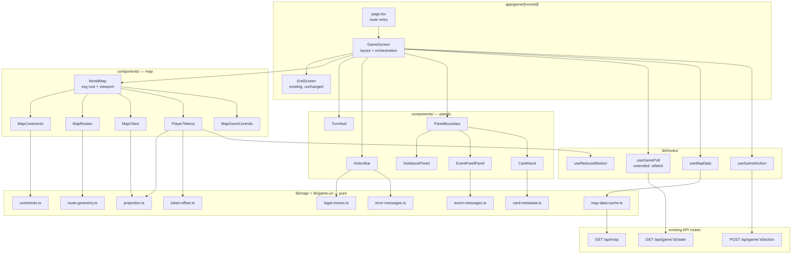
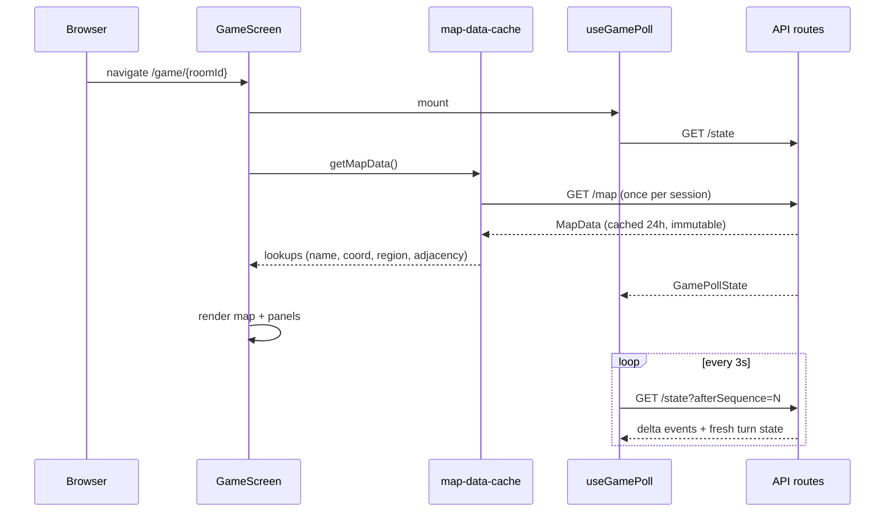
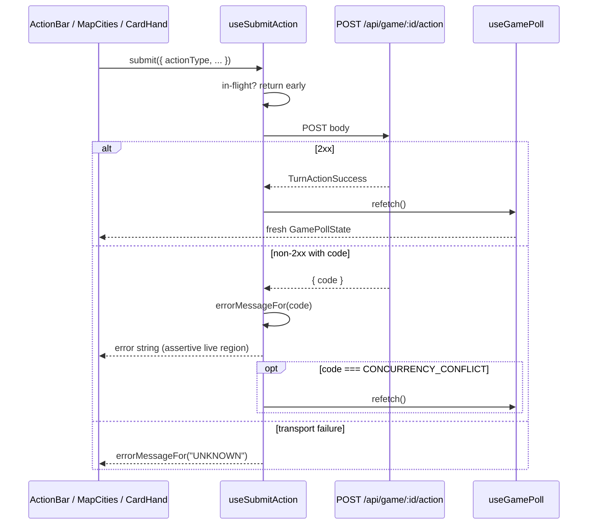

# Design Document: Active Game UI

## Overview

This design replaces the placeholder branch in `app/game/[roomId]/page.tsx` with the complete in-game surface: an inline-SVG world map, per-transport route rendering, animated player tokens, action controls, the turn HUD, the private Notebook, the public Event Feed, the Action Card hand, and the lobby-to-game handoff.

The shape of the solution follows from three constraints in the requirements, restated here as design rules:

1. **All graphics are code.** Landmasses are hand-authored `<path>` data in TypeScript. Icons are inline SVG components. There is no `<image>` element, no tile fetch, no sprite sheet.
2. **Zero new packages.** Animation is CSS transitions on `transform`. Projection is arithmetic. Testing uses the installed `fast-check` + `vitest` + Testing Library stack. No ARCHITECTURE.md tech-stack row is added.
3. **The server is authoritative.** The client renders poll state and posts actions. Every client-side rule (legal moves, blocked transports) exists only to produce an affordance; a rejected action is corrected by the server's error code, never by client prediction.

Two data-layer gaps are closed here because the UI cannot exist without them:

- `Location` gains `latitude` and `longitude`, seeded for all 40 cities and returned by `GET /api/map`.
- `LobbyState` gains `roomId`, so the lobby can navigate to `/game/{roomId}`.

### Design goals

- **One SVG, one coordinate space.** Projection, landmass authoring, routes, markers, labels, and tokens all live in the fixed `0 0 1000 500` viewBox. Zoom and pan are a single transform on a single group, so nothing downstream needs to know about them beyond dividing by `zoom`.
- **Pure logic out of components.** Projection, cluster offsets, legal-move computation, event sentences, card copy, and error copy are pure functions in `lib/`, each with its own test. Components stay thin enough that their tests are about markup and interaction, not arithmetic.
- **Totality over defensiveness.** Every switch over a closed server-side union (13 event types, 10 card identifiers, 18 error codes) is a `Record` keyed by that union, so TypeScript fails the build when the union grows — plus a runtime fallback branch, because these values arrive as JSON.
- **Panel independence.** A thrown render in one panel must not blank the screen (Requirement 17.5), so each panel is wrapped in an error boundary.

### Conflicts found during design

Three divergences between the requirements, the glossary, and the existing server code were found while reading `lib/turn-engine/validate-action.ts`. Per the documentation steering rule these are flagged rather than silently resolved. See [Findings and Conflicts](#findings-and-conflicts) for the full statement and the recommended resolution of each.

- **F-1 — the plane rule.** The server accepts a plane move when the **target** is a hub. Requirement 9.7 excludes a plane move when the **origin** is not a hub. The glossary requires **both** endpoints to be hubs. All three rules differ.
- **F-2 — blockade activity window.** The server evaluates blockades against a turn-ordinal window; the poll payload only exposes `lifted: false`, so the client cannot reproduce that window.
- **F-3 — `capture-failed` is never emitted.** The event type exists in `GameEventType` and must be formatted (Requirement 13.3), but no production code path emits it.

## Architecture

### Layer diagram



### Module boundaries

Every row here becomes a one-line "owns X / doesn't own Y" entry in ARCHITECTURE.md's Key Modules section before the implementing task is marked done.

| Module | Owns | Does not own |
|---|---|---|
| `app/game/[roomId]/page.tsx` | Route entry; reads `roomId` param; renders `GameScreen` | Layout, game rules |
| `.../components/GameScreen.tsx` | Screen layout, loading/error branches, `EndScreen` delegation, responsive mode, panel boundaries, live-region announcer | Map geometry, action validation, panel internals |
| `.../components/WorldMap.tsx` | SVG root, viewBox, zoom/pan state and transform, pointer/keyboard viewport input, layer composition and z-order | Projection arithmetic, per-layer markup |
| `.../components/MapContinents.tsx` | Rendering the stylized landmass paths | Path data (lives in `lib/map/continents.ts`), city positions |
| `.../components/MapRoutes.tsx` | Edge deduplication, per-transport styling, blocked styling | Arc geometry (lives in `lib/map/route-geometry.ts`) |
| `.../components/MapCities.tsx` | City markers, labels, hub treatment, region hue, legal-move highlight, marker a11y and activation | Legal-move computation, action submission |
| `.../components/PlayerTokens.tsx` | Token markup, cluster offsets applied, CSS transform transition | Offset arithmetic (lives in `lib/game-ui/token-offset.ts`) |
| `.../components/MapZoomControls.tsx` | Zoom in / out / reset buttons | Zoom state (owned by `WorldMap`) |
| `.../components/TurnHud.tsx` | Round, current turn, action budget, turn order, viewer status flags, blockade indicators | Blockade semantics beyond reading `activeBlockades` |
| `.../components/ActionBar.tsx` | Skip, Capture Attempt + confirmation dialog, move-list fallback, error live region | HTTP (owned by `useSubmitAction`), legal-move arithmetic |
| `.../components/NotebookPanel.tsx` | Notebook rows per entry type, pending-clue rows, type filter, empty state | Clue computation, name resolution source |
| `.../components/EventFeedPanel.tsx` | Reverse-chron rows, round markers, relative time, scroll-anchoring, unseen-count control | Sentence text (lives in `lib/game-ui/event-messages.ts`) |
| `.../components/CardHand.tsx` | Card grid, disabled state, pending-reward notice, target-picker orchestration | Card copy (lives in `lib/game-ui/card-metadata.ts`) |
| `.../components/CardTile.tsx` | One card button: glyph, name, description, category treatment | Submission |
| `.../components/TargetPicker.tsx` | Player option list, focus trap, cancel/restore-focus | Which card opened it |
| `.../components/CardIcon.tsx` | 10 card glyphs + neutral fallback, switched on `cardIdentifier` | Card copy |
| `.../components/EventIcon.tsx` | 13 event glyphs + neutral fallback, switched on event `type` | Event copy |
| `.../components/PanelBoundary.tsx` | Catching a render throw in one panel and rendering a fallback | Anything else |
| `lib/map/projection.ts` | `projectCoordinate` and `unprojectPoint` | Rendering, clamping, zoom |
| `lib/map/continents.ts` | Landmass `<path>` `d` strings and per-continent bounding boxes | Rendering, city positions |
| `lib/map/route-geometry.ts` | Straight-line and quadratic-arc `d` strings, canonical edge keys | Styling, transport semantics |
| `lib/game-ui/map-data-cache.ts` | Session-scoped `MapData` fetch, in-flight promise sharing, lookup construction | React lifecycle |
| `lib/game-ui/legal-moves.ts` | Legal-move-target computation from adjacency + blockades | Submission, server authority |
| `lib/game-ui/token-offset.ts` | Deterministic cluster offsets from `turnPosition` | Projection, rendering |
| `lib/game-ui/event-messages.ts` | `{ iconKey, sentence }` for all 13 event types + fallback | Glyph markup |
| `lib/game-ui/card-metadata.ts` | Display name, description, category, icon key for all 10 identifiers + fallback | Card effects |
| `lib/game-ui/error-messages.ts` | Error code → player-facing sentence for all 18 codes | HTTP |
| `lib/hooks/use-map-data.ts` | React binding over `map-data-cache`, retry control | Fetch memoisation |
| `lib/hooks/use-submit-action.ts` | POST, in-flight guard, error mapping, post-success refetch trigger | Which action, enablement rules |
| `lib/hooks/use-reduced-motion.ts` | `prefers-reduced-motion` match as boolean state | Durations |
| `lib/hooks/use-game-poll.ts` (extended) | Adds `refetch` and an unmount guard | Everything else, unchanged |

### Data flow: mount to first paint



### Data flow: action submission



## Components and Interfaces

### 1. Schema and seed: location coordinates

**Prisma schema change** (`prisma/schema.prisma`, `model Location`):

```prisma
model Location {
  id        String  @id @default(cuid())
  name      String  @unique
  regionId  String
  isHub     Boolean @default(false)
  latitude  Float   @default(0)
  longitude Float   @default(0)
  // ...relations unchanged
}
```

**Decision D-12 — non-null `Float` with a database default of `0`, backfilled by the seed.** The requirements offer nullable-then-tighten or non-null-with-defaults. Neither of the stated options accounts for the decisive constraint: more than twenty existing property tests create `Location` rows directly (`lib/map/__tests__/graph-invariants.property.test.ts`, `lib/turn-engine/__tests__/*`, `lib/game/__tests__/*`). A non-null column with no default makes `latitude` a required field in the generated Prisma create input, breaking every one of those fixtures at compile time. A nullable column instead pushes `number | null` through `MapData` and into the projection signature, forcing null handling in the one function that most wants to stay total.

`Float @default(0)` satisfies Requirement 2.1 (non-nullable), keeps `MapData.Location.latitude` typed `number`, and leaves existing fixtures compiling untouched. Its one weakness — a row can silently sit at `(0, 0)` — is closed two ways: the seed asserts after upserting that no location has both coordinates equal to `0`, and a unit test asserts the same over the coordinate table. `(0, 0)` is in the Gulf of Guinea and no seeded city is near it, so the sentinel is unambiguous. This is a single migration; the alternatives need two or three.

**Migration** — `prisma/migrations/20260824090000_add_location_coordinates/migration.sql`:

```sql
-- Add coordinates to locations. Non-null with a 0 default so existing rows
-- and existing test fixtures remain valid; prisma/seed.ts backfills real values.
ALTER TABLE "locations" ADD COLUMN "latitude" DOUBLE PRECISION NOT NULL DEFAULT 0;
ALTER TABLE "locations" ADD COLUMN "longitude" DOUBLE PRECISION NOT NULL DEFAULT 0;
```

**Seed change** (`prisma/seed.ts`): each region entry in `MAP_DATA.regions` changes from `locations: string[]` to `locations: { name, latitude, longitude }[]`, and the Step 2 `location.upsert` gains `latitude` and `longitude` in **both** `create` and `update`, which is what makes re-seeding an already-populated database set coordinates on the existing 40 rows without changing the count (Requirement 2.6). The upsert key stays `{ name }`, so the existing idempotency pattern is unchanged. A post-upsert assertion fails the seed if any of the 40 rows still reads `(0, 0)`.

**Read path** (`lib/map/get-map-data.ts`): the `regions.map(...).locations.map(...)` projection adds `latitude: loc.latitude, longitude: loc.longitude`. Prisma's `include: { locations: true }` already selects all columns, so no query change is needed.

**Type change** (`lib/map/types.ts`):

```ts
export interface Location {
  id: string;
  name: string;
  regionId: string;
  isHub: boolean;
  latitude: number;   // decimal degrees, [-90, 90]
  longitude: number;  // decimal degrees, [-180, 180]
}
```

**Third producer of `Location`.** Adding required fields to the interface breaks every object literal typed as `Location`. A repository search finds exactly two production sites besides `get-map-data.ts`: `getLocationsByRegion` and `getAllRegions`, both in `lib/map/regions.ts`. Both gain the two fields. `lib/map/adjacency.ts` declares its own `AdjacentLocationWithTransport` interface and is unaffected. The turn-engine and map test files declare local structural types, not `Location`, so they are unaffected.

### 2. City coordinate table (canonical)

This table is the single source of truth for city geometry and is transcribed verbatim into `prisma/seed.ts`. Per the documentation steering rule it is stated once, here; no other document or module repeats it. All values are real-world decimal degrees.

**Europe (8)**

| City | Latitude | Longitude |
|---|---|---|
| London (hub) | 51.5074 | -0.1278 |
| Paris | 48.8566 | 2.3522 |
| Berlin | 52.5200 | 13.4050 |
| Rome | 41.9028 | 12.4964 |
| Madrid | 40.4168 | -3.7038 |
| Vienna | 48.2082 | 16.3738 |
| Warsaw | 52.2297 | 21.0122 |
| Athens | 37.9838 | 23.7275 |

**Asia (8)**

| City | Latitude | Longitude |
|---|---|---|
| Tokyo (hub) | 35.6762 | 139.6503 |
| Beijing | 39.9042 | 116.4074 |
| Seoul | 37.5665 | 126.9780 |
| Bangkok | 13.7563 | 100.5018 |
| New Delhi | 28.6139 | 77.2090 |
| Jakarta | -6.2088 | 106.8456 |
| Manila | 14.5995 | 120.9842 |
| Hanoi | 21.0285 | 105.8542 |

**Africa (9)**

| City | Latitude | Longitude |
|---|---|---|
| Cairo (hub) | 30.0444 | 31.2357 |
| Nairobi | -1.2921 | 36.8219 |
| Lagos | 6.5244 | 3.3792 |
| Pretoria | -25.7479 | 28.2293 |
| Accra | 5.6037 | -0.1870 |
| Addis Ababa | 9.0320 | 38.7469 |
| Casablanca | 33.5731 | -7.5898 |
| Dar es Salaam | -6.7924 | 39.2083 |
| Cape Town | -33.9249 | 18.4241 |

**North America (6)**

| City | Latitude | Longitude |
|---|---|---|
| Washington D.C. (hub) | 38.9072 | -77.0369 |
| Ottawa | 45.4215 | -75.6972 |
| Mexico City | 19.4326 | -99.1332 |
| Havana | 23.1136 | -82.3666 |
| Panama City | 8.9824 | -79.5199 |
| Toronto | 43.6532 | -79.3832 |

**South America (5)**

| City | Latitude | Longitude |
|---|---|---|
| Brasília (hub) | -15.8267 | -47.9218 |
| Buenos Aires | -34.6037 | -58.3816 |
| Lima | -12.0464 | -77.0428 |
| Bogotá | 4.7110 | -74.0721 |
| Santiago | -33.4489 | -70.6693 |

**Oceania (4)**

| City | Latitude | Longitude |
|---|---|---|
| Canberra (hub) | -35.2809 | 149.1300 |
| Wellington | -41.2865 | 174.7762 |
| Suva | -18.1248 | 178.4501 |
| Auckland | -36.8485 | 174.7633 |

Total: 40. Latitude range across the set is Berlin at 52.52 down to Wellington at -41.29; longitude range is Mexico City at -99.13 up to Suva at 178.45. No city is polar, which is what makes the equirectangular choice (D-3) lossless for this purpose and guarantees every projected point lands strictly inside the viewBox.

### 3. Map projection — `lib/map/projection.ts`

```ts
export interface LocationCoordinate {
  latitude: number;
  longitude: number;
}

export interface MapPoint {
  x: number;
  y: number;
}

export const MAP_VIEWBOX_WIDTH = 1000;
export const MAP_VIEWBOX_HEIGHT = 500;

/** Equirectangular projection into the fixed 1000x500 viewBox. Pure. */
export function projectCoordinate(coordinate: LocationCoordinate): MapPoint;

/** Inverse of projectCoordinate. Pure. */
export function unprojectPoint(point: MapPoint): LocationCoordinate;
```

Forward:

```
x = (longitude + 180) / 360 * 1000
y = (90 - latitude) / 180 * 500
```

Inverse:

```
longitude = x / 1000 * 360 - 180
latitude  = 90 - y / 500 * 180
```

The module reads no module-level mutable state and closes over nothing (Requirement 4.4), so calling it twice with equal input returns equal output by construction (4.2). Monotonicity is immediate: `x` is affine increasing in longitude (4.5) and `y` is affine decreasing in latitude (4.6). Bounds follow from the affine maps being exactly onto `[0, 1000]` and `[0, 500]` over the stated domains (4.3).

Worked values, for orientation and as unit-test anchors:

| City | Longitude | Latitude | x | y |
|---|---|---|---|---|
| London | -0.1278 | 51.5074 | 499.65 | 106.92 |
| Cairo | 31.2357 | 30.0444 | 586.77 | 166.54 |
| Tokyo | 139.6503 | 35.6762 | 887.92 | 150.90 |
| Canberra | 149.1300 | -35.2809 | 914.25 | 348.00 |
| Suva | 178.4501 | -18.1248 | 995.69 | 300.35 |
| Santiago | -70.6693 | -33.4489 | 303.70 | 342.91 |

`unprojectPoint` exists for two reasons: it makes the round-trip a testable property, and it is the conversion a pointer-position-anchored zoom would need. The MVP zoom is centre-anchored (see §7), so no component calls it yet; it ships anyway because it is three lines and it is what makes Property 2 expressible as a round trip.

**Edge-proximity note.** Suva (x ≈ 995.7), Wellington (x ≈ 985.5), and Auckland (x ≈ 985.4) sit within 15 user units of the right edge. `MapCities` therefore anchors labels for any city with `x > 940` to `text-anchor="end"` on the left side of the marker; every other label anchors `start` on the right. This is a rendering concern, not a projection concern, and lives in `MapCities`.

### 4. Continent rendering — `lib/map/continents.ts` + `MapContinents.tsx`

The landmasses are **stylized silhouettes authored by hand in the projected 1000×500 space**. They are not coastlines and make no fidelity claim. They exist to give the eye a world to read city positions against. City positions come from `projectCoordinate` and never from the path data; a mismatch between a marker and the silhouette under it is a cosmetic defect in the path, not a positioning bug.

**Vertex budget (resolves O-1).** Each landmass group is a single `d` string of 25–45 points using only `M`, `L`, and `Z` — no curve commands anywhere in the set. Straight-segment-only authoring at a comparable point density is what makes six independently drawn shapes read as one deliberate art direction rather than six efforts of differing fidelity.

**Six groups**, keyed so a region can be associated with a group:

| Key | Covers | Subpaths |
|---|---|---|
| `eurasia` | Europe + Asia | mainland, British Isles, Japan |
| `africa` | Africa | mainland, Madagascar |
| `northAmerica` | North America + Central America + Cuba | mainland, Cuba |
| `southAmerica` | South America | mainland |
| `oceania` | Australia + New Zealand + Fiji | Australia, New Zealand, Fiji speck |
| `southeastAsiaIslands` | Indonesian and Philippine archipelago | Sumatra/Java, Borneo, Philippines |

Antarctica is omitted: no location is there, and at this projection it would occupy the bottom 15% of the viewBox with nothing on it.

```ts
export type ContinentKey =
  | "eurasia" | "africa" | "northAmerica"
  | "southAmerica" | "oceania" | "southeastAsiaIslands";

export interface ContinentShape {
  key: ContinentKey;
  /** One or more subpath `d` strings, M/L/Z only, in viewBox units. */
  paths: string[];
  /** Declared bounding box, used by the on-land sanity test. */
  bounds: { minX: number; minY: number; maxX: number; maxY: number };
}

export const CONTINENTS: ContinentShape[] = [ /* ... */ ];

/** Region name -> the continent group its cities should fall within. */
export const REGION_CONTINENT: Record<string, ContinentKey>;
```

`MapContinents` renders `<g role="img" aria-label="Stylized world map landmasses">` containing one `<path>` per subpath, `fill="#1f2937"`, `stroke="#374151"`, `strokeWidth={0.75 / zoom}`. It takes only `zoom` as a prop and is otherwise static, so it re-renders on zoom and nothing else.

**Fallback if the silhouettes look poor.** The escape hatch is `world-atlas` TopoJSON plus `d3-geo`, which would add two runtime dependencies, two ARCHITECTURE.md tech-stack rows, and a projection abstraction the game does not otherwise need. `MapContinents` is the swap boundary: nothing outside it reads `CONTINENTS`, and nothing inside it knows about game state, so replacing the module's internals is a self-contained change. Taking that route requires the steering-mandated ARCHITECTURE.md note and is out of scope unless the hand-authored set fails review.

### 5. Route rendering — `lib/map/route-geometry.ts` + `MapRoutes.tsx`

**Deduplication.** `MapData.adjacency` is per-location, so all 72 edges appear twice. `MapRoutes` folds the adjacency list into a deduplicated edge list keyed canonically:

```ts
/** Canonical, order-independent key for an unordered location pair. */
export function edgeKey(locationIdA: string, locationIdB: string): string {
  return locationIdA < locationIdB
    ? `${locationIdA}|${locationIdB}`
    : `${locationIdB}|${locationIdA}`;
}

export interface RenderableEdge {
  key: string;
  fromLocationId: string; // lexicographically smaller id
  toLocationId: string;   // lexicographically larger id
  transport: TransportType;
}

export function buildRenderableEdges(adjacency: AdjacencyListEntry[]): RenderableEdge[];
```

Canonical ordering serves two purposes: it collapses each pair to one path (Requirement 6.1), and it fixes the direction of the perpendicular used for plane arcs, so an arc bows the same way on every render regardless of which endpoint the adjacency list was walked from. `buildRenderableEdges` returns edges sorted by `key` for stable DOM order. The database's `@@unique([locationAId, locationBId])` means at most one transport per pair, so a pair never needs two paths; the reducer keeps the first transport it sees and is written so that a future multi-edge schema would degrade to "first by canonical order" rather than crash.

**Geometry.**

```ts
export function straightLinePath(from: MapPoint, to: MapPoint): string;
export function arcPath(from: MapPoint, to: MapPoint): string;
export function arcControlPoint(from: MapPoint, to: MapPoint): MapPoint;
```

`arcControlPoint` computes, for chord `d = to - from` of length `L`:

```
unit perpendicular n = (-d.y / L, d.x / L)
offset k             = clamp(0.20 * L, 16, 80)
control C            = midpoint(from, to) + n * k
```

`k` has a floor of 16 rather than the 8 that Requirement 6.4 demands, because a quadratic Bézier passes through only half of its control-point offset: peak deviation from the chord at `t = 0.5` is `k / 2`. A floor of 16 therefore delivers the 8 user units of *visible* separation that the requirement is reaching for, and satisfies the literal control-point constraint with margin. The 80 ceiling stops the long trans-Pacific hub arcs from bowing off the top of the viewBox. `arcPath` emits `M x1 y1 Q cx cy x2 y2`; degenerate zero-length chords (impossible with distinct cities, guarded anyway) fall back to `straightLinePath`.

**Styling, by transport type only** (Requirement 6.2–6.5, Property 13):

| Transport | Element | Stroke | Width | Dash |
|---|---|---|---|---|
| `car` | `<line>` | `#94a3b8` | `1.5 / zoom` | none |
| `boat` | `<line>` | `#a8b6c9` | `1.5 / zoom` | `6 / zoom, 4 / zoom` |
| `plane` | `<path>` (quadratic) | `#c084fc` | `1.2 / zoom` | none |

Blocked styling: when `transport ∈ viewerBlockedTransports`, the path gets `opacity={0.25}` (from `0.7`) and its `<desc>` text includes the word "blocked".

**Accessibility and z-order.** The whole layer is `<g aria-hidden="true">` (Requirement 6.7); route information reaches assistive technology through `TurnHud` blockade indicators and the `ActionBar` move list, each of which names transport in text. Document order inside `WorldMap` is continents → routes → cities → tokens, which gives the paint order Requirements 5.8 and 8.10 demand.

### 6. City markers — `MapCities.tsx`

One `<g>` per location, rendered **sorted by location name** so that sequential keyboard navigation visits cities in name order (Requirement 16.1). Markers do not overlap enough for name-order DOM order to cause a visual layering problem.

```tsx
<g role="group" aria-label="Cities">
  {citiesSortedByName.map((city) => (
    <g
      key={city.id}
      role="button"
      tabIndex={0}
      aria-label={markerName(city)}          // "Cairo, Africa, hub"
      aria-describedby={`city-desc-${city.id}`}
      aria-disabled={!isLegalTarget(city.id)}
      onClick={...}
      onKeyDown={...}                         // Enter | Space
    >
      <desc id={`city-desc-${city.id}`}>{markerDescription(city)}</desc>
      <circle cx={p.x} cy={p.y} r={radius} ... />
      {showLabel && <text ...>{city.name}</text>}
    </g>
  ))}
</g>
```

| Concern | Treatment |
|---|---|
| Hub vs non-hub (5.6) | hub `r = 7 / zoom`, `strokeWidth = 2 / zoom`, stroke `#f8fafc`; non-hub `r = 4.5 / zoom`, `strokeWidth = 1 / zoom`, stroke `#0f172a` |
| Region hue (5.7) | `fill` from `REGION_HUES` keyed by region name (see Data Models) |
| Counter-scaling (5.12) | every `r`, `strokeWidth`, and `fontSize` is a base constant divided by `zoom` |
| Legal-move highlight (9.1) | an extra `<circle>` ring at `r + 3 / zoom`, stroke `#facc15`, `strokeWidth = 2 / zoom`, plus `class="cursor-pointer"` |
| Labels at zoom 1 (5.9) | hubs and the viewer's current location only |
| Labels above zoom 1 (5.10) | every city whose projected point is inside the visible rect `[panX, panX + 1000/zoom] × [panY, panY + 500/zoom]` |
| Label offset (5.11) | `dx = ±(r + 4) / zoom`, `dy = 3 / zoom`; `text-anchor="end"` and negative `dx` when `x > 940`, otherwise `start` |
| Accessible name (16.3) | `"{city}, {region}"`, with `", hub"` appended for hubs |
| Accessible description (16.4, 6.6) | `"legal move target by {transport}"` when legal; `"not reachable this turn"` otherwise; `"{transport} routes are blocked"` appended when the connecting transport is blocked |
| Non-target activation (9.3) | `aria-disabled="true"` and the click/key handler returns before submitting |

Activation is suppressed when `!isViewerTurn`, `actionsRemaining === 0`, the marker is not a legal target, a submission is in flight, or the pointer sequence was a drag (see §7).

### 7. Map viewport — zoom and pan in `WorldMap.tsx`

State lives in `WorldMap` as a single object so that zoom and pan clamping always happen together:

```ts
interface ViewportState { zoom: number; panX: number; panY: number }
const INITIAL_VIEWPORT: ViewportState = { zoom: 1, panX: 0, panY: 0 };
```

The transform is applied to one wrapper group containing every layer:

```tsx
<g transform={`scale(${zoom}) translate(${-panX} ${-panY})`}>
```

SVG composes these left to right, so a point `p` in viewBox units renders at `zoom * (p - pan)`. A point is visible exactly when `panX ≤ p.x ≤ panX + 1000 / zoom` and `panY ≤ p.y ≤ panY + 500 / zoom`, which is the visible-rect formula that `MapCities` uses for label culling.

**Clamping** (Requirements 7.7, 7.8) is a pure helper, exported for test:

```ts
export function clampViewport(next: ViewportState): ViewportState;
// zoom  -> clamp(next.zoom, 1, 4)
// panX  -> clamp(next.panX, 0, 1000 - 1000 / zoom)
// panY  -> clamp(next.panY, 0, 500 - 500 / zoom)
```

At `zoom === 1` both pan bounds collapse to `[0, 0]`, so pan is pinned to zero without a special case (7.8).

**Zoom transitions keep the viewport centre fixed.** Going from `z` to `z'`, the centre `c = pan + (500/z, 250/z)` is preserved: `pan' = c - (500/z', 250/z')`, then clamped. This is why zooming out from a corner walks smoothly back to the full map instead of jumping.

| Input | Behaviour |
|---|---|
| Zoom-in button (7.2) | `zoom * 1.5`, clamped to 4 |
| Zoom-out button (7.3) | `zoom / 1.5`, clamped to 1 |
| Reset button (7.4) | back to `INITIAL_VIEWPORT` |
| `+` / `-` keys | same as the buttons |
| Arrow keys (7.6) | `pan ± 50 / zoom` on the matching axis, only when `zoom > 1` |
| Pointer drag (7.5) | `pan -= deltaUserUnits / zoom`, where `deltaUserUnits = deltaCssPx * (1000 / svgClientWidth)`; only when `zoom > 1` |
| Wheel | up zooms in, down zooms out, one 1.5 step per event |
| Two-pointer pinch | scale by the ratio of current to initial pointer distance, same clamp |

Wheel handling is registered in a `useEffect` via `addEventListener("wheel", handler, { passive: false })` on the SVG ref so `preventDefault` is allowed; React's JSX `onWheel` cannot guarantee a non-passive listener. Drag uses `setPointerCapture` on `pointerdown` so a fast drag that leaves the SVG still tracks.

**Click versus drag.** A drag must never fire a move. Two refs on the SVG root:

```ts
const pointerStartRef = useRef<{ x: number; y: number } | null>(null);
const didDragRef = useRef(false);
const DRAG_THRESHOLD_PX = 4;
```

`pointerdown` records the start point and sets `didDragRef.current = false`. `pointermove` sets `didDragRef.current = true` once cumulative movement exceeds `DRAG_THRESHOLD_PX`. Because a DOM `click` is dispatched after `pointerup`, the marker's `onClick` can read `didDragRef.current` and return early. Keyboard activation bypasses the flag entirely, since `keydown` never sets it.

The three buttons are real `<button>` elements with `aria-label`s, rendered outside the SVG in an HTML toolbar above the map (Requirement 7.9), which also keeps them out of the SVG's counter-scaling concerns.

### 8. Player tokens — `PlayerTokens.tsx` + `lib/game-ui/token-offset.ts`

**Offsets.**

```ts
export interface TokenOffset { dx: number; dy: number }

export const TOKEN_CLUSTER_RADIUS = 7;

/**
 * Deterministic offset for one token within a cluster.
 * clusterSize <= 1 -> zero offset (token sits on the marker).
 * Otherwise: a ring slot chosen by turnPosition, so a player's slot within a
 * given cluster is identical on every render.
 */
export function computeTokenOffset(turnPosition: number, clusterSize: number): TokenOffset;
```

Slot angles are `-90° + ((turnPosition - 1) mod 4) * 90°`, giving up (`turnPosition` 1), right (2), down (3), left (4) at radius `TOKEN_CLUSTER_RADIUS * (1 + floor((turnPosition - 1) / 4))`. With at most four players every slot is unique, and the tightest pair is two adjacent slots at `sqrt(7² + 7²) ≈ 9.90` user units apart — comfortably over the 6-unit floor of Requirement 8.4. Opposite slots are 14 apart. The radius multiplier is defensive: it keeps slots distinct if the player cap ever rises above four. Deriving the slot from `turnPosition` rather than from array index or cluster position is what makes the offset stable across renders and across poll responses (Requirement 8.5).

A solo token gets a zero offset so it sits centred on its marker. When a second player arrives, both tokens shift into ring slots — and because the shift is expressed through the same `transform`, it animates with the same transition rather than snapping.

**Positioning and animation.**

```tsx
<g
  key={player.playerId}                        // stable key: never remount
  style={{
    transform: `translate(${x + dx}px, ${y + dy}px)`,
    transition: shouldAnimate ? `transform ${motionDuration}ms ease-in-out` : "none",
  }}
  className="motion-reduce:transition-none"
>
```

`transform` is used rather than `cx`/`cy` because only `transform` transitions. The `<g>` key is `playerId`, which React keeps stable across poll responses, so the element is updated rather than remounted — a remount would restart from the new position and show no motion at all.

Retargeting mid-flight (Requirement 8.7) needs no code: a CSS `transform` transition whose target changes mid-transition interpolates from the currently computed value, which is exactly "from the token's current rendered position to the newest point". A `useRef<Map<string, string>>` of previous `locationId` per player is kept for one purpose only: suppressing the transition on first paint, so tokens do not fly in from the origin on mount. `shouldAnimate` is `hasMountedRef.current && !isReducedMotion`.

`motionDuration` is `600` normally and `0` when `useReducedMotion()` returns true (Requirement 8.8, 16.9). The Tailwind `motion-reduce:transition-none` class is belt-and-braces for users whose preference changes without a React re-render.

**Token vocabulary (resolves O-3).** Colour carries no information here, which sidesteps both the region-hue palette and colour-vision concerns:

- Every token: `<circle r={8 / zoom}>` filled `#e5e7eb`, stroked `#111827` at `1.5 / zoom`.
- Inside it: the player's `turnPosition` digit as `<text>` in `#111827` at `font-size: 9 / zoom`, which ties the token to the `TurnHud` turn-order list and stays unambiguous when two players share an initial.
- The viewer's token adds an unfilled outer ring at `r = 11 / zoom`, stroke `#fbbf24`, `strokeWidth = 2 / zoom` (Requirement 8.3).

Accessible name is the display name, with `" (you)"` appended for the viewer; the accessible description, in a `<desc>`, is the resolved location name (Requirements 8.3, 8.9).

**Missing location (Requirement 17.1).** A player whose `locationId` is absent from `Coordinate_Lookup` is filtered out before render. Filtering rather than defaulting keeps a bad id from parking a token at `(0, 0)` and implying the Gulf of Guinea.

### 9. Map data provider — `lib/game-ui/map-data-cache.ts` + `lib/hooks/use-map-data.ts`

The fetch memoisation lives in a plain module, not in the hook, so that Property 14 ("exactly one request per session") is testable without rendering anything. This is a deliberate refinement of the file layout in the requirements.

```ts
// lib/game-ui/map-data-cache.ts — module-level, session-scoped
let cached: MapData | null = null;
let inFlight: Promise<MapData> | null = null;

/** Resolves cached data, joins an in-flight request, or starts the one request. */
export function getMapData(): Promise<MapData>;

/** Clears cache and in-flight state. Used by the retry control and by tests. */
export function resetMapDataCache(): void;

export interface MapLookups {
  locationName(locationId: string): string;   // "Unknown location" when absent
  regionName(regionId: string): string;       // "Unknown region" when absent
  coordinate(locationId: string): LocationCoordinate | undefined;
  point(locationId: string): MapPoint | undefined;
  region(locationId: string): RegionWithLocations | undefined;
  edges(locationId: string): AdjacencyEdgeSummary[];
  location(locationId: string): Location | undefined;
  allLocations: Location[];
}

export function buildMapLookups(data: MapData): MapLookups;
```

`getMapData` returns `cached` if present, else `inFlight` if present, else assigns `inFlight` and returns it — which is what makes N concurrent callers share one request (Requirement 3.3). On rejection `inFlight` is cleared so a retry can start a fresh request; on success `cached` is set and `inFlight` cleared. `buildMapLookups` builds `Map` indexes once and memoises projected points, so `point()` is a lookup rather than repeated arithmetic across 40 markers × every render.

`locationName` and `regionName` return `"Unknown location"` / `"Unknown region"` for absent ids (Requirement 3.5), which is what makes them total and lets panels call them without null checks.

```ts
// lib/hooks/use-map-data.ts
interface UseMapDataResult {
  lookups: MapLookups | null;   // null until loaded, and on failure
  isLoading: boolean;
  error: string | null;
  retry: () => void;
}
export function useMapData(): UseMapDataResult;
```

The hook guards `setState` behind a mounted ref. `retry` calls `resetMapDataCache()` then re-requests (Requirement 3.6).

**Degradation when lookups are null** (Requirements 3.6, 17.3): panels receive an optional `lookups` prop and route every name through a local `resolveLocationName(id)` helper that returns the raw id when `lookups` is null. `GameScreen` replaces the map with a notice and a "Retry loading map" button. The HUD, notebook, feed, and card hand still render.

### 10. Action submission — `lib/hooks/use-submit-action.ts`

```ts
interface UseSubmitActionResult {
  submit: (payload: ActionPayload) => Promise<void>;
  isSubmitting: boolean;
  error: string | null;
  clearError: () => void;
}
export function useSubmitAction(roomId: string, onSuccess: () => void): UseSubmitActionResult;
```

Sequence:

1. If `isSubmittingRef.current`, return immediately. The guard is a ref, not the state value, because two clicks inside one React batch would both read a stale `false` from state (Requirement 10.5).
2. Set the ref and the state, clear `error`.
3. `POST /api/game/{roomId}/action` with `Content-Type: application/json` and the payload as body (Requirement 10.1).
4. On `res.ok`: call `onSuccess()`, which is `useGamePoll`'s `refetch` (Requirement 10.8).
5. On non-2xx: read `code` from the JSON body, set `error = errorMessageFor(code)`. When `code === "CONCURRENCY_CONFLICT"`, also call `onSuccess()` so the client re-syncs (Requirement 10.13).
6. On a thrown fetch or unparseable body: `error = errorMessageFor("UNKNOWN")` (Requirement 10.12).
7. `finally`: clear the ref and the state, re-enabling whatever Requirement 10.2 permits.

**`useGamePoll` extension.** The hook gains `refetch` to its result and two safety changes, and nothing else:

```ts
interface UseGamePollResult {
  state: GamePollState | null;
  error: string | null;
  isLoading: boolean;
  refetch: () => Promise<void>;   // new: the existing memoised `poll`
}
```

- `refetch` is the already-memoised `poll` callback, returned as-is. It reuses the `afterSequence` merge logic, so a post-action refetch picks up exactly the new events.
- An `isMountedRef` guard wraps every `setState` in `poll`, satisfying Requirement 17.4. The current implementation has no such guard, so a response landing after unmount warns and does redundant work.
- The `finally` block only clears `isLoading` when still mounted.

The polling interval, merge semantics, and finish-detection behaviour are untouched.

### 11. Legal move computation — `lib/game-ui/legal-moves.ts`

```ts
export interface LegalMoveTarget {
  locationId: string;
  locationName: string;
  transport: TransportType;
}

export function computeBlockedTransportsForViewer(
  activeBlockades: ActiveBlockadeData[],
  viewerPlayerId: string,
): Set<TransportType>;

export function computeLegalMoveTargets(params: {
  viewerLocationId: string;
  lookups: MapLookups;
  blockedTransports: Set<TransportType>;
}): LegalMoveTarget[];
```

`computeBlockedTransportsForViewer` keeps every entry whose `casterPlayerId !== viewerPlayerId` (glossary Viewer_Blocked_Transports; Requirement 11.12). It mirrors the server's `computeBlockedTransports` in `lib/turn-engine/cards/effects/blockade-utils.ts` — deliberately a mirror rather than a shared import, because that module pulls in `TransactionClient` and would drag server types into the client bundle.

`computeLegalMoveTargets` walks `lookups.edges(viewerLocationId)` and drops an edge when:

- its `transport` is in `blockedTransports` (Requirement 9.8), or
- its `transport` is `plane` and the **target** location is not a hub (see F-1 below), or
- the target id does not resolve through `lookups`.

Survivors are deduplicated by `locationId`, preferring `car`, then `boat`, then `plane` when a pair somehow carries several edges, and returned sorted by `locationName` so the move list and the marker order agree. The result feeds three consumers: marker highlighting, marker activation gating, and the `ActionBar` move list.

**F-1 — the plane rule, stated precisely.** Three sources disagree:

| Source | Rule |
|---|---|
| `validateAction` → `validateMove` in `lib/turn-engine/validate-action.ts` | rejects when `edge.transport === "plane" && !edge.isHub`, where `edge` is the **neighbour** returned by `getAdjacentLocations`, so `isHub` is the **target's** flag. Origin is not consulted. |
| Requirement 9.7 | exclude when the edge is `plane` and the **origin** is a non-hub. Target is not consulted. |
| Glossary `Legal_Move_Target` | require **both** endpoints to be hubs. |

The rules produce different answers on real seed data. Athens → Cairo (`plane`, origin non-hub, target hub): the server accepts, Requirement 9.7 excludes, the glossary excludes. Cairo → Athens: the server rejects with `INVALID_TRANSPORT`, Requirement 9.7 permits, the glossary excludes.

**This design mirrors the server: a plane edge is a legal target when the target location is a hub.** The spec's own third constraint is that the server is authoritative, and of the two failure modes, hiding a move the server would accept is worse than offering one it will reject — the first makes a route unreachable through the UI with no feedback, the second costs a click and produces an error message. Requirement 9.7 and the glossary definition of `Legal_Move_Target` need amending to match; that is a requirements change, flagged here, not made here.

A consequence worth recording because it will look like a UI bug: under the server rule, the ten non-hub plane edges in the seed are directional or dead. `Madrid–Casablanca`, `Auckland–Santiago`, `Beijing–Toronto`, and `Suva–Manila` connect two non-hubs and are therefore traversable in neither direction, while `Athens→Cairo`, `New Delhi→Cairo`, `Panama City→Bogotá` (Bogotá is not a hub — also dead), `Jakarta→Canberra`, `Cape Town→Brasília`, and `Mexico City→Tokyo` work one way only. The UI renders these edges (Requirement 6.1 asks for every adjacency edge) but will not offer them as targets. Whether the seed's non-hub plane edges or the server's hub rule is the actual defect belongs to a separate spec.

**F-2 — blockade activity window.** The server calls `getActiveBlockades`, which filters `lifted: false` **and** tests `isWithinBlockadeWindow(creationRound, casterTurnPosition, currentRound, currentTurnPosition)`. `GamePollState.activeBlockades` carries only `{ transportType, casterPlayerId, creationRound }` — no `casterTurnPosition` — so the client cannot reproduce the window and will treat a blockade as active for the whole game until something lifts it. The visible effect is over-reporting: a dimmed route and a hidden move target for a blockade the server no longer enforces, which is the failure mode F-1 argues against.

This design implements the requirement as written, reading `activeBlockades` directly. The recommended follow-up is a one-field extension: add `casterTurnPosition` to `ActiveBlockadeData` in `lib/turn-engine/types.ts` and select it in `query-turn-state.ts` (the column already exists on the `Blockade` model), then have the client reuse the already-pure `isWithinBlockadeWindow`. It is roughly four lines of server change and would make client and server agree exactly. It is outside this spec's stated scope, so it is flagged for a decision rather than folded in.

### 12. Action controls — `ActionBar.tsx`

Enablement is one derived boolean, computed once and passed to every control so that Property 10 has a single source:

```ts
const canAct = isViewerTurn && actionsRemaining > 0 && !isSubmitting;
```

| Control | Behaviour |
|---|---|
| Skip | `disabled={!canAct}`; submits `{ actionType: "SKIP" }` |
| Capture Attempt | `disabled={!canAct}`; opens the confirmation, submits nothing on its own (Requirement 10.6) |
| Move list | one `<button>` per `LegalMoveTarget`, labelled `"{Location} — by {road\|sea\|air}"`, submitting `{ actionType: "MOVE", targetLocationId }`; renders "No legal moves available" when the set is empty and it is the viewer's turn (Requirements 9.6, 9.9) |
| Error region | `<div role="alert" aria-live="assertive">` holding `error` (Requirements 10.9, 16.7) |

**Capture confirmation (resolves O-5).** A `role="dialog" aria-modal="true"` panel with an `aria-labelledby` heading, opened by the Capture Attempt button. Copy: *"Attempt a capture in {Location}? This spends one action, and you cannot attempt again in {Location} this turn."* — naming the location as Requirement 10.6 demands and warning about `DUPLICATE_CAPTURE_ATTEMPT`, which is the one rejection a player cannot recover from within the turn.

Focus moves to the confirm button on open. Sequential navigation is confined to confirm and cancel by a `keydown` handler on the dialog that wraps Tab and Shift+Tab between the two, and Escape cancels (Requirement 16.11). Cancel dismisses, submits nothing, and returns focus to the Capture Attempt button (Requirement 10.7).

### 13. Turn HUD — `TurnHud.tsx`

| Element | Source | Requirement |
|---|---|---|
| `"Round {n}"` | `currentRound` | 11.1 |
| Current player name | `players.find(p => p.playerId === currentPlayerId)?.displayName ?? "Unknown player"` | 11.2 |
| `"Your turn"` badge | `isViewerTurn`; amber background + bold; otherwise `"{Name}'s turn"` in muted text | 11.3 |
| `"{actionsRemaining} of {actionBudget} actions"` | poll state | 11.4 |
| Turn-order list | `<ol>` of players sorted by ascending `turnPosition`, each `"{turnPosition}. {name} — {resolved location}"` | 11.5 |
| Current-turn marking | `aria-current="true"` on that `<li>` plus a visible left border | 11.6 |
| `"Your next turn will be skipped"` | `privateData.skipNextTurn` | 11.7 |
| `"You lose one action next turn"` | `privateData.actionPenaltyFlag` | 11.8 |
| `"You are owed {n} extra turn(s)"` | `privateData.pendingExtraTurns > 0` | 11.9 |
| Blockade indicators | one per viewer-blocked transport: `"{Road\|Sea\|Air} routes blocked by {caster name}"` | 11.10, 11.11 |
| Own-blockade indicator | for entries where `casterPlayerId === viewerPlayerId`: `"You closed all {transport} routes"`, and that transport is excluded from the blocked set | 11.12 |

Every indicator is text, never colour alone (Requirement 16.12). The turn-order list numbers match the digits inside the player tokens.

**Turn-change announcer.** A visually hidden `<div aria-live="polite">` inside `TurnHud` whose content is recomputed from `currentRound` + `currentPlayerId`. Because the string only changes when the turn changes, the 3-second poll does not re-announce a static turn.

### 14. Notebook panel — `NotebookPanel.tsx`

Rows come from `privateData.notebook` only — never from `players` or `events` (Requirement 12.13, Property 6). Ordering is a stable sort on `roundNumber` ascending, which preserves array order within a round (Requirement 12.2).

Per-variant row layout, switched on `entryType`:

| `entryType` | Row content |
|---|---|
| `spy-proximity` | `"Spy in {regionName(regionId)} is {stepsAway} step(s) away"` |
| `mastermind_distance` | `"{locationName(locationId)} is {stepsAway} step(s) from the Mastermind"` |
| `mastermind_direction` | `"{locationName(locationId)} is one step closer to the Mastermind"` |
| `phone_bug` | `"{playerName(targetPlayerId)} was in {locationName(targetLocationId)}, {mastermindStepsAway} step(s) from the Mastermind"` plus spy status: `spyCaptured` → `"spy in {regionName(spyRegionId)} already captured"`; `spyRegionId === null` → `"no spy information"`; otherwise `"spy active in {regionName(spyRegionId)}"` |
| unknown | `"Unrecognised clue"` with the round number (Requirement 12.14) |

Every row carries `"Round {n}"` (Requirement 12.8). `playerName` resolves through `GamePollState.players`, falling back to `"someone"`; location and region names resolve through `MapLookups`.

Pending clues render as their own rows below the entries: `"{cardDisplayName(cardIdentifier)} — resolves at the end of round {n}"`, with a dashed left border and muted text to separate them visually from settled entries (Requirements 12.9, 12.10).

The filter is a row of chips: an "All" chip plus one chip per `entryType` **actually present** in the notebook, each `<button role="radio">` inside a `role="radiogroup"`. Selecting a type filters rendered rows to that type (Requirement 12.12). Pending-clue rows are unaffected by the filter, since they have no `entryType`. Empty notebook and empty pending clues together render `"No clues yet"` (Requirement 12.11).

### 15. Event feed panel — `EventFeedPanel.tsx` + `lib/game-ui/event-messages.ts`

```ts
export type EventIconKey =
  | "victory" | "draw" | "capture-failed" | "spy" | "move" | "card"
  | "skip" | "turn-skipped" | "blockade" | "blockade-lifted"
  | "penalty" | "relocate" | "extra-turn" | "unknown";

export interface EventPresentation { iconKey: EventIconKey; sentence: string }

export interface EventFormatContext {
  playerName(playerId: string | undefined): string;      // "someone" fallback
  locationName(locationId: string | undefined): string;  // "an unknown location" fallback
  regionName(regionId: string | undefined): string;      // "an unknown region" fallback
  cardName(cardIdentifier: string | undefined): string;
}

export function formatEvent(event: GameEventData, ctx: EventFormatContext): EventPresentation;
```

`formatEvent` switches on `event.type` through a `Record<GameEventType, (payload, ctx) => EventPresentation>`, so adding a 14th event type to the server union fails the build here. Payload fields were read from the actual emit sites in `lib/turn-engine/**`:

| Type | Payload fields observed | Sentence | Icon |
|---|---|---|---|
| `game-won` | `winnerId`, `locationId`, `mastermindLocationId` | "{Winner} captured the Mastermind in {Location} and won the game." | `victory` |
| `game-draw` | `roundNumber`, `mastermindLocationId`, `reason` | "The game ended in a draw after round {n}. The Mastermind was hiding in {Location}." | `draw` |
| `capture-failed` | `playerId`, `locationId` | "{Player} attempted a capture in {Location} and found nothing." | `capture-failed` |
| `spy-captured-reward-collected` | `playerId`, `regionId`, `rewardTier` | "{Player} confronted the spy in {Region} and collected {n} card(s)." | `spy` |
| `player-moved` | `playerId`, `fromLocationId`, `toLocationId`, `transport` | "{Player} travelled from {From} to {To} by {road\|sea\|air}." | `move` |
| `card-used` | `playerId`, `cardIdentifier`, `targetPlayerId?` | "{Player} played {Card}." / "…played {Card} on {Target}." | `card` |
| `player-skipped` | `playerId` | "{Player} skipped an action." | `skip` |
| `turn-skipped` | `playerId` | "{Player}'s turn was skipped." | `turn-skipped` |
| `blockade-activated` | `playerId`, `transportType`, `roundNumber` | "{Player} closed every {road\|sea\|air} route." | `blockade` |
| `blockade-lifted` | `playerId`, `liftedCount` | "{Player} reopened {n} closed route network(s)." | `blockade-lifted` |
| `action-penalty-applied` | `playerId`, `targetPlayerId` | "{Player} cost {Target} an action on their next turn." | `penalty` |
| `player-relocated` | `playerId`, `fromLocationId`, `toLocationId`, `cause` | "{Player} was dropped from {From} into {To}." | `relocate` |
| `extra-turn-started` | `playerId`, `roundNumber`, `extraTurnIndex?` | "{Player} took an extra turn." | `extra-turn` |
| anything else | — | "Unrecognised event" | `unknown` |

All name resolution goes through `ctx`, whose fallbacks satisfy Requirement 13.6 without any formatter branch needing to know about missing fields.

**F-3 — `capture-failed` has no emitter.** `GameEventType` includes it and `resolve-capture.ts` handles the failure path, but a repository search finds `"capture-failed"` emitted only in tests. The formatter covers it because Requirements 13.3 and 13.4 require all 13 types, and because a server fix would otherwise render as "Unrecognised event". Flagged for a separate spec; nothing in this design depends on the resolution.

**Panel behaviour.**

- Rows sorted by `sequenceNumber` descending (Requirement 13.2), one row per event with no cap (Requirement 13.1). **Resolves O-4:** no virtualisation and no row limit. At the 20-round default with four players the feed tops out in the low hundreds of rows, and Requirement 13.1 forbids dropping any.
- A round marker `<li>` above the first row of each distinct `roundNumber` in rendered order (Requirement 13.8).
- Relative time from `createdAt`: `< 60s` → `"{n}s ago"`, `< 60min` → `"{n}m ago"`, otherwise `"{n}h ago"` (Requirement 13.7). Computed at render; rows re-render every poll, so displayed values stay within one interval of accurate (L-3).
- Scroll anchoring: an `onScroll` handler stores `distanceFromNewest = scrollTop` (the newest row is at the top, so proximity to the newest row is proximity to `scrollTop === 0`). A `useLayoutEffect` on the event count scrolls to the newest row when `distanceFromNewest <= 40` (Requirement 13.9); otherwise it leaves the scroll position and shows a sticky `"{n} new events"` button that scrolls to the newest row and clears the count (Requirement 13.10).
- The list is `<ul aria-live="polite">` (Requirement 16.8), each row's sentence is text content, and the glyph is `aria-hidden` (Requirement 13.12).
- Empty feed renders `"No events yet"` (Requirement 13.11).

### 16. Card hand — `CardHand.tsx`, `CardTile.tsx`, `TargetPicker.tsx`, `card-metadata.ts`

```ts
export interface CardPresentation {
  displayName: string;
  description: string;          // <= 120 characters
  category: CardCategory;
  iconKey: CardIdentifier | "unknown";
}

export const CARD_PRESENTATION: Record<CardIdentifier, CardPresentation>;

/** Total: falls back to { displayName: raw id, description: "Unrecognised card" }. */
export function cardPresentationFor(cardIdentifier: string): CardPresentation;
```

| Identifier | Display name | Category | Description |
|---|---|---|---|
| `close-all-roads` | Close All Roads | sabotage | "Closes every road route until your next turn. Rivals cannot drive." |
| `close-all-airways` | Close All Airways | sabotage | "Closes every flight route until your next turn. Rivals cannot fly." |
| `close-all-sea-routes` | Close All Sea Routes | sabotage | "Closes every sea route until your next turn. Rivals cannot sail." |
| `lose-an-action` | Lose An Action | sabotage | "Costs a chosen rival one action on their next turn." |
| `locate-the-mastermind` | Locate The Mastermind | clue | "At the end of this round, logs how many steps from here the Mastermind is." |
| `bug-a-phone` | Bug A Phone | clue | "At the end of this round, logs a rival's city and their distance to the Mastermind." |
| `reveal-direction` | Reveal Direction | clue | "At the end of this round, logs one neighbouring city that is closer to the Mastermind." |
| `drop-ship` | Drop Ship | booster | "Moves you to a random city outside your region, ignoring every blockade." |
| `extra-turn` | Extra Turn | booster | "Grants you another turn once this one ends." |
| `open-all-roads` | Open All Roads | booster | "Lifts every active blockade immediately." |

Category treatment (Requirement 14.3), each paired with a visible text label so colour is never the sole carrier (Requirement 16.12):

| Category | Border / accent | Text label |
|---|---|---|
| `sabotage` | `#f87171` | "Sabotage" |
| `clue` | `#38bdf8` | "Clue" |
| `booster` | `#a3e635` | "Booster" |

`CardTile` is a `<button>` whose accessible name is `"{displayName}, {category}"` (Requirement 14.12), containing a `CardIcon` glyph (`aria-hidden`), the display name, the category label, and the description. `disabled={!canAct}` uses the same derived boolean as `ActionBar`.

Activation branches on `targetRequirement`: `none` submits `{ actionType: "USE_CARD", cardId }` immediately (Requirement 14.5); `player` opens `TargetPicker` and submits nothing until an option is chosen (Requirement 14.6). Only `lose-an-action` declares `player` in the registry, but the branch reads `card.targetRequirement` from the payload rather than hard-coding the identifier.

`TargetPicker` is a `role="dialog" aria-modal="true"` list of `<button>`s, one per `players` entry whose `playerId !== viewerPlayerId` (Requirements 14.6, 14.9, Property 12), each labelled `"{name} — {resolved location}"`. Choosing one submits `{ actionType: "USE_CARD", cardId, targetPlayerId }` (Requirement 14.7). Cancel dismisses, submits nothing, and restores focus to the originating `CardTile` via a ref captured on open (Requirement 14.8). Focus is trapped while open, as in the capture confirmation.

An empty hand renders `"No cards in hand"` (Requirement 14.10). A non-null `privateData.pendingReward` renders a callout above the grid: `"Spy captured in {regionName(regionId)} — {rewardTier} card(s) owed"` (Requirement 14.11).

### 17. Icons — `CardIcon.tsx`, `EventIcon.tsx`

Both are pure switch components over a key union, returning a `<svg viewBox="0 0 24 24" aria-hidden="true" focusable="false">` with `stroke="currentColor"`, `fill="none"`, `strokeWidth={1.75}`, so colour comes from the Tailwind text colour of the surrounding element. Each glyph is two to four `<path>`/`<circle>`/`<line>` children — a barrier for blockades, a plane for airways, a magnifier for clue cards, a trophy for `game-won`, a handshake-free neutral dot-in-circle for `unknown`. Ten card glyphs plus a neutral, fourteen event glyphs including the neutral. No sprite file, no icon package, no network fetch.

### 18. Lobby to game navigation

**`LobbyState` gains `roomId`** (`lib/lobby/types.ts`):

```ts
export interface LobbyState {
  roomId: string;   // Room.id — the segment /game/[roomId] expects
  roomCode: string;
  status: RoomStatus;
  visibility: RoomVisibility;
  players: LobbyPlayer[];
  hostId: string;
}
```

Every producer of a `LobbyState` object literal must be updated, or the build fails. A repository search finds exactly three in production code plus the API route tests:

| Producer | Change |
|---|---|
| `lib/lobby/poll-state.ts` | `roomId: room.id` — `room` is already in scope from the re-fetched membership |
| `lib/lobby/join-room.ts` | `roomId: updatedRoom.id` — `updatedRoom` is already in scope |
| `lib/lobby/create-room.ts` | `roomId: room.id` — `room` is returned from the create transaction and already in scope |
| `app/api/rooms/__tests__/route.test.ts` | fixture `LobbyState` objects gain `roomId` |
| `app/api/rooms/poll/__tests__/route.test.ts` | same |
| `app/api/rooms/join/__tests__/route.test.ts` | same |

`leave-room.ts` returns `LeaveRoomResult` and `toggle-ready.ts` returns `ToggleReadyResult`; neither constructs a `LobbyState`, so neither changes. No new query is needed anywhere — `Room.id` is already loaded in all three producers, which is what makes this a one-line-per-site change (D-10).

**`app/lobby/[code]/page.tsx`** gains the redirect:

```ts
const router = useRouter();                 // next/navigation
const hasNavigatedRef = useRef(false);

useEffect(() => {
  if (state?.status !== "in-progress") return;
  if (!state.roomId) return;                 // Requirement 15.5
  if (hasNavigatedRef.current) return;       // Requirement 15.4
  hasNavigatedRef.current = true;
  router.push(`/game/${state.roomId}`);
}, [state?.status, state?.roomId, router]);
```

The ref guard makes the navigation fire once even though the poll reports `in-progress` every 3 seconds (Requirement 15.4). `router.push` is the App Router client API, not `window.location` (Requirement 15.6). The effect is outside any host check, so it runs for host and non-host alike (Requirement 15.3). When `status` is `in-progress` but `roomId` is missing, the existing "Game in progress!" banner gains a `<Link href="/game/...">`-less fallback message plus a manual link rendered only when `roomId` is present; with no `roomId` there is nothing to link to, so the banner alone renders and no navigation occurs (Requirement 15.5).

**Out of scope, noted:** `app/lobby/[code]/page.tsx` computes `const isHost = state.players.some(p => p.isHost)`, which is true for every viewer because *some* player is always the host. The correct expression compares the viewer's own id against `state.hostId`, but the page has no viewer id — the poll response does not include one. That is a separate defect, tracked separately, and explicitly not fixed here. The redirect above is deliberately independent of `isHost`, so it works regardless.

### 19. Screen shell and responsive layout — `GameScreen.tsx`

`page.tsx` shrinks to a route entry that reads `roomId` from `useParams` and renders `<GameScreen roomId={roomId} />`. `GameScreen` owns the branches:

| Condition | Render |
|---|---|
| `isLoading` and no state yet | centred `"Loading game"` with `role="status"` (Requirement 1.3) |
| `error` | error text plus `<Link href="/">` (Requirement 1.4) |
| `status === "finished"` | `<EndScreen roomId playerId={viewerPlayerId} events />`, nothing else (Requirement 1.2) |
| `status === "in-progress"` | map + all four panels (Requirement 1.1) |

Root element: `<div className="min-h-screen bg-gray-900 text-white">`, matching `EndScreen` (Requirement 1.8). Structure is `<main>` containing `<section aria-label>` per surface — "World map", "Turn status", "Actions", "Action cards", "Notebook", "Event feed" — each a region landmark with a distinct accessible name (Requirement 1.9).

**Desktop (`lg:` = ≥1024px)** — CSS grid, map dominant:

```
lg:grid lg:grid-cols-[minmax(0,1fr)_360px] lg:grid-rows-[auto_minmax(0,1fr)]
┌──────────────────────────────┬──────────────┐
│ TurnHud                      │ CardHand     │
├──────────────────────────────┤ NotebookPanel│
│ WorldMap + zoom toolbar      │ EventFeed    │
│ ActionBar                    │ (scroll col) │
└──────────────────────────────┴──────────────┘
```

**Compact (`< lg`)** — map plus a tab bar (D-5):

```
┌──────────────────────────┐
│ WorldMap + zoom toolbar  │
│ ActionBar                │
│ [Turn][Cards][Notes][Log]│  role="tablist"
│ selected panel           │  role="tabpanel"
└──────────────────────────┘
```

The breakpoint is expressed purely in Tailwind `lg:` variants, not in a JS media query, so there is no hydration mismatch and no resize listener. Both layouts render the same component tree; only visibility and grid placement differ. The tab bar itself is `lg:hidden` and the desktop sidebar is `hidden lg:flex`.

**Tab state model** (Requirements 1.6, 1.7):

```ts
type PanelId = "turn" | "cards" | "notebook" | "events";
const [activePanel, setActivePanel] = useState<PanelId>("turn");   // Requirement 1.6
const scrollPositions = useRef<Map<PanelId, number>>(new Map());
```

All four panels stay **mounted** at all times; inactive ones carry the `hidden` attribute. Keeping them mounted is what preserves component state across tab switches, but `display: none` is not guaranteed to preserve `scrollTop`, so each panel body records `scrollTop` into `scrollPositions` on scroll, and a `useLayoutEffect` keyed on `activePanel` restores the stored value when a panel becomes visible. That makes Requirement 1.7 deterministic and assertable in jsdom rather than dependent on browser scroll behaviour.

Tabs follow the standard pattern: `role="tablist"` wrapper, each tab a `<button role="tab" aria-selected aria-controls>`, each panel `role="tabpanel" aria-labelledby`, with Left/Right arrow keys moving selection.

**Panel isolation (Requirement 17.5).** `PanelBoundary` is a small class component — the only class component in the codebase, because `componentDidCatch` has no hook equivalent — wrapping each of the four panels and the map:

```tsx
<PanelBoundary label="Notebook"><NotebookPanel ... /></PanelBoundary>
```

On catch it renders `"{label} could not be displayed"` inside the same `<section>`, leaving every sibling untouched.

**Missing `privateData` (Requirement 17.2).** `GameScreen` normalises the payload once:

```ts
const privateData = state.privateData ?? EMPTY_PRIVATE_DATA;
```

with `EMPTY_PRIVATE_DATA` a frozen constant of empty arrays, `null` reward, `false` flags, and `0` extra turns. Notebook and card hand then land in their documented empty states without either component needing a null branch.

### 20. Accessibility summary

Consolidated because these obligations cut across components; each row names the owning component so nothing is orphaned.

| Concern | Treatment | Owner | Requirement |
|---|---|---|---|
| Landmark roles and names | `<main>` plus `<section aria-label>` per surface | `GameScreen` | 1.9 |
| Decorative layers | continents `role="img"` + `aria-label`; routes `aria-hidden="true"` | `MapContinents`, `MapRoutes` | 6.7 |
| Interactive city layer | `<g role="group" aria-label="Cities">`; each marker `role="button" tabIndex={0}` | `MapCities` | 16.1 |
| SVG root semantics | `tabIndex={0}`, `aria-label="World map"`, `aria-describedby` → a `<desc>` naming the viewer's location and the legal-target count | `WorldMap` | 16.5 |
| Marker names / descriptions | `aria-label` = "{city}, {region}[, hub]"; `<desc>` includes "legal move target" and "blocked" where they apply | `MapCities` | 16.3, 16.4, 6.6 |
| Keyboard activation | Enter and Space on a marker do what a click does | `MapCities` | 16.2 |
| Primary keyboard path | the `ActionBar` move list, a linear list of buttons naming location and transport | `ActionBar` | 9.6, D-6 |
| Focus visibility | `focus-visible:outline-2 focus-visible:outline-offset-2 focus-visible:outline-amber-300` on every focusable, including SVG markers | `GameScreen` (global class), all | 16.6 |
| Assertive live region | action errors in `role="alert" aria-live="assertive"` | `ActionBar` | 16.7 |
| Polite live regions | event list `aria-live="polite"`; a hidden turn announcer | `EventFeedPanel`, `TurnHud` | 16.8 |
| Focus trapping | capture confirmation and target picker trap Tab, support Escape, restore focus on close | `ActionBar`, `TargetPicker` | 16.11, 10.7, 14.8 |
| Reduced motion | `useReducedMotion` sets durations to 0; `motion-reduce:transition-none` on token and viewport transforms | `PlayerTokens`, `WorldMap` | 8.8, 16.9 |
| No colour-only meaning | turn ownership, actions remaining, blockade status, and card category all carry text | `TurnHud`, `CardTile` | 16.12 |

`role="application"` is deliberately **not** used on the SVG root. It would suppress screen-reader browse mode for the whole map, and the move list (D-6) already provides the linear, fully-labelled path to every legal move, so the cost buys nothing. `role="group"` plus per-marker `role="button"` keeps browse mode intact.

**Reduced motion in tests.** jsdom does not implement `window.matchMedia`, so `vitest.setup.ts` gains a `matchMedia` stub (default `matches: false`, with `addEventListener`/`removeEventListener` no-ops) that individual tests override to assert the reduced-motion branch. This is a test-setup change, not a dependency.

## Data Models

### Client-side types

```ts
// lib/map/projection.ts
export interface LocationCoordinate { latitude: number; longitude: number }
export interface MapPoint { x: number; y: number }

// lib/map/route-geometry.ts
export interface RenderableEdge {
  key: string;
  fromLocationId: string;
  toLocationId: string;
  transport: TransportType;
}

// lib/game-ui/legal-moves.ts
export interface LegalMoveTarget {
  locationId: string;
  locationName: string;
  transport: TransportType;
}

// lib/game-ui/token-offset.ts
export interface TokenOffset { dx: number; dy: number }

// components/WorldMap.tsx
export interface ViewportState { zoom: number; panX: number; panY: number }

// lib/game-ui/event-messages.ts
export interface EventPresentation { iconKey: EventIconKey; sentence: string }

// lib/game-ui/card-metadata.ts
export interface CardPresentation {
  displayName: string;
  description: string;
  category: CardCategory;
  iconKey: CardIdentifier | "unknown";
}
```

### Changed server-side types

| Type | Change |
|---|---|
| `lib/map/types.ts` → `Location` | `+ latitude: number`, `+ longitude: number` |
| `lib/lobby/types.ts` → `LobbyState` | `+ roomId: string` |
| `lib/hooks/use-game-poll.ts` → `UseGamePollResult` | `+ refetch: () => Promise<void>` |
| `prisma/schema.prisma` → `Location` | `+ latitude Float @default(0)`, `+ longitude Float @default(0)` |

No change to `GamePollState`, `ActionPayload`, `TurnActionErrorCode`, or any card type. (The `ActiveBlockadeData` extension discussed in F-2 is a recommendation, not part of this design.)

### Region hue palette (resolves O-2)

Six hues, keyed by region name, applied to that region's city marker fills (Requirement 5.7). Contrast is measured against the landmass fill `#1f2937`, which is the surface markers sit on; the floor for non-text graphics is 3:1 (Requirement 16.10).

| Region | Hue | Contrast vs `#1f2937` |
|---|---|---|
| Europe | `#60a5fa` | ~5.8:1 |
| Asia | `#f472b6` | ~4.6:1 |
| Africa | `#fbbf24` | ~7.9:1 |
| North America | `#34d399` | ~7.0:1 |
| South America | `#a78bfa` | ~5.4:1 |
| Oceania | `#22d3ee` | ~7.6:1 |

The set is separated by hue *and* lightness, so it survives the common colour-vision deficiencies well enough to be a grouping cue — but it is only ever a cue. Region membership is also in every marker's accessible name (Requirement 16.3) and in the notebook and feed sentences, so nothing depends on hue discrimination (Requirement 16.12).

### Surface palette

| Surface | Colour | Note |
|---|---|---|
| Page and ocean | `#111827` (`bg-gray-900`) | matches `EndScreen` (Requirement 1.8) |
| Landmass fill | `#1f2937` | one step lighter than the ocean |
| Landmass stroke | `#374151` | |
| Panel surface | `#1f2937` with `#374151` border | |
| Body text | `#e5e7eb` on `#1f2937` → ~11:1 | Requirement 16.10 |
| Muted text | `#9ca3af` on `#1f2937` → ~5.3:1 | above the 4.5:1 floor |
| Focus ring | `#fcd34d` | |
| Legal-target ring | `#facc15` | |

Route strokes (`#94a3b8` car ~5.7:1, `#a8b6c9` boat ~6.9:1, `#c084fc` plane ~4.6:1) all clear 3:1 against the landmass fill. Boat and plane additionally differ by dash pattern and by curvature, so transport type never rests on colour alone either.

### Error message table

`errorMessageFor(code: string): string` reads from a `Record<ErrorMessageCode, string>` where `ErrorMessageCode = TurnActionErrorCode | "UNAUTHENTICATED" | "UNKNOWN"`, so the compiler rejects an incomplete table. Every string is at most 120 characters (Requirement 10.10, Property 11).

| Code | Message |
|---|---|
| `NOT_IN_ROOM` | "You are not a player in this game." |
| `GAME_NOT_ACTIVE` | "This game is no longer accepting actions." |
| `NOT_YOUR_TURN` | "It is not your turn yet." |
| `NO_ACTIONS_REMAINING` | "You have no actions left this turn." |
| `INVALID_MOVE` | "That city is not connected to where you are." |
| `INVALID_TRANSPORT` | "Flights only land at regional hubs." |
| `SAME_LOCATION_MOVE` | "You are already in that city." |
| `ROADS_BLOCKED` | "Every road route is closed right now." |
| `AIRWAYS_BLOCKED` | "Every flight route is closed right now." |
| `SEA_ROUTES_BLOCKED` | "Every sea route is closed right now." |
| `DUPLICATE_CAPTURE_ATTEMPT` | "You already attempted a capture this turn." |
| `INVALID_CARD` | "That card is no longer in your hand." |
| `UNKNOWN_CARD_TYPE` | "That card cannot be played right now." |
| `INVALID_CARD_TARGET` | "That card needs a different target." |
| `CONCURRENCY_CONFLICT` | "The game moved on while you were acting. Reloading the board — try again." |
| `UNKNOWN_ACTION_TYPE` | "The game did not recognise that action." |
| `UNAUTHENTICATED` | "Your session has expired. Reload the page to keep playing." |
| `UNKNOWN` | "Something went wrong. Try that action again." |
