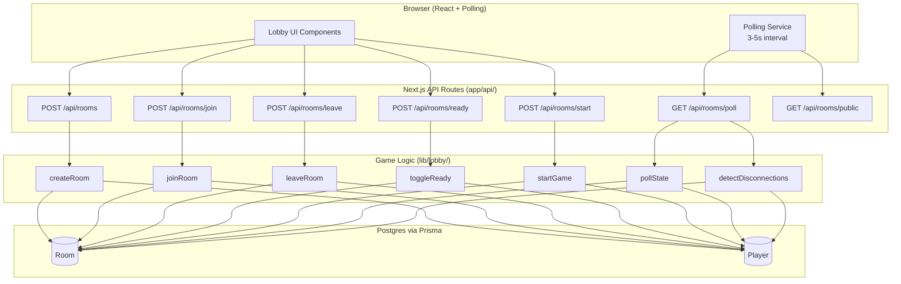

# Design Document: Lobby & Player Join

## Overview

The Lobby & Player Join system manages the full lifecycle of game rooms — from creation and player joining, through readiness signaling, to game-start transition. It also handles host transfer, player departure, and disconnection detection during active games.

The system operates under a turn-based/async multiplayer model: no WebSockets. Clients poll every 3–5 seconds for state updates, and the server uses polling timestamps as liveness signals for disconnection detection.

### Key Design Decisions

1. **Polling as liveness** — Instead of maintaining persistent connections, the server records `lastActivityAt` on every poll. A player who hasn't polled within the timeout threshold (10s) is marked disconnected. This trades ~3–5s staleness for dramatically simpler infrastructure.

2. **Optimistic concurrency on joins** — The 4-player cap is enforced at the database level via a check constraint and a transaction that reads+increments the player count atomically. This prevents race conditions when multiple players attempt to join a public room simultaneously.

3. **Room codes as primary join key** — All rooms (public and private) are joinable by code. Public rooms are additionally listed in a browsable directory. The code is 6 alphanumeric characters, case-insensitive, stored uppercase.

4. **Stateless API routes** — Each API route handler validates input, calls a game-logic function in `lib/lobby/`, and returns the result. No server-side session state beyond the database.

5. **Single-room constraint** — A player can only be a member of one room at a time. This simplifies state management and prevents conflicting game sessions.

## Architecture



### Request Flow

1. Client sends an API request (create, join, leave, toggle ready, start, or poll).
2. API route handler validates input shape (TypeScript types enforced).
3. Handler calls the corresponding function in `lib/lobby/`.
4. Logic function opens a Prisma transaction, performs validation against current DB state, mutates as needed, and returns a result or error.
5. API route returns the result as JSON.

### Disconnection Detection Flow

Disconnection detection is piggybacked on the poll endpoint rather than running as a separate cron:

1. When a player polls, their `lastActivityAt` is updated.
2. On every poll response, the server checks all players in the room. Any player whose `lastActivityAt` is older than the timeout threshold (10s) is marked `disconnected`.
3. For rooms in "waiting" status, a disconnected host triggers host-transfer logic.
4. For rooms in "in-progress" status, disconnected players' turns are skipped automatically.
5. If all players in a game are disconnected for 60s, the room is marked "abandoned".
6. If a single player remains disconnected for 5 consecutive minutes during a game, they are permanently removed (forfeited).

## Components and Interfaces

### API Route Handlers

All routes live under `app/api/rooms/`. Each is a thin validation layer that delegates to `lib/lobby/`.

| Route | Method | Purpose |
|-------|--------|---------|
| `app/api/rooms/route.ts` | POST | Create a new room |
| `app/api/rooms/join/route.ts` | POST | Join a room via Room_Code |
| `app/api/rooms/leave/route.ts` | POST | Leave current room |
| `app/api/rooms/ready/route.ts` | POST | Toggle ready state |
| `app/api/rooms/start/route.ts` | POST | Start the game (host only) |
| `app/api/rooms/poll/route.ts` | GET | Poll current lobby state |
| `app/api/rooms/public/route.ts` | GET | List public rooms |

### Lobby Engine Functions (`lib/lobby/`)

```typescript
// lib/lobby/create-room.ts
export async function createRoom(params: {
  playerId: string;
  displayName: string;
  visibility: "public" | "private";
}): Promise<CreateRoomResult>;

// lib/lobby/join-room.ts
export async function joinRoom(params: {
  playerId: string;
  displayName: string;
  roomCode: string;
}): Promise<JoinRoomResult>;

// lib/lobby/leave-room.ts
export async function leaveRoom(params: {
  playerId: string;
}): Promise<LeaveRoomResult>;

// lib/lobby/toggle-ready.ts
export async function toggleReady(params: {
  playerId: string;
}): Promise<ToggleReadyResult>;

// lib/lobby/start-game.ts
export async function startGame(params: {
  playerId: string;
}): Promise<StartGameResult>;

// lib/lobby/poll-state.ts
export async function pollState(params: {
  playerId: string;
}): Promise<PollStateResult>;

// lib/lobby/list-public-rooms.ts
export async function listPublicRooms(): Promise<PublicRoomListResult>;
```

### Shared Types (`lib/lobby/types.ts`)

```typescript
export type RoomStatus = "waiting" | "in-progress" | "abandoned";
export type PlayerStatus = "connected" | "disconnected";
export type ReadyState = "ready" | "not-ready";
export type RoomVisibility = "public" | "private";

export interface LobbyPlayer {
  id: string;
  displayName: string;
  isHost: boolean;
  readyState: ReadyState;
  status: PlayerStatus;
  turnPosition: number | null;
}

export interface LobbyState {
  roomCode: string;
  status: RoomStatus;
  visibility: RoomVisibility;
  players: LobbyPlayer[];
  hostId: string;
}

export interface CreateRoomResult {
  success: true;
  roomCode: string;
  state: LobbyState;
}

export interface JoinRoomResult {
  success: true;
  state: LobbyState;
}

export interface LeaveRoomResult {
  success: true;
  roomDeleted: boolean;
}

export interface ToggleReadyResult {
  success: true;
  newReadyState: ReadyState;
}

export interface StartGameResult {
  success: true;
  turnOrder: { playerId: string; position: number }[];
}

export interface PollStateResult {
  success: true;
  state: LobbyState;
}

export interface PublicRoomListResult {
  rooms: {
    roomCode: string;
    hostName: string;
    playerCount: number;
  }[];
}

export interface LobbyError {
  success: false;
  error: string;
  code: LobbyErrorCode;
}

export type LobbyErrorCode =
  | "ROOM_NOT_FOUND"
  | "ROOM_FULL"
  | "GAME_ALREADY_STARTED"
  | "ALREADY_IN_ROOM"
  | "MUST_LEAVE_CURRENT_ROOM"
  | "INSUFFICIENT_PLAYERS"
  | "PLAYERS_NOT_READY"
  | "NOT_HOST"
  | "NOT_IN_ROOM"
  | "CANNOT_LEAVE_ACTIVE_GAME"
  | "INVALID_INPUT";
```

### Room Code Generator (`lib/lobby/room-code.ts`)

```typescript
// Generates a unique 6-character alphanumeric code (uppercase).
// Retries on collision (checked against active rooms in DB).
export async function generateRoomCode(): Promise<string>;
```

### Disconnection Manager (`lib/lobby/disconnection.ts`)

```typescript
// Called during poll to detect and handle disconnected players.
export async function processDisconnections(roomId: string): Promise<void>;

// Called by a periodic check (or on poll) for rooms where all players are disconnected.
export async function checkAbandonedRooms(): Promise<void>;
```

### Client-Side Polling Hook (`lib/hooks/use-lobby-poll.ts`)

```typescript
export function useLobbyPoll(roomCode: string | null): {
  state: LobbyState | null;
  error: string | null;
  isLoading: boolean;
};
```

## Data Models

### Prisma Schema

```prisma
model Room {
  id          String         @id @default(cuid())
  code        String         @unique @db.VarChar(6)
  status      String         @default("waiting") // "waiting" | "in-progress" | "abandoned"
  visibility  String         @default("private") // "public" | "private"
  playerCount Int            @default(0)
  createdAt   DateTime       @default(now())
  updatedAt   DateTime       @updatedAt
  players     RoomPlayer[]

  @@index([status, visibility, playerCount]) // For public room listing query
  @@index([code])
}

model RoomPlayer {
  id              String   @id @default(cuid())
  playerId        String   // External player identifier (from auth or session)
  displayName     String   @db.VarChar(30)
  roomId          String
  room            Room     @relation(fields: [roomId], references: [id], onDelete: Cascade)
  isHost          Boolean  @default(false)
  readyState      String   @default("not-ready") // "ready" | "not-ready"
  status          String   @default("connected") // "connected" | "disconnected"
  turnPosition    Int?     // Assigned on game start (1-based)
  joinedAt        DateTime @default(now())
  lastActivityAt  DateTime @default(now())
  disconnectedAt  DateTime? // Set when status transitions to "disconnected"

  @@unique([playerId, roomId])
  @@unique([playerId]) // Single-room constraint: a player can only be in one room
  @@index([roomId, status])
  @@index([lastActivityAt])
}
```

### Key Data Invariants

1. **Single-room constraint**: The `@@unique([playerId])` on `RoomPlayer` guarantees a player can only exist in one room at a time.
2. **Player count consistency**: `Room.playerCount` is always equal to the count of `RoomPlayer` records for that room (including disconnected players). Updated within the same transaction as player insert/delete.
3. **Player cap**: `Room.playerCount` never exceeds 4. Enforced in application logic within a serializable transaction.
4. **Code uniqueness**: `Room.code` has a unique constraint ensuring no two active rooms share a code.
5. **Host invariant**: Every room in "waiting" or "in-progress" status has exactly one player with `isHost = true`.

### Player Identity

For MVP, player identity is session-based. A unique `playerId` is generated client-side (or via a lightweight server-side session cookie) and persisted in the browser. This avoids requiring a full auth system while still enforcing the single-room constraint.

```typescript
// lib/auth/player-session.ts
export function getOrCreatePlayerId(req: Request): string;
```

This can be upgraded to a proper auth system later without changing the lobby logic — all functions accept a `playerId` parameter and are agnostic to how it's generated.

## Correctness Properties

*A property is a characteristic or behavior that should hold true across all valid executions of a system — essentially, a formal statement about what the system should do. Properties serve as the bridge between human-readable specifications and machine-verifiable correctness guarantees.*

### Property 1: Room creation produces valid initial state

*For any* valid display name and player ID where the player is not already in a room, creating a room SHALL produce a room with: a 6-character uppercase alphanumeric code unique across active rooms, status "waiting", playerCount of 1, and the creator assigned as host with readyState "not-ready".

**Validates: Requirements 1.1, 1.2, 1.3, 1.4**

### Property 2: Single-room constraint

*For any* player who is already a member of a room, attempting to create a new room or join a different room SHALL always fail with a "must leave current room" error, and the existing room state SHALL remain unchanged.

**Validates: Requirements 1.5, 2.5, 2.6**

### Property 3: Join succeeds only when all preconditions are met

*For any* join attempt, it succeeds if and only if: the room code matches an active room (case-insensitive), the room is in "waiting" status, the room has fewer than 4 players, and the requesting player is not already in any room. The newly joined player's readyState SHALL be "not-ready".

**Validates: Requirements 2.1, 2.2, 2.3, 2.4, 5.1**

### Property 4: Player count invariant

*For any* sequence of join, leave, and disconnect operations on a room, the player count SHALL never exceed 4 and SHALL always equal the actual number of RoomPlayer records associated with that room.

**Validates: Requirements 3.1, 3.2, 3.3, 10.5, 10.6**

### Property 5: Player count arithmetic

*For any* successful join operation, the room's player count increases by exactly 1. *For any* successful leave or player removal, the room's player count decreases by exactly 1.

**Validates: Requirements 3.3, 7.1**

### Property 6: Game start preconditions

*For any* start-game request, it succeeds if and only if: the requester is the host, the room has at least 2 players, and all non-host players have readyState "ready". When it succeeds, the room transitions to "in-progress".

**Validates: Requirements 4.1, 4.2, 4.3, 5.3, 8.1**

### Property 7: Ready toggle is an involution

*For any* player in a room, toggling their ready state twice returns them to their original ready state. A single toggle flips "ready" to "not-ready" and vice versa.

**Validates: Requirements 5.2**

### Property 8: Membership changes reset readiness

*For any* room with players, when a new player joins or an existing player leaves, all remaining players' readiness states SHALL be reset to "not-ready".

**Validates: Requirements 5.4, 7.2**

### Property 9: Host transfer preserves room continuity

*For any* room in "waiting" status where the host leaves (explicitly or via disconnection timeout) and at least one other player remains, the remaining player with the earliest join timestamp SHALL become the new host with readyState "not-ready", while all other players' readiness states are preserved. If no other players remain, the room SHALL be deleted.

**Validates: Requirements 6.1, 6.2, 6.4, 6.5**

### Property 10: Turn positions form a valid permutation

*For any* game start with N players, the assigned turn positions SHALL form a permutation of the integers 1 through N — each player gets a unique position and all positions in the range are used.

**Validates: Requirements 8.2**

### Property 11: Cannot leave during active game

*For any* player in a room with status "in-progress", attempting to leave SHALL always fail with a "cannot leave active game" error.

**Validates: Requirements 7.4**

### Property 12: Poll response completeness

*For any* valid poll request from a player in a room, the response SHALL contain the full player list with readiness states, the host identity, and the room status. Additionally, the polling player's lastActivityAt SHALL be updated to the current server time.

**Validates: Requirements 9.1, 9.3**

### Property 13: Public room listing correctness

*For any* set of rooms in the system, the public room list SHALL contain exactly those rooms where visibility is "public", status is "waiting", and playerCount is less than 4 — up to a maximum of 50 rooms, ordered by most recently created first.

**Validates: Requirements 10.2, 10.3, 10.8**

### Property 14: Disconnection detection and reconnection

*For any* player whose lastActivityAt is older than the disconnection timeout threshold (10s), the system SHALL mark them as "disconnected". *For any* disconnected player who subsequently polls successfully, the system SHALL restore their status to "connected".

**Validates: Requirements 11.1, 11.3**

### Property 15: Disconnected player turn skipping

*For any* turn in a game where the current player's status is "disconnected", the system SHALL skip that player's turn and advance to the next connected player in sequence without waiting.

**Validates: Requirements 11.2, 11.4**

### Property 16: Room abandonment on total disconnection

*For any* room in "in-progress" status where all players have been marked "disconnected" for at least 60 seconds with no reconnections, the system SHALL transition the room status to "abandoned".

**Validates: Requirements 11.7**

### Property 17: Forfeit on extended disconnection

*For any* player who remains in "disconnected" status for more than 5 consecutive minutes during an "in-progress" game, the system SHALL permanently remove that player from the game session.

**Validates: Requirements 11.8**

## Error Handling

### Error Response Format

All API routes return errors in a consistent JSON format:

```typescript
{
  success: false,
  error: string,   // Human-readable message
  code: string     // Machine-readable error code from LobbyErrorCode
}
```

HTTP status codes:
- `400 Bad Request` — Invalid input (missing fields, wrong types)
- `404 Not Found` — Room not found, player not in room
- `409 Conflict` — State conflicts (room full, already in room, game started, not ready)
- `403 Forbidden` — Authorization failures (not host)
- `500 Internal Server Error` — Unexpected failures

### Error Categories

| Error Code | HTTP Status | Trigger |
|------------|-------------|---------|
| `INVALID_INPUT` | 400 | Missing or malformed request body fields |
| `ROOM_NOT_FOUND` | 404 | Room code doesn't match any active room |
| `NOT_IN_ROOM` | 404 | Player polls but isn't in any room |
| `ROOM_FULL` | 409 | Room already has 4 players |
| `GAME_ALREADY_STARTED` | 409 | Room is in "in-progress" or "abandoned" status |
| `ALREADY_IN_ROOM` | 409 | Player tries to join a room they're already in |
| `MUST_LEAVE_CURRENT_ROOM` | 409 | Player is in another room |
| `INSUFFICIENT_PLAYERS` | 409 | Fewer than 2 players when host tries to start |
| `PLAYERS_NOT_READY` | 409 | At least one non-host player is not ready |
| `NOT_HOST` | 403 | Non-host tries to start the game |
| `CANNOT_LEAVE_ACTIVE_GAME` | 409 | Player tries to leave during "in-progress" |

### Transaction Failure Handling

All state-mutating operations run inside Prisma transactions. On transaction failure (e.g., serialization conflict during concurrent joins):

1. The operation is retried once with a short delay (50ms).
2. If the retry also fails, a 409 Conflict is returned with the appropriate error code.
3. No partial state changes are persisted — transactions ensure atomicity.

### Input Validation

- `displayName`: Required, 1–30 characters, trimmed of leading/trailing whitespace, no empty/whitespace-only strings.
- `roomCode`: Required, exactly 6 characters, alphanumeric only, normalized to uppercase before lookup.
- `visibility`: Required on create, must be exactly "public" or "private".
- `playerId`: Extracted from session/cookie, required on all requests.

## Testing Strategy

### Test Framework

- **Vitest** as the test runner (fast, TypeScript-native, compatible with Next.js).
- **fast-check** for property-based testing (mature JS/TS PBT library).
- Tests live alongside source files or in a parallel `__tests__/` directory structure.

### Unit Tests (Example-Based)

Each `lib/lobby/` function gets example-based tests covering:

- Happy path with specific concrete inputs
- Each error condition with a specific trigger
- Edge cases: empty strings, max-length names, boundary player counts

Target: Every game-logic function in `lib/lobby/` ships with at least one unit test (per project convention).

### Property-Based Tests

Each correctness property from the design maps to a single `fast-check` property test with a minimum of 100 iterations.

Test tag format: `// Feature: lobby-player-join, Property {N}: {title}`

Property tests will use:
- **Arbitraries** for generating random display names (1–30 char alphanumeric strings), player IDs (CUIDs), room states (varying player counts 0–4, statuses, readiness combinations).
- **Model-based testing** for the player count invariant (Property 4) — generate random sequences of join/leave/disconnect operations and verify the count never exceeds 4.
- **In-memory Prisma mock** or test database for transaction testing.

### API Route Tests

Every API route gets at least one integration test:
- Verifies request validation (rejects bad input)
- Verifies correct delegation to engine function
- Verifies HTTP status codes and response shapes

### Concurrency Tests

For the concurrent join scenario (Property 4, Requirement 10.5):
- Spawn multiple parallel join requests against a room with 1 slot remaining.
- Verify exactly one succeeds and the final player count is 4.
- Run against a real Postgres instance (not mocked) to test actual transaction isolation.

### Test File Organization

```
lib/lobby/__tests__/
  create-room.test.ts        # Unit + property tests for createRoom
  join-room.test.ts          # Unit + property tests for joinRoom
  leave-room.test.ts         # Unit + property tests for leaveRoom
  toggle-ready.test.ts       # Unit + property tests for toggleReady
  start-game.test.ts         # Unit + property tests for startGame
  poll-state.test.ts         # Unit + property tests for pollState
  disconnection.test.ts      # Unit + property tests for disconnection logic
  room-code.test.ts          # Property tests for code generation
  lobby-model.test.ts        # Model-based property test (random operation sequences)
app/api/rooms/__tests__/
  rooms.route.test.ts        # Integration test for POST /api/rooms
  join.route.test.ts         # Integration test for POST /api/rooms/join
  ...
```

