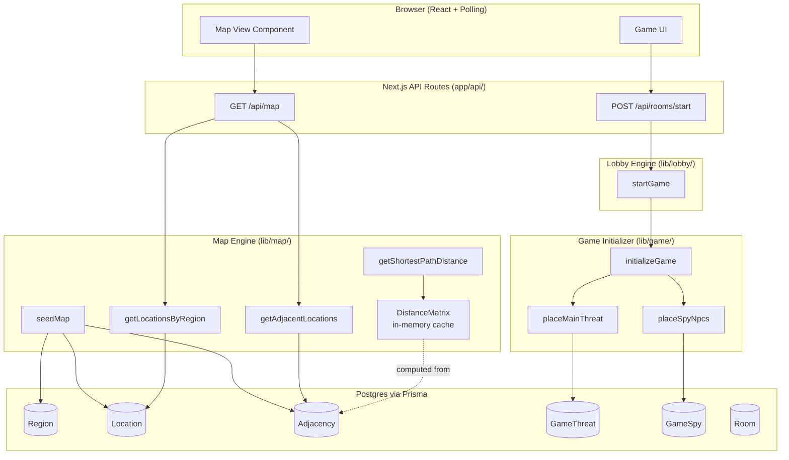
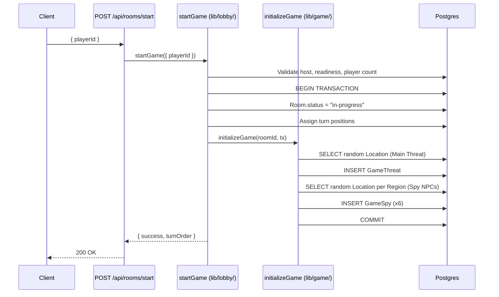
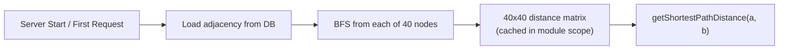

# Design Document: Map & Game Initialization

## Overview

The Map & Game Initialization system manages two distinct concerns:

1. **Static Map Data** — A fixed graph of 40 Locations across 6 Regions connected by 72 adjacency edges, seeded once into Postgres via Prisma and served read-only at runtime.
2. **Dynamic Game Initialization** — Per-session placement of hidden entities (Main Threat + 6 Spy NPCs) triggered atomically when the host starts a game via the existing lobby `startGame` function.

The map is static and never changes after seeding. The adjacency graph is hand-authored based on real-world geographic proximity, with a diameter of 6 and every Location possessing a unique shortest-path distance vector (guaranteeing unambiguous clue deduction). Clues returned to players are exact step counts (integers 0–6), not proximity tiers.

### Key Design Decisions

1. **Precomputed distance matrix** — Since the map is static (40 nodes, 72 edges), the full 40x40 shortest-path distance matrix is computed via BFS at server startup and cached in memory. This avoids repeated BFS per clue query while the matrix is small (~1.6 KB).

2. **Seed script as Prisma seed** — Map data is populated via `prisma/seed.ts`, compatible with `prisma db seed`. The script is idempotent: it uses upserts and checks existing data before inserting.

3. **Atomic game initialization** — Entity placement (Main Threat + Spy NPCs) and the Room status transition to "in-progress" happen in a single Prisma transaction, integrated into the existing `startGame` function. A failure rolls back to "waiting".

4. **Canonical edge ordering** — Adjacency edges store the two Location IDs in lexicographic order (`locationAId < locationBId`), enforced by a database check constraint and unique index. This prevents duplicate edges in either direction.

5. **Hidden state isolation** — Game state records (`GameThreat`, `GameSpy`) are never included in any API response. The read-only map API returns only structural data (regions, locations, adjacency). Clue values are computed server-side and returned individually per Investigate action.

6. **Cacheable map API** — Since map data is immutable after seeding, the `GET /api/map` endpoint returns `Cache-Control: public, max-age=86400, immutable` headers. Clients can cache indefinitely.

## Architecture



### Integration with Lobby

The existing `startGame` function in `lib/lobby/start-game.ts` handles lobby validation (host check, player readiness, minimum players). After those checks pass, it calls `initializeGame(roomId, tx)` within the same transaction that transitions the Room to "in-progress" and assigns turn positions.



### Distance Matrix Initialization



The distance matrix is lazily initialized on first use and cached in module scope (persists across requests within the same server instance). On Vercel serverless, cold starts recompute it — acceptable given the ~40 BFS traversals on a 40-node graph complete in <1ms.

## Components and Interfaces

### Map Engine (`lib/map/`)

```typescript
// lib/map/seed.ts
// Prisma seed script — called via `prisma db seed`
export async function seedMap(): Promise<void>;

// lib/map/adjacency.ts
export async function getAdjacentLocations(locationId: string): Promise<Location[]>;
export async function getAllAdjacencyEdges(): Promise<AdjacencyEdge[]>;

// lib/map/regions.ts
export async function getLocationsByRegion(regionId: string): Promise<Location[]>;
export async function getAllRegions(): Promise<RegionWithLocations[]>;

// lib/map/distance.ts
export function getShortestPathDistance(locationA: string, locationB: string): number;
export function getDistanceMatrix(): Map<string, Map<string, number>>;
export async function initializeDistanceMatrix(): Promise<void>;

// lib/map/get-map-data.ts
export async function getFullMapData(): Promise<MapData>;
```

### Game Initializer (`lib/game/`)

```typescript
// lib/game/initialize-game.ts
import { PrismaClient } from "@/app/generated/prisma/client";

export async function initializeGame(
  roomId: string,
  tx: Omit<PrismaClient, "$connect" | "$disconnect" | "$on" | "$transaction" | "$use" | "$extends">
): Promise<InitializeGameResult>;

// lib/game/place-threat.ts
export async function placeMainThreat(
  roomId: string,
  allLocationIds: string[],
  tx: TransactionClient
): Promise<string>; // Returns the chosen locationId

// lib/game/place-spies.ts
export async function placeSpyNpcs(
  roomId: string,
  regionLocations: Map<string, string[]>, // regionId → locationId[]
  tx: TransactionClient
): Promise<SpyPlacement[]>;

// lib/game/query-game-state.ts (server-side only)
export async function getGameState(roomId: string): Promise<GameState>;
export async function markSpyCaptured(spyId: string, capturedByPlayerId: string): Promise<void>;
```

### Map API Route (`app/api/map/`)

```typescript
// app/api/map/route.ts
// GET — Returns full map structure (regions, locations, adjacency)
// Cacheable, no auth required, no game state included
export async function GET(): Promise<Response>;
```

### Shared Types (`lib/map/types.ts`)

```typescript
export interface Region {
  id: string;
  name: string;
  hubLocationId: string;
}

export interface Location {
  id: string;
  name: string;
  regionId: string;
  isHub: boolean;
}

export interface AdjacencyEdge {
  id: string;
  locationAId: string;
  locationBId: string;
  isSameRegion: boolean;
}

export interface RegionWithLocations extends Region {
  locations: Location[];
}

export interface MapData {
  regions: RegionWithLocations[];
  adjacency: AdjacencyListEntry[];
}

export interface AdjacencyListEntry {
  locationId: string;
  adjacentLocationIds: string[];
  edges: { targetLocationId: string; isSameRegion: boolean }[];
}
```

### Game Types (`lib/game/types.ts`)

```typescript
export interface GameState {
  roomId: string;
  threat: {
    id: string;
    locationId: string;
  };
  spies: SpyPlacement[];
}

export interface SpyPlacement {
  id: string;
  regionId: string;
  locationId: string;
  captured: boolean;
  capturedByPlayerId: string | null;
}

export interface InitializeGameResult {
  success: true;
  threatLocationId: string;
  spyPlacements: SpyPlacement[];
}

export interface GameInitError {
  success: false;
  error: string;
  code: "INITIALIZATION_FAILED" | "NO_LOCATIONS_FOUND";
}

export type TransactionClient = Omit<
  PrismaClient,
  "$connect" | "$disconnect" | "$on" | "$transaction" | "$use" | "$extends"
>;
```

## Data Models

### Prisma Schema Additions

```prisma
model Region {
  id            String     @id @default(cuid())
  name          String     @unique
  hubLocationId String?    @unique  // Set after Location is created
  hubLocation   Location?  @relation("RegionHub", fields: [hubLocationId], references: [id])
  locations     Location[] @relation("RegionLocations")

  @@map("regions")
}

model Location {
  id        String  @id @default(cuid())
  name      String  @unique
  regionId  String
  isHub     Boolean @default(false)

  region         Region          @relation("RegionLocations", fields: [regionId], references: [id])
  hubOfRegion    Region?         @relation("RegionHub")
  adjacencyA     Adjacency[]     @relation("AdjacencyLocationA")
  adjacencyB     Adjacency[]     @relation("AdjacencyLocationB")
  gameThreat     GameThreat[]
  gameSpies      GameSpy[]

  @@index([regionId])
  @@map("locations")
}

model Adjacency {
  id            String  @id @default(cuid())
  locationAId   String
  locationBId   String
  isSameRegion  Boolean

  locationA  Location @relation("AdjacencyLocationA", fields: [locationAId], references: [id], onDelete: Cascade)
  locationB  Location @relation("AdjacencyLocationB", fields: [locationBId], references: [id], onDelete: Cascade)

  // Canonical ordering: locationAId < locationBId (enforced in application + check constraint)
  @@unique([locationAId, locationBId])
  @@index([locationAId])
  @@index([locationBId])
  @@map("adjacencies")
}

model GameThreat {
  id          String   @id @default(cuid())
  roomId      String   @unique  // One threat per game session
  locationId  String
  createdAt   DateTime @default(now())

  room     Room     @relation(fields: [roomId], references: [id], onDelete: Cascade)
  location Location @relation(fields: [locationId], references: [id])

  @@map("game_threats")
}

model GameSpy {
  id                  String   @id @default(cuid())
  roomId              String
  regionId            String
  locationId          String
  captured            Boolean  @default(false)
  capturedByPlayerId  String?
  createdAt           DateTime @default(now())

  room     Room     @relation(fields: [roomId], references: [id], onDelete: Cascade)
  location Location @relation(fields: [locationId], references: [id])

  @@unique([roomId, regionId])  // One spy per region per game
  @@index([roomId])
  @@map("game_spies")
}
```

### Schema Changes to Existing `Room` Model

The `Room` model needs relation fields added for `GameThreat` and `GameSpy`:

```prisma
model Room {
  // ... existing fields ...
  gameThreat  GameThreat?
  gameSpies   GameSpy[]
}
```

### Key Data Invariants

1. **One threat per game**: `GameThreat.roomId` has a `@unique` constraint — exactly one Main Threat per Room.
2. **One spy per region per game**: `@@unique([roomId, regionId])` on `GameSpy` ensures exactly one Spy NPC per Region per game session.
3. **Canonical edge ordering**: `@@unique([locationAId, locationBId])` with application-enforced `locationAId < locationBId` prevents duplicate edges.
4. **Referential integrity**: All foreign keys (regionId, locationId, roomId) are enforced. Cascade deletes on Room ensure game state is cleaned up when a room is removed.
5. **Region hub uniqueness**: `Region.hubLocationId` has `@unique`, ensuring each Location can only be the hub of one Region, and each Region has at most one hub.
6. **Location uniqueness**: `Location.name` is unique globally — no two cities share a name.
7. **No self-loops**: Application logic ensures `locationAId !== locationBId` on every adjacency insert. Can be reinforced with a database check constraint.
8. **Graph connectivity**: Ensured by the seed data and verified by a post-seed validation step.

### Distance Matrix (In-Memory)

The distance matrix is not stored in the database. It's computed at runtime from the adjacency graph:

```typescript
// Conceptual structure — stored as Map<string, Map<string, number>>
// distanceMatrix.get(locationAId)!.get(locationBId) → integer 0–6

// Computed via BFS from each of 40 locations
// Total entries: 40 * 40 = 1,600 (trivial memory footprint)
// Initialized lazily on first distance query
```

### Seed Data Structure

The seed script (`prisma/seed.ts`) contains the authoritative map definition as a TypeScript constant:

```typescript
const MAP_DATA = {
  regions: [
    { name: "Europe", hub: "London", locations: ["London", "Paris", "Berlin", "Rome", "Madrid", "Vienna", "Warsaw", "Athens"] },
    { name: "Asia", hub: "Tokyo", locations: ["Tokyo", "Beijing", "Seoul", "Bangkok", "New Delhi", "Jakarta", "Manila", "Hanoi"] },
    { name: "Africa", hub: "Cairo", locations: ["Cairo", "Nairobi", "Lagos", "Pretoria", "Accra", "Addis Ababa", "Casablanca", "Dar es Salaam", "Cape Town"] },
    { name: "North America", hub: "Washington D.C.", locations: ["Washington D.C.", "Ottawa", "Mexico City", "Havana", "Panama City", "Toronto"] },
    { name: "South America", hub: "Brasília", locations: ["Brasília", "Buenos Aires", "Lima", "Bogotá", "Santiago"] },
    { name: "Oceania", hub: "Canberra", locations: ["Canberra", "Wellington", "Suva", "Auckland"] },
  ],
  intraRegionEdges: [
    // Europe (14)
    ["London", "Paris"], ["London", "Madrid"], ["London", "Berlin"], ["Paris", "Madrid"],
    ["Paris", "Berlin"], ["Paris", "Rome"], ["Paris", "Vienna"], ["Berlin", "Warsaw"],
    ["Berlin", "Vienna"], ["Warsaw", "Vienna"], ["Vienna", "Rome"], ["Vienna", "Athens"],
    ["Rome", "Athens"], ["Rome", "Madrid"],
    // Asia (11)
    ["Tokyo", "Seoul"], ["Tokyo", "Beijing"], ["Tokyo", "Manila"], ["Seoul", "Beijing"],
    ["Beijing", "Hanoi"], ["Beijing", "New Delhi"], ["Hanoi", "Bangkok"], ["Hanoi", "Manila"],
    ["Bangkok", "New Delhi"], ["Bangkok", "Jakarta"], ["Jakarta", "Manila"],
    // Africa (11)
    ["Cairo", "Addis Ababa"], ["Cairo", "Casablanca"], ["Cairo", "Nairobi"],
    ["Casablanca", "Accra"], ["Accra", "Lagos"], ["Lagos", "Nairobi"],
    ["Lagos", "Cape Town"], ["Addis Ababa", "Nairobi"], ["Nairobi", "Dar es Salaam"],
    ["Dar es Salaam", "Pretoria"], ["Pretoria", "Cape Town"],
    // North America (8)
    ["Washington D.C.", "Toronto"], ["Washington D.C.", "Ottawa"], ["Washington D.C.", "Havana"],
    ["Washington D.C.", "Mexico City"], ["Ottawa", "Toronto"], ["Havana", "Mexico City"],
    ["Havana", "Panama City"], ["Mexico City", "Panama City"],
    // South America (6)
    ["Brasília", "Bogotá"], ["Brasília", "Buenos Aires"], ["Brasília", "Lima"],
    ["Bogotá", "Lima"], ["Lima", "Santiago"], ["Buenos Aires", "Santiago"],
    // Oceania (5)
    ["Canberra", "Auckland"], ["Canberra", "Wellington"], ["Canberra", "Suva"],
    ["Auckland", "Wellington"], ["Auckland", "Suva"],
  ],
  interRegionEdges: [
    // Hub-to-Hub (7)
    ["London", "Tokyo"], ["London", "Cairo"], ["London", "Washington D.C."],
    ["Tokyo", "Cairo"], ["Tokyo", "Canberra"], ["Cairo", "Brasília"],
    ["Washington D.C.", "Brasília"],
    // Non-Hub (10)
    ["Madrid", "Casablanca"], ["Athens", "Cairo"], ["New Delhi", "Cairo"],
    ["Panama City", "Bogotá"], ["Jakarta", "Canberra"], ["Cape Town", "Brasília"],
    ["Auckland", "Santiago"], ["Tokyo", "Mexico City"], ["Beijing", "Toronto"],
    ["Suva", "Manila"],
  ],
};
```

## Correctness Properties

*A property is a characteristic or behavior that should hold true across all valid executions of a system — essentially, a formal statement about what the system should do. Properties serve as the bridge between human-readable specifications and machine-verifiable correctness guarantees.*

### Property 1: Adjacency bidirectionality

*For any* adjacency edge (A, B) in the graph, querying the adjacent locations of A SHALL include B, and querying the adjacent locations of B SHALL include A.

**Validates: Requirements 1.4, 2.8, 3.19**

### Property 2: No self-loops

*For any* adjacency edge in the graph, the two endpoint Locations SHALL be distinct (locationAId !== locationBId).

**Validates: Requirements 1.7, 2.11, 11.5**

### Property 3: Minimum adjacency degree

*For any* Location in the map, the number of adjacent Locations (its degree) SHALL be at least 2.

**Validates: Requirements 1.6**

### Property 4: Canonical edge ordering

*For any* adjacency edge stored in the database, locationAId SHALL be lexicographically less than locationBId.

**Validates: Requirements 11.4**

### Property 5: Region subgraph connectivity

*For any* Region, the subgraph induced by that Region's Locations and intra-region edges SHALL be connected — every Location in the Region is reachable from every other Location in the same Region without crossing Region boundaries.

**Validates: Requirements 2.10**

### Property 6: Full graph connectivity

*For any* Location used as a starting node, a BFS traversal over the full adjacency graph (including inter-region edges) SHALL reach all 40 Locations.

**Validates: Requirements 11.6**

### Property 7: Shortest-path distance correctness

*For any* pair of Locations (A, B), the value returned by `getShortestPathDistance(A, B)` SHALL equal the minimum number of edges in any path from A to B in the full adjacency graph, computed via independent BFS.

**Validates: Requirements 5.3, 5.4, 5.6**

### Property 8: Distance range bounded by diameter

*For any* pair of Locations (A, B), the shortest-path distance SHALL be an integer in the inclusive range [0, 6], where 6 is the graph diameter.

**Validates: Requirements 5.7**

### Property 9: Unique distance vectors

*For any* two distinct Locations A and B, their shortest-path distance vectors (the ordered list of distances from that Location to all 40 Locations) SHALL differ in at least one entry.

**Validates: Requirements 11.8**

### Property 10: Adjacency query correctness

*For any* Location, the set of Locations returned by `getAdjacentLocations` SHALL equal exactly the set of Locations that share an adjacency edge with it in the stored edge list — no more, no less.

**Validates: Requirements 5.1, 2.9**

### Property 11: isSameRegion flag correctness

*For any* adjacency edge in the map API response, the `isSameRegion` flag SHALL be `true` if and only if both endpoint Locations belong to the same Region.

**Validates: Requirements 10.3**

### Property 12: Seed idempotency

*For any* number of consecutive executions of the seed script (N >= 1), the resulting database state SHALL contain exactly 6 Regions, 40 Locations, and 72 adjacency edges — identical to the state after a single execution.

**Validates: Requirements 4.1, 4.3**

### Property 13: Game initialization produces exactly one threat

*For any* successful game initialization, exactly one GameThreat record SHALL be created for the Room, and its locationId SHALL reference a valid Location from the full set of 40.

**Validates: Requirements 7.1, 9.1**

### Property 14: Game initialization produces one spy per region

*For any* successful game initialization, exactly 6 GameSpy records SHALL be created (one per Region), and each spy's locationId SHALL reference a Location that belongs to the spy's assigned Region.

**Validates: Requirements 8.1, 8.2, 9.2**

### Property 15: Spy capture records the captor

*For any* valid spy capture operation, the GameSpy record SHALL be updated with `captured = true` and `capturedByPlayerId` set to the capturing player's ID, and no other GameSpy records for the same game SHALL be modified.

**Validates: Requirements 9.3**

## Error Handling

### Error Response Format

All errors follow the same JSON structure used by the lobby module:

```typescript
{
  success: false,
  error: string,   // Human-readable message
  code: string     // Machine-readable error code
}
```

### Map Service Errors

| Error Scenario | HTTP Status | Code | Behavior |
|----------------|-------------|------|----------|
| Seed script fails mid-execution | N/A (CLI) | — | Transaction rollback, error logged to stderr, non-zero exit code |
| Distance matrix not initialized | 500 | `MAP_NOT_READY` | Lazy init triggered; if it fails, 500 returned |
| Location not found in distance query | 400 | `INVALID_LOCATION` | Returned when locationId doesn't exist in the matrix |

### Game Initialization Errors

| Error Scenario | HTTP Status | Code | Behavior |
|----------------|-------------|------|----------|
| No locations found in DB | 500 | `INITIALIZATION_FAILED` | Rollback entire transaction (room stays "waiting") |
| Database constraint violation | 500 | `INITIALIZATION_FAILED` | Rollback entire transaction |
| Duplicate game state (re-init attempt) | 409 | `GAME_ALREADY_STARTED` | Unique constraint on GameThreat.roomId prevents double-init |

### Transaction Atomicity

Game initialization runs inside the same Prisma `$transaction` as the room status change and turn position assignment. If any step fails:

1. The entire transaction rolls back — room status remains "waiting", no GameThreat or GameSpy records are created, no turn positions are assigned.
2. The lobby `startGame` function returns an error to the API route.
3. The API route returns a 500 to the client with a generic "game initialization failed" message (no internal details leaked).

### Seed Script Error Handling

The seed script uses a single Prisma transaction:

```typescript
await prisma.$transaction(async (tx) => {
  // Upsert regions
  // Upsert locations
  // Upsert adjacency edges
  // If any step throws, entire transaction rolls back
});
```

If the transaction fails, the script:
- Logs the error with full stack trace to stderr
- Exits with code 1
- Does NOT leave partial data in the database

### Map API Error Handling

The `GET /api/map` endpoint:
- Returns 500 if the database is unreachable
- Returns 200 with cached data on success
- Never returns game state data (GameThreat, GameSpy) regardless of what query parameters or headers are sent

## Testing Strategy

### Test Framework

- **Vitest** as the test runner (consistent with existing project setup)
- **fast-check** for property-based testing (already in devDependencies)
- Tests live in `__tests__/` directories adjacent to source files

### Unit Tests (Example-Based)

Each module gets example-based tests covering:

| Module | Key Examples |
|--------|-------------|
| `lib/map/seed.ts` | Seed empty DB → correct counts; seed twice → no duplicates; seed with invalid data → rollback |
| `lib/map/adjacency.ts` | Query London → returns known neighbors; query non-existent ID → error |
| `lib/map/distance.ts` | Distance London↔London = 0; Distance London↔Tokyo = 1; Distance Warsaw↔Cape Town = known value |
| `lib/game/initialize-game.ts` | Init with valid room → creates threat + 6 spies; init with non-existent room → error |
| `lib/game/query-game-state.ts` | Query active game → returns all state; query non-existent room → null |
| `app/api/map/route.ts` | GET → 200 with complete map; response excludes game state fields |

### Property-Based Tests

Each correctness property maps to a single `fast-check` property test with minimum 100 iterations.

Test tag format: `// Feature: map-game-initialization, Property {N}: {title}`

**Strategy by property:**

- **Properties 1–6, 8–11** (graph invariants): These operate on the fixed seeded graph. Use `fc.constantFrom(...allLocations)` or `fc.constantFrom(...allEdges)` to randomly sample from the seeded data and verify invariants hold for any sampled element. The randomization ensures all parts of the graph are exercised over 100+ iterations.

- **Property 7** (BFS correctness): Generate random pairs of locations. Compute distance via the cached matrix AND via an independent BFS implementation. Assert equality.

- **Property 9** (unique distance vectors): Generate random pairs of *distinct* locations. Compute both distance vectors and assert they differ.

- **Property 12** (idempotency): Run seed, snapshot counts. Run seed again, assert counts unchanged. (Lower iteration count acceptable — 5 repetitions suffice for idempotency.)

- **Properties 13–14** (game initialization): Generate random room setups (valid rooms with 2–4 players). Run `initializeGame`. Assert exactly 1 threat from 40 locations, exactly 6 spies each within their region.

- **Property 15** (spy capture): Generate random valid game states, pick a random spy and player, call `markSpyCaptured`, verify only that spy is updated.

### Integration Tests

| Scenario | What's Verified |
|----------|-----------------|
| `startGame` → `initializeGame` | Full flow: lobby validation + game state creation in single transaction |
| Transaction rollback | Inject failure in initializeGame → room stays "waiting", no game state persisted |
| Map API response shape | GET /api/map → correct structure, no hidden state |
| Map API caching headers | Response includes `Cache-Control: public, max-age=86400, immutable` |
| Hidden state exclusion | After game init, map API and poll responses contain zero game state |

### Test File Organization

```
lib/map/__tests__/
  seed.test.ts                  # Unit + integration tests for seeding
  adjacency.test.ts             # Unit + property tests for adjacency queries
  distance.test.ts              # Unit + property tests for distance computation
  graph-invariants.property.test.ts  # Property tests for graph structure (Properties 1-6, 8-11)
lib/game/__tests__/
  initialize-game.test.ts       # Unit tests for game initialization
  initialize-game.property.test.ts  # Property tests (Properties 13-14)
  query-game-state.test.ts      # Unit tests for game state queries
  spy-capture.property.test.ts  # Property test (Property 15)
app/api/map/__tests__/
  map.route.test.ts             # Integration test for GET /api/map
```

### Test Database Strategy

Property tests and integration tests that touch the database use a dedicated test Postgres instance (configured via `DATABASE_URL` in `.env.test`). Each test file:

1. Seeds the map data in a `beforeAll` hook
2. Creates game-specific data (rooms, threats, spies) in individual test setups
3. Cleans up game-specific data in `afterEach` (map data persists across tests since it's static)
