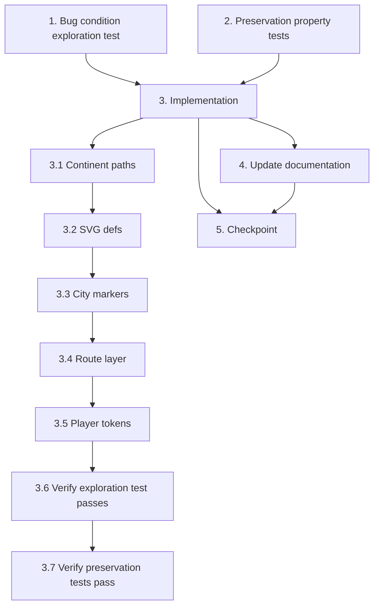

## Overview

Implementation plan for the map visual redesign bugfix. Replaces placeholder/deficient visual elements (abstract continent paths, tiny markers, thin routes, muted token colors) with production-quality rendering while preserving all interactive behavior and accessibility attributes.

## Tasks

# Implementation Plan

- [x] 1. Write bug condition exploration test
  - **Property 1: Bug Condition** - Map Visual Elements Are Deficient
  - **CRITICAL**: This test MUST FAIL on unfixed code — failure confirms the visual defects exist
  - **DO NOT attempt to fix the test or the code when it fails**
  - **NOTE**: This test encodes the expected visual behavior — it will validate the fix when it passes after implementation
  - **GOAL**: Surface counterexamples that demonstrate the visual defects exist in the current components
  - **Scoped PBT Approach**: Scope to concrete assertions on rendered SVG output from the four target components
  - Test assertions (all should FAIL on unfixed code, confirming bug exists):
    - Assert each entry in `CONTINENT_PATHS` has path complexity > 40 points (current: 10–15 points)
    - Assert each continent path bounding box spans its expected proportional area of the 1000×500 viewBox (current: undersized ~90×80 units for Europe)
    - Render `CityMarkers` with hub locations and assert `<text>` elements are present for hub city labels (current: zero text elements)
    - Assert non-hub marker radius is >= 5/zoom (current: 4/zoom)
    - Render `RouteLayer` and assert all routes have `strokeWidth >= 1.5` (current: strokeWidth=1)
    - Assert `PlayerTokens` renders tokens with brighter color palette classes (current: `fill-blue-500` etc.)
  - Run tests on UNFIXED code
  - **EXPECTED OUTCOME**: Tests FAIL (this is correct — it proves the visual defects exist)
  - Document counterexamples: continent paths have 10–15 points, zero `<text>` labels, strokeWidth=1, marker r=4/zoom
  - Mark task complete when tests are written, run, and failure is documented
  - _Requirements: 1.1, 1.2, 1.3, 1.5, 1.7, 1.8, 1.9_

- [x] 2. Write preservation property tests (BEFORE implementing fix)
  - **Property 2: Preservation** - Interactive Behavior and Data Flow Unchanged
  - **IMPORTANT**: Follow observation-first methodology
  - **IMPORTANT**: Write these tests BEFORE implementing the fix
  - Observe on UNFIXED code:
    - `CityMarkers` fires `onMoveSelect(locationId)` when a highlighted legal-move marker is clicked
    - `CityMarkers` keyboard activation (Enter/Space) fires `onMoveSelect` identically to click
    - `CityMarkers` preserves all `role="button"`, `aria-label`, `aria-disabled`, `tabIndex` attributes
    - `RouteLayer` deduplicates edges (each connection drawn once via sorted-id-pair Set)
    - `RouteLayer` applies `opacity-30` class for blocked transport types
    - `RouteLayer` computes bezier control points for plane routes identically
    - `PlayerTokens` renders one token per player at projected coordinates with cluster offsets for co-located players
    - `PlayerTokens` CSS transition animation and reduced-motion query are present
    - `MapViewport` zoom/pan behavior is not affected (component not modified)
  - Write property-based tests capturing these observed behaviors:
    - For random game states with various legal-move sets, clicking a highlighted marker fires `onMoveSelect` with correct `locationId`
    - For random adjacency lists, route deduplication produces exactly one element per unique edge pair
    - For random player configurations with co-located players, cluster offset positions follow the deterministic OFFSETS array
    - Accessibility attributes (`role`, `aria-label`, `aria-disabled`, `tabIndex`) are preserved on all city markers
    - Blocked routes retain `opacity-30` styling
  - Run tests on UNFIXED code
  - **EXPECTED OUTCOME**: Tests PASS (this confirms baseline interactive behavior to preserve)
  - Mark task complete when tests are written, run, and passing on unfixed code
  - _Requirements: 3.1, 3.2, 3.3, 3.4, 3.5, 3.6, 3.7, 3.8_

- [x] 3. Fix for map visual redesign — replace placeholder visuals with production-quality rendering

  - [x] 3.1 Replace `CONTINENT_PATHS` with detailed recognizable continent silhouettes in `world-map.tsx`
    - Replace each of the 6 abstract polygon paths (10–15 points) with detailed stylized silhouettes (60–120 path points each)
    - Each continent path must span its correct geographic extent within the 1000×500 viewBox using equirectangular positioning
    - Europe: ~150×130 units centered around (510, 110)
    - Asia: ~250×150 units spanning east of Europe
    - Africa: ~130×180 units south of Europe
    - North America: ~200×180 units in left portion of viewBox
    - South America: ~100×180 units below North America
    - Oceania: ~120×80 units in bottom-right area
    - Maintain existing component composition order (continents → routes → markers → tokens)
    - Maintain existing `REGION_COLORS` constant and `aria-hidden="true"` on continent group
    - _Bug_Condition: isBugCondition(input) where continentPaths are abstract polygons with < 40 points_
    - _Expected_Behavior: continentPaths have > 40 points, span correct geographic extent, visually resemble real-world continents_
    - _Preservation: Component composition order, REGION_COLORS usage, aria-hidden attribute unchanged_
    - _Requirements: 2.1, 2.2, 2.3_

  - [x] 3.2 Add SVG `<defs>` section with shared visual effects to `world-map.tsx`
    - Add `<defs>` block inside the SVG element (before the MapViewport children)
    - Add `<filter id="city-glow">` with `feGaussianBlur` for city node radial glow effect
    - Add CSS `@keyframes` for reachable-destination pulse animation (emerald ring pulsing opacity 0.4→1.0)
    - Add optional subtle drop shadow filter for player tokens
    - Keep all existing SVG structure and prop passing unchanged
    - _Bug_Condition: No glow/animation effects exist in current SVG_
    - _Expected_Behavior: SVG defs provide reusable filters and animations for child components_
    - _Preservation: Existing SVG structure, viewBox, role, aria-label unchanged_
    - _Requirements: 2.4, 2.7, 2.8_

  - [x] 3.3 Update `city-markers.tsx` — increase marker sizes, add glow, render labels, enhance highlights
    - Increase radii: hub `r=8/zoom` → `r=9/zoom`, non-hub `r=4/zoom` → `r=5/zoom`
    - Replace 30%-opacity region fill with solid fill for inner dot (e.g., `fill-blue-400` for Europe hubs) and apply `filter="url(#city-glow)"` for radial glow
    - Render `<text>` city name labels: hub cities always visible at `fontSize={10/zoom}`, white fill with slight shadow; non-hub cities visible when `zoom > 1.5` (via conditional rendering or CSS opacity toggle on `<g>` hover)
    - Replace simple emerald ring highlight with animated pulsing glow ring using CSS animation class from defs
    - Increase highlight ring radius and stroke width for better visibility
    - **PRESERVE ALL**: `onClick`, `onKeyDown`, `handleActivate`, `role="button"`, `aria-label`, `aria-disabled`, `tabIndex` — no changes to interaction logic
    - _Bug_Condition: markers r < 5, no labels, no glow, weak highlight_
    - _Expected_Behavior: markers r >= 5/zoom, hub labels always visible, glow filter applied, animated highlight ring_
    - _Preservation: All interactive callbacks, accessibility attributes, keyboard handling unchanged_
    - _Requirements: 2.4, 2.7, 2.9, 2.10, 2.12, 2.13_

  - [x] 3.4 Update `route-layer.tsx` — increase stroke widths, improve contrast, refine dash patterns
    - Car routes: `strokeWidth={1}` → `strokeWidth={1.5}`, `stroke-gray-500` → `stroke-gray-400`
    - Boat routes: `strokeWidth={1}` → `strokeWidth={1.5}`, keep `stroke-blue-400`, add `strokeLinecap="round"`, adjust `strokeDasharray` from `"6 4"` to `"8 5"`
    - Plane routes: `strokeWidth={1}` → `strokeWidth={1.5}`, keep `stroke-amber-400`, add `strokeLinecap="round"`
    - Add `<title>` elements for non-blocked routes indicating transport type (accessibility improvement)
    - **PRESERVE ALL**: Deduplication logic (sorted-id-pair Set), bezier control point calculation, blocked-transport `opacity-30` class, fill="none" on plane arcs
    - _Bug_Condition: all routes strokeWidth=1, minimal contrast_
    - _Expected_Behavior: all routes strokeWidth >= 1.5, improved colors, refined dash patterns_
    - _Preservation: Deduplication, bezier calculation, blocked opacity, aria-hidden unchanged_
    - _Requirements: 2.5, 2.11_

  - [x] 3.5 Update `player-tokens.tsx` — increase token size, brighter colors, add tooltips, enhance viewer highlight
    - Increase token radius: `r={6/zoom}` → `r={7/zoom}`
    - Update `PLAYER_COLORS` for better contrast: `fill-blue-500` → `fill-cyan-400`, `fill-red-500` → `fill-rose-400`, `fill-green-500` → `fill-emerald-400`, `fill-yellow-500` → `fill-amber-300`
    - Add `<title>{player.displayName}</title>` inside each token's `<g>` for hover identification
    - Enhance viewer highlight ring: `r={9/zoom}` → `r={11/zoom}`, add subtle pulsing glow via CSS animation class
    - **PRESERVE ALL**: Cluster offset logic (OFFSETS array), CSS transition animation, reduced-motion media query, coordinate projection, `style.transform` positioning
    - _Bug_Condition: tokens r=6, muted colors, no name tooltips, simple viewer ring_
    - _Expected_Behavior: tokens r=7, brighter palette, name tooltips, enhanced viewer glow_
    - _Preservation: Cluster offsets, CSS transitions, reduced-motion, transform positioning unchanged_
    - _Requirements: 2.12, 2.14_

  - [x] 3.6 Verify bug condition exploration test now passes
    - **Property 1: Expected Behavior** - Map Visual Elements Are Production Quality
    - **IMPORTANT**: Re-run the SAME test from task 1 — do NOT write a new test
    - The test from task 1 encodes the expected visual behavior
    - When this test passes, it confirms the visual defects are resolved:
      - Continent paths have > 40 points each
      - City markers have r >= 5/zoom
      - Hub city labels render as `<text>` elements
      - Route stroke widths >= 1.5
      - Player token colors use brighter palette
    - Run bug condition exploration test from step 1
    - **EXPECTED OUTCOME**: Test PASSES (confirms visual defects are fixed)
    - _Requirements: 2.1, 2.2, 2.3, 2.4, 2.5, 2.9, 2.10, 2.11, 2.12, 2.14_

  - [x] 3.7 Verify preservation tests still pass
    - **Property 2: Preservation** - Interactive Behavior and Data Flow Unchanged
    - **IMPORTANT**: Re-run the SAME tests from task 2 — do NOT write new tests
    - Run preservation property tests from step 2
    - **EXPECTED OUTCOME**: Tests PASS (confirms no regressions to interactive behavior)
    - Confirm: move selection callbacks fire correctly, route deduplication works, cluster offsets are correct, accessibility attributes preserved, blocked opacity unchanged

- [x] 4. Update documentation
  - Update ARCHITECTURE.md changelog if the map visual layer is mentioned in Key Modules (add note about visual redesign scope)
  - Verify `design.md` accurately reflects the implementation (no discrepancies)
  - Ensure no documentation states facts that conflict with the new visual implementation
  - _Requirements: Documentation steering rules_

- [x] 5. Checkpoint — Ensure all tests pass
  - Run full test suite (`vitest --run`)
  - Ensure exploration tests (task 1) pass on fixed code
  - Ensure preservation tests (task 2) pass on fixed code
  - Ensure no TypeScript compilation errors in modified files
  - Verify no game-logic code in `lib/map/`, `lib/turn-engine/`, or `lib/game/` was modified
  - Ask the user if questions arise

## Task Dependency Graph



```json
{
  "waves": [
    {"tasks": [1, 2]},
    {"tasks": [3.1]},
    {"tasks": [3.2]},
    {"tasks": [3.3]},
    {"tasks": [3.4]},
    {"tasks": [3.5]},
    {"tasks": [3.6]},
    {"tasks": [3.7]},
    {"tasks": [4]},
    {"tasks": [5]}
  ]
}
```

## Notes

- Tasks 1 and 2 are independent and can be executed in parallel.
- All implementation sub-tasks (3.1–3.5) modify SVG component files only — no game-logic changes.
- Task 3.6 and 3.7 are verification steps that re-run existing tests without writing new ones.
- The exploration test (task 1) is expected to FAIL before the fix and PASS after — this is the bug condition methodology.
- Preservation tests (task 2) must PASS both before and after the fix to confirm no regressions.
