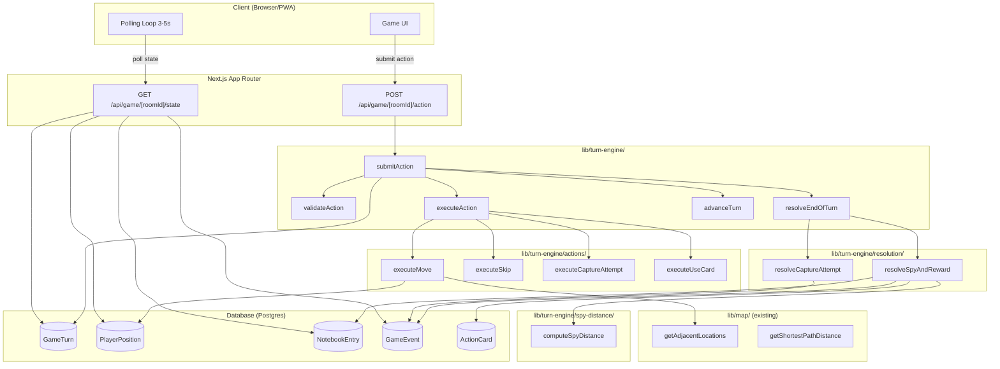
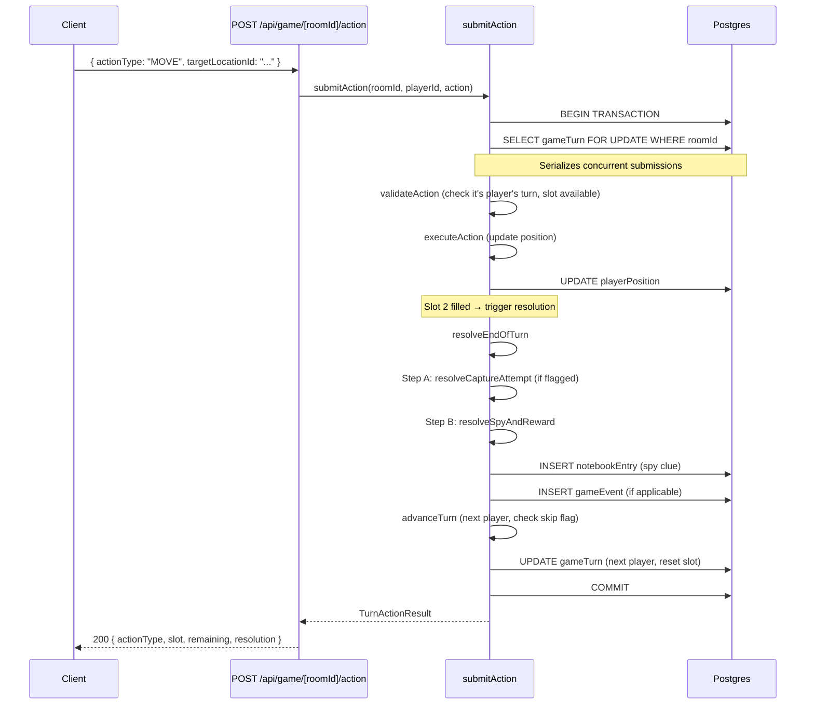
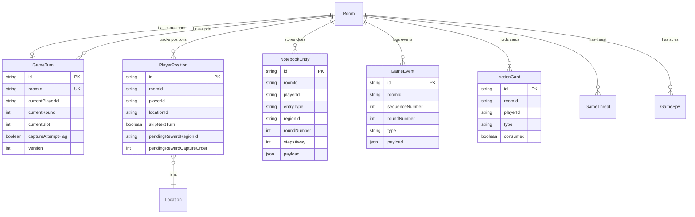

# Design Document: Movement & Turn Actions

## Overview

The Movement & Turn Actions system implements the core gameplay loop for Shadow Hunt. It manages turn order, validates and executes player actions (Move, Skip, Capture Attempt, Use Card), tracks player positions, delivers Spy-proximity clues, handles the win condition, and provides a public event feed.

The system operates as a state machine driven by a single API endpoint. Each turn consists of two action slots submitted sequentially. After both slots are filled, an automatic end-of-turn resolution phase handles Capture Attempt outcomes and Spy/reward logic. A polling endpoint allows all players to observe game state without WebSockets. The system provides a public event feed (the Tablet) logging all player actions.

Key design constraints:
- Single action-at-a-time submission — the server tracks which slot is active
- End-of-turn resolution is atomic with the second action submission
- Spy distance uses a restricted BFS over car/boat edges only (plane excluded)
- Concurrency is handled via SELECT FOR UPDATE on the turn state row
- Player starting positions are assigned at game initialization to Hub locations of distinct random regions

## Architecture



### Sequence Diagram — Action Submission (Slot 2 with End-of-Turn)



## Components and Interfaces

### Module Structure

```
lib/turn-engine/
├── index.ts                    # Re-exports public API
├── types.ts                    # All types for the turn engine
├── submit-action.ts            # Main orchestrator: validate → execute → resolve → advance
├── validate-action.ts          # Validates player turn, slot, and action-specific rules
├── advance-turn.ts             # Advances to next player, handles skip flags
├── query-turn-state.ts         # Reads current turn state for polling
├── actions/
│   ├── execute-move.ts         # MOVE validation + position update
│   ├── execute-skip.ts         # SKIP (no-op, consumes slot)
│   ├── execute-capture-attempt.ts  # Sets capture flag for end-of-turn
│   └── execute-use-card.ts     # Validates card, marks consumed, dispatches placeholder
├── resolution/
│   ├── resolve-end-of-turn.ts  # Orchestrates Step A + Step B
│   ├── resolve-capture.ts      # Compares position to Mastermind, win/fail
│   └── resolve-spy-reward.ts   # Spy proximity clue, capture, reward logic
├── spy-distance.ts             # BFS over car/boat edges only
├── player-positions.ts         # Assign starting positions, update/query positions
└── __tests__/
    ├── submit-action.test.ts
    ├── move-validation.property.test.ts
    ├── spy-distance.property.test.ts
    ├── end-of-turn.property.test.ts
    └── turn-advance.property.test.ts

app/api/game/[roomId]/
├── action/route.ts             # POST handler for action submission
└── state/route.ts              # GET handler for game state polling
```

### Core Types (`lib/turn-engine/types.ts`)

```typescript
import { TransactionClient } from "@/lib/game/types";

// --- Action Types ---

export type ActionType = "MOVE" | "SKIP" | "CAPTURE_ATTEMPT" | "USE_CARD";

export interface MoveActionPayload {
  actionType: "MOVE";
  targetLocationId: string;
}

export interface SkipActionPayload {
  actionType: "SKIP";
}

export interface CaptureAttemptPayload {
  actionType: "CAPTURE_ATTEMPT";
}

export interface UseCardPayload {
  actionType: "USE_CARD";
  cardId: string;
}

export type ActionPayload =
  | MoveActionPayload
  | SkipActionPayload
  | CaptureAttemptPayload
  | UseCardPayload;

// --- Turn State ---

export interface TurnState {
  id: string;
  roomId: string;
  currentPlayerId: string;
  currentRound: number;
  currentSlot: 1 | 2;
  captureAttemptFlag: boolean;
  version: number; // optimistic concurrency
}

// --- Results ---

export interface TurnActionSuccess {
  success: true;
  actionType: ActionType;
  slotNumber: 1 | 2;
  remainingSlots: number;
  updatedLocationId?: string;       // present for MOVE
  resolution?: EndOfTurnResolution; // present when slot 2 completes
}

export interface TurnActionError {
  success: false;
  error: string;
  code: TurnActionErrorCode;
}

export type TurnActionResult = TurnActionSuccess | TurnActionError;

export type TurnActionErrorCode =
  | "NOT_IN_ROOM"
  | "GAME_NOT_ACTIVE"
  | "NOT_YOUR_TURN"
  | "INVALID_SLOT_ORDER"
  | "INVALID_MOVE"
  | "INVALID_TRANSPORT"
  | "SAME_LOCATION_MOVE"
  | "DUPLICATE_CAPTURE_ATTEMPT"
  | "INVALID_CARD"
  | "HAND_FULL"
  | "CONCURRENCY_CONFLICT"
  | "UNKNOWN_ACTION_TYPE";

// --- End-of-Turn Resolution ---

export interface EndOfTurnResolution {
  captureAttempt?: CaptureAttemptOutcome;
  spyResult?: SpyResolutionOutcome;
}

export interface CaptureAttemptOutcome {
  result: "success" | "failed";
  locationId: string;
  winnerId?: string;          // present on success
  mastermindLocationId?: string; // revealed on success only
}

export interface SpyResolutionOutcome {
  type: "clue" | "spy-captured" | "spy-captured-reward-collected" | "none";
  notebookEntry?: NotebookEntryData;
  captureOrder?: number;
  rewardTier?: number;
  message?: string;
}

export interface NotebookEntryData {
  regionId: string;
  roundNumber: number;
  stepsAway: number;
}

// --- Polling State ---

export interface GamePollState {
  roomId: string;
  status: "in-progress" | "finished";
  currentPlayerId: string;
  currentRound: number;
  currentSlot: 1 | 2;
  players: PlayerPollData[];
  privateData: PlayerPrivateData;
  events: GameEventData[];
}

export interface PlayerPollData {
  playerId: string;
  displayName: string;
  locationId: string;
  turnPosition: number;
  skipNextTurn: boolean;
}

export interface PlayerPrivateData {
  notebook: NotebookEntryData[];
  actionCards: ActionCardData[];
  pendingReward: PendingRewardData | null;
  skipNextTurn: boolean;
}

export interface ActionCardData {
  id: string;
  type: string;      // e.g., "locator", "extra-move", "reveal-region"
  consumed: boolean;
}

export interface PendingRewardData {
  regionId: string;  // the region where the spy was captured
  captureOrder: number;
  rewardTier: number; // number of cards to grant
}

export interface GameEventData {
  id: string;
  sequenceNumber: number;
  roundNumber: number;
  type: "game-won" | "capture-failed" | "spy-captured-reward-collected" | "player-moved" | "card-used" | "player-skipped" | "turn-skipped";
  payload: Record<string, unknown>;
  createdAt: string;
}
```

### Key Function Signatures

```typescript
// --- Main Orchestrator ---
// lib/turn-engine/submit-action.ts
export async function submitAction(
  roomId: string,
  playerId: string,
  action: ActionPayload
): Promise<TurnActionResult>;

// --- Validation ---
// lib/turn-engine/validate-action.ts
export function validateAction(
  action: ActionPayload,
  turnState: TurnState,
  playerId: string,
  playerPosition: string,
  adjacentLocations: AdjacentLocationWithTransport[],
  playerCards: ActionCardData[]
): TurnActionError | null;

// --- Action Executors ---
// lib/turn-engine/actions/execute-move.ts
export async function executeMove(
  playerId: string,
  roomId: string,
  targetLocationId: string,
  tx: TransactionClient
): Promise<void>;

// lib/turn-engine/actions/execute-capture-attempt.ts
export async function executeCaptureAttempt(
  turnStateId: string,
  tx: TransactionClient
): Promise<void>;

// lib/turn-engine/actions/execute-use-card.ts
export async function executeUseCard(
  playerId: string,
  roomId: string,
  cardId: string,
  tx: TransactionClient
): Promise<void>;

// --- End-of-Turn Resolution ---
// lib/turn-engine/resolution/resolve-end-of-turn.ts
export async function resolveEndOfTurn(
  roomId: string,
  playerId: string,
  turnState: TurnState,
  tx: TransactionClient
): Promise<EndOfTurnResolution>;

// lib/turn-engine/resolution/resolve-capture.ts
export async function resolveCaptureAttempt(
  roomId: string,
  playerId: string,
  playerLocationId: string,
  tx: TransactionClient
): Promise<CaptureAttemptOutcome | null>;

// lib/turn-engine/resolution/resolve-spy-reward.ts
export async function resolveSpyAndReward(
  roomId: string,
  playerId: string,
  playerLocationId: string,
  currentRound: number,
  tx: TransactionClient
): Promise<SpyResolutionOutcome>;

// --- Spy Distance (restricted BFS) ---
// lib/turn-engine/spy-distance.ts
export async function computeSpyDistance(
  fromLocationId: string,
  toLocationId: string
): Promise<number>;

// lib/turn-engine/spy-distance.ts
export async function initializeSpyDistanceMatrix(): Promise<void>;

// --- Turn Advancement ---
// lib/turn-engine/advance-turn.ts
export async function advanceTurn(
  roomId: string,
  turnState: TurnState,
  tx: TransactionClient
): Promise<void>;

// --- Player Positions ---
// lib/turn-engine/player-positions.ts
export async function assignStartingPositions(
  roomId: string,
  playerIds: string[],
  tx: TransactionClient
): Promise<void>;

export async function getPlayerPosition(
  roomId: string,
  playerId: string
): Promise<string>;

// --- Polling ---
// lib/turn-engine/query-turn-state.ts
export async function getGamePollState(
  roomId: string,
  playerId: string,
  afterSequence?: number
): Promise<GamePollState>;
```

### Algorithm: `submitAction` Orchestrator

```typescript
async function submitAction(roomId, playerId, action): Promise<TurnActionResult> {
  return prisma.$transaction(async (tx) => {
    // 1. Lock turn state row (SELECT FOR UPDATE)
    const turnState = await tx.gameTurn.findUnique({
      where: { roomId },
      // Prisma doesn't natively support FOR UPDATE in findUnique,
      // so we use $queryRaw for the lock:
    });
    // Alternative: use raw query for row-level lock
    const [turnState] = await tx.$queryRaw`
      SELECT * FROM "game_turns" WHERE "roomId" = ${roomId} FOR UPDATE
    `;

    // 2. Validate room is in-progress
    if (!turnState) return error("GAME_NOT_ACTIVE");

    // 3. Validate it's this player's turn
    if (turnState.currentPlayerId !== playerId) return error("NOT_YOUR_TURN");

    // 4. Get player position and adjacent locations
    const position = await getPlayerPosition(roomId, playerId, tx);
    const adjacent = await getAdjacentLocationsFromTx(position, tx);

    // 5. Validate the action
    const validationError = validateAction(action, turnState, playerId, position, adjacent, cards);
    if (validationError) return validationError;

    // 6. Execute the action
    let updatedLocationId: string | undefined;
    switch (action.actionType) {
      case "MOVE":
        await executeMove(playerId, roomId, action.targetLocationId, tx);
        updatedLocationId = action.targetLocationId;
        break;
      case "SKIP":
        // No-op
        break;
      case "CAPTURE_ATTEMPT":
        await executeCaptureAttempt(turnState.id, tx);
        break;
      case "USE_CARD":
        await executeUseCard(playerId, roomId, action.cardId, tx);
        break;
    }

    // 6b. Emit public action event to event feed
    switch (action.actionType) {
      case "MOVE":
        await emitEvent(roomId, "player-moved", {
          playerId,
          fromLocationId: position,
          toLocationId: action.targetLocationId,
          transport: edge.transport,
        }, turnState.currentRound, tx);
        break;
      case "SKIP":
        await emitEvent(roomId, "player-skipped", { playerId }, turnState.currentRound, tx);
        break;
      case "USE_CARD":
        await emitEvent(roomId, "card-used", { playerId, cardType: card.type }, turnState.currentRound, tx);
        break;
      case "CAPTURE_ATTEMPT":
        // No event here — capture attempt event fires during resolution (success/failure)
        break;
    }

    // 7. Advance slot counter
    const slotNumber = turnState.currentSlot;
    let resolution: EndOfTurnResolution | undefined;

    if (slotNumber === 2) {
      // 8. Trigger end-of-turn resolution
      const finalPosition = updatedLocationId ?? position;
      resolution = await resolveEndOfTurn(roomId, playerId, turnState, tx);

      // 9. Advance to next player
      await advanceTurn(roomId, turnState, tx);
    } else {
      // Advance to slot 2
      await tx.gameTurn.update({
        where: { id: turnState.id },
        data: { currentSlot: 2, captureAttemptFlag: action.actionType === "CAPTURE_ATTEMPT" ? true : undefined },
      });
    }

    return {
      success: true,
      actionType: action.actionType,
      slotNumber,
      remainingSlots: slotNumber === 1 ? 1 : 0,
      updatedLocationId,
      resolution,
    };
  }, { isolationLevel: "Serializable" });
}
```

### Algorithm: `advanceTurn`

```typescript
async function advanceTurn(roomId, currentTurnState, tx): Promise<void> {
  const players = await tx.roomPlayer.findMany({
    where: { roomId },
    orderBy: { turnPosition: "asc" },
  });

  const currentIdx = players.findIndex(p => p.playerId === currentTurnState.currentPlayerId);
  let nextIdx = (currentIdx + 1) % players.length;
  let newRound = currentTurnState.currentRound;

  // If we wrapped around, increment round
  if (nextIdx <= currentIdx) {
    newRound += 1;
  }
  // Actually: wrap only if nextIdx === 0
  if (nextIdx === 0) {
    newRound += 1;
  }

  // Check for skip flags — skip players until we find one without the flag
  // Safety: if ALL remaining players have skip flags, clear all and start fresh round
  let skippedCount = 0;
  while (skippedCount < players.length) {
    const nextPlayer = players[nextIdx];
    const position = await getPlayerPositionRecord(roomId, nextPlayer.playerId, tx);

    if (position.skipNextTurn) {
      // Clear the flag, emit skip event, advance
      await clearSkipFlag(roomId, nextPlayer.playerId, tx);
      await emitEvent(roomId, "turn-skipped", { playerId: nextPlayer.playerId }, newRound, tx);

      nextIdx = (nextIdx + 1) % players.length;
      if (nextIdx === 0) newRound += 1;
      skippedCount++;
    } else {
      break;
    }
  }

  // If all players were skipped, we've already advanced the round
  // Update the turn state
  await tx.gameTurn.update({
    where: { id: currentTurnState.id },
    data: {
      currentPlayerId: players[nextIdx].playerId,
      currentRound: newRound,
      currentSlot: 1,
      captureAttemptFlag: false,
    },
  });
}
```

### Algorithm: `computeSpyDistance` (Restricted BFS)

```typescript
/**
 * Module-level cache of the spy distance matrix.
 * Built from car/boat edges only (plane edges excluded).
 * Unlike the full-graph distance matrix, this produces different
 * shortest-path values because plane shortcuts are unavailable.
 */
let spyDistanceMatrix: Map<string, Map<string, number>> | null = null;

export async function initializeSpyDistanceMatrix(): Promise<void> {
  const [locations, edges] = await Promise.all([
    prisma.location.findMany({ select: { id: true } }),
    prisma.adjacency.findMany({
      where: { transport: { in: ["car", "boat"] } }, // Exclude plane
      select: { locationAId: true, locationBId: true },
    }),
  ]);

  const adjacencyList = new Map<string, Set<string>>();
  for (const loc of locations) adjacencyList.set(loc.id, new Set());
  for (const edge of edges) {
    adjacencyList.get(edge.locationAId)!.add(edge.locationBId);
    adjacencyList.get(edge.locationBId)!.add(edge.locationAId);
  }

  const matrix = new Map<string, Map<string, number>>();
  for (const source of locations) {
    matrix.set(source.id, bfs(source.id, adjacencyList));
  }

  spyDistanceMatrix = matrix;
}

export async function computeSpyDistance(
  fromLocationId: string,
  toLocationId: string
): Promise<number> {
  if (!spyDistanceMatrix) await initializeSpyDistanceMatrix();
  return spyDistanceMatrix!.get(fromLocationId)!.get(toLocationId)!;
}
```

### Algorithm: `resolveSpyAndReward` (Step B Priority Cases)

```typescript
async function resolveSpyAndReward(roomId, playerId, playerLocationId, currentRound, tx): Promise<SpyResolutionOutcome> {
  // Get player's position region
  const playerLocation = await tx.location.findUnique({ where: { id: playerLocationId } });
  const playerRegionId = playerLocation.regionId;

  // Get player's pending reward status
  const playerPos = await tx.playerPosition.findUnique({ where: { roomId_playerId: { roomId, playerId } } });

  // Get this region's spy
  const spy = await tx.gameSpy.findUnique({ where: { roomId_regionId: { roomId, regionId: playerRegionId } } });

  // Case 1: Player has pending reward AND has left the capture region
  if (playerPos.pendingRewardRegionId && playerPos.pendingRewardRegionId !== playerRegionId) {
    const rewardTier = computeRewardTier(playerPos.pendingRewardCaptureOrder);
    const cards = await grantRewardCards(playerId, roomId, rewardTier, tx);
    await clearPendingReward(roomId, playerId, tx);
    await emitEvent(roomId, "spy-captured-reward-collected", { playerId, regionId: playerPos.pendingRewardRegionId, rewardTier }, currentRound, tx);
    return { type: "spy-captured-reward-collected", rewardTier };
  }

  // Case 2: Player has pending reward but still in same region
  if (playerPos.pendingRewardRegionId && playerPos.pendingRewardRegionId === playerRegionId) {
    return { type: "none" };
  }

  // Case 3: Region's spy already captured, no pending reward
  if (spy.captured) {
    return { type: "none" };
  }

  // Case 4: Player is at the uncaptured spy's location
  if (spy.locationId === playerLocationId) {
    const captureOrder = await getNextCaptureOrder(roomId, tx);
    await captureSpy(spy.id, playerId, tx);
    await setPendingReward(roomId, playerId, playerRegionId, captureOrder, tx);
    // NO emitEvent here — spy capture is private until reward collection
    return { type: "spy-captured", captureOrder, message: "Spy captured — leave the region to collect your reward" };
  }

  // Case 5: Player in region with uncaptured spy, not at spy's location
  const stepsAway = await computeSpyDistance(playerLocationId, spy.locationId);
  const entry = { regionId: playerRegionId, roundNumber: currentRound, stepsAway };
  await appendNotebookEntry(roomId, playerId, entry, tx);
  return { type: "clue", notebookEntry: entry };
}

function computeRewardTier(captureOrder: number): number {
  if (captureOrder === 1) return 4;
  if (captureOrder === 2) return 3;
  if (captureOrder === 3) return 2;
  return 1; // 4th, 5th, 6th
}
```

## Data Models

### New Prisma Models

```prisma
model GameTurn {
  id                String  @id @default(cuid())
  roomId            String  @unique
  currentPlayerId   String
  currentRound      Int     @default(1)
  currentSlot       Int     @default(1) // 1 or 2
  captureAttemptFlag Boolean @default(false)
  version           Int     @default(0) // optimistic locking

  room Room @relation(fields: [roomId], references: [id], onDelete: Cascade)

  @@map("game_turns")
}

model PlayerPosition {
  id                       String  @id @default(cuid())
  roomId                   String
  playerId                 String
  locationId               String
  skipNextTurn             Boolean @default(false)
  pendingRewardRegionId    String? // Region where spy was captured
  pendingRewardCaptureOrder Int?   // 1-6, determines reward tier

  room     Room     @relation(fields: [roomId], references: [id], onDelete: Cascade)
  location Location @relation(fields: [locationId], references: [id])

  @@unique([roomId, playerId])
  @@index([roomId])
  @@map("player_positions")
}

model NotebookEntry {
  id          String   @id @default(cuid())
  roomId      String
  playerId    String
  entryType   String   // "spy-proximity" | "locator"
  regionId    String?  // For spy-proximity entries
  roundNumber Int
  stepsAway   Int?     // For spy-proximity entries
  payload     Json?    // For locator entries (defined by Action Cards spec)
  createdAt   DateTime @default(now())

  room Room @relation(fields: [roomId], references: [id], onDelete: Cascade)

  @@index([roomId, playerId])
  @@map("notebook_entries")
}

model GameEvent {
  id             String   @id @default(cuid())
  roomId         String
  sequenceNumber Int      // Monotonically increasing per room
  roundNumber    Int
  type           String   // "game-won" | "capture-failed" | "spy-captured-reward-collected" | "player-moved" | "card-used" | "player-skipped" | "turn-skipped"
  payload        Json     // Event-specific data
  createdAt      DateTime @default(now())

  room Room @relation(fields: [roomId], references: [id], onDelete: Cascade)

  @@unique([roomId, sequenceNumber])
  @@index([roomId, sequenceNumber])
  @@map("game_events")
}

model ActionCard {
  id         String  @id @default(cuid())
  roomId     String
  playerId   String
  type       String  // "locator" | "extra-move" | "reveal-region" | "peek-clue"
  consumed   Boolean @default(false)
  grantedAt  DateTime @default(now())

  room Room @relation(fields: [roomId], references: [id], onDelete: Cascade)

  @@index([roomId, playerId])
  @@map("action_cards")
}
```

### Entity Relationship Diagram



### Modifications to Existing Models

The `Room` model needs relations added for the new models:

```prisma
model Room {
  // ... existing fields ...
  gameTurn        GameTurn?
  playerPositions PlayerPosition[]
  notebookEntries NotebookEntry[]
  gameEvents      GameEvent[]
  actionCards     ActionCard[]
}
```

The `Location` model needs a relation for player positions:

```prisma
model Location {
  // ... existing fields ...
  playerPositions PlayerPosition[]
}
```

### Starting Position Assignment

The `initializeGame` function in `lib/game/initialize-game.ts` must be extended to:
1. Select N distinct regions (one per player) via Fisher-Yates shuffle of the 6 regions
2. Assign each player to the Hub location of their assigned region
3. Create `PlayerPosition` records
4. Create the `GameTurn` record with the first player in turn order

```typescript
// Added to initializeGame after spy placement:
async function assignStartingPositions(roomId: string, playerIds: string[], tx: TransactionClient): Promise<void> {
  const regions = await tx.region.findMany({ include: { hubLocation: true } });
  const shuffledRegions = shuffle(regions);

  for (let i = 0; i < playerIds.length; i++) {
    await tx.playerPosition.create({
      data: {
        roomId,
        playerId: playerIds[i],
        locationId: shuffledRegions[i].hubLocationId!,
        skipNextTurn: false,
      },
    });
  }
}

async function createInitialTurnState(roomId: string, firstPlayerId: string, tx: TransactionClient): Promise<void> {
  await tx.gameTurn.create({
    data: {
      roomId,
      currentPlayerId: firstPlayerId,
      currentRound: 1,
      currentSlot: 1,
      captureAttemptFlag: false,
      version: 0,
    },
  });
}
```


## Correctness Properties

*A property is a characteristic or behavior that should hold true across all valid executions of a system — essentially, a formal statement about what the system should do. Properties serve as the bridge between human-readable specifications and machine-verifiable correctness guarantees.*

### Property 1: Round-Robin Turn Advancement

*For any* game with N players (2-4) with turnPositions 1..N, after the current player completes their turn, the turn engine SHALL advance to the player with the next highest turnPosition, wrapping from position N to position 1 with a round number increment.

**Validates: Requirements 1.1, 1.2, 1.3**

### Property 2: Skip Flag Bypass and Clear

*For any* game state where the next player(s) in turn order have their Skip_Next_Turn_Flag set, the turn engine SHALL skip each flagged player sequentially, clear their flag, emit a "turn-skipped" event for each, and advance until reaching an unflagged player. If all players are flagged, all flags are cleared and a new round begins at position 1.

**Validates: Requirements 1.4, 1.7, 13.2, 13.3, 13.5, 13.6**

### Property 3: Non-Current-Player Rejection

*For any* game session and any player who is not the current player, all action submissions from that player SHALL be rejected without modifying any game state.

**Validates: Requirements 1.5, 15.7**

### Property 4: Inactive Game Rejection

*For any* room whose status is not "in-progress" (i.e., "waiting" or "finished"), all action submissions SHALL be rejected without modifying any game state.

**Validates: Requirements 1.6, 14.2**

### Property 5: Move Adjacency Validation

*For any* player at location L and any target location T, a MOVE action to T is valid if and only if an adjacency edge exists between L and T in the map graph, AND T is not equal to L.

**Validates: Requirements 3.1, 3.4, 3.8**

### Property 6: Transport-Mode Movement Rules

*For any* adjacency edge between locations A and B, a MOVE along that edge is valid if and only if: (a) the edge transport is `car` or `boat` (always allowed), OR (b) the edge transport is `plane` AND both A and B have `isHub = true`.

**Validates: Requirements 3.2, 3.3, 3.5**

### Property 7: Position Update on Valid Move

*For any* valid MOVE action from location L to adjacent location T, after execution the player's stored position SHALL equal T (not L or any other location).

**Validates: Requirements 3.6, 7.3**

### Property 8: Sequential Slot Position Chaining

*For any* turn where the first action is a MOVE to location T1, the second action's validation SHALL use T1 as the player's current location (not the pre-move position).

**Validates: Requirements 2.2, 3.7**

### Property 9: Failed Action State Preservation

*For any* action submission that fails validation (invalid move, invalid card, duplicate capture attempt, wrong turn), the game state (player positions, notebook, events, cards, flags) SHALL remain identical to the pre-submission state.

**Validates: Requirements 2.6, 7.4, 15.8**

### Property 10: SKIP Is a No-Op

*For any* game state, executing a SKIP action SHALL leave all state fields (position, notebook, cards, flags, turn state) unchanged except for advancing the slot counter.

**Validates: Requirements 4.1**

### Property 11: Capture Attempt Deferred Resolution at Final Position

*For any* turn containing a CAPTURE_ATTEMPT combined with a MOVE action, the capture SHALL be resolved against the player's final position (after the MOVE), not the pre-move position. The capture flag is recorded without immediate resolution; resolution occurs only during End_Of_Turn_Resolution.

**Validates: Requirements 5.1, 5.3**

### Property 12: Capture Resolution Correctness

*For any* end-of-turn resolution where the capture flag is set, the outcome SHALL be "success" if and only if the player's final location equals the Mastermind's location. On success: room transitions to "finished", winner is recorded, Mastermind location is revealed, and Step B is skipped. On failure: Skip_Next_Turn_Flag is set, a "capture-failed" event is emitted, and the Mastermind's actual location is NOT included in any response or event.

**Validates: Requirements 8.1, 8.2, 8.3, 8.4, 8.5, 8.6, 8.7**

### Property 13: Step B Priority Case Exclusivity

*For any* end-of-turn resolution reaching Step B, exactly one of the five cases SHALL match and execute: (1) pending reward + left region → grant reward, (2) pending reward + same region → no action, (3) spy captured + no pending reward → no action, (4) player at uncaptured spy → capture spy, (5) in region with uncaptured spy → deliver distance clue. No two cases SHALL produce effects simultaneously.

**Validates: Requirements 9.1, 9.2, 9.3, 9.4, 9.5, 9.6**

### Property 14: Spy Distance Uses Car/Boat Subgraph Only

*For any* pair of locations (A, B), the spy distance computed for clue delivery SHALL equal the shortest-path distance over the subgraph containing only `car` and `boat` edges (plane edges excluded). This value SHALL be greater than or equal to the full-graph shortest-path distance for the same pair.

**Validates: Requirements 9.7**

### Property 15: Reward Tier Mapping

*For any* capture order value C in {1, 2, 3, 4, 5, 6}, the reward tier SHALL be: C=1 → 4 cards, C=2 → 3 cards, C=3 → 2 cards, C∈{4,5,6} → 1 card. Additionally, at least one card in every reward SHALL be of type "locator".

**Validates: Requirements 10.1, 10.3**

### Property 16: Starting Positions at Distinct Hub Locations

*For any* game with N players (2-4), after initialization each player SHALL be positioned at the Hub location of a distinct Region, with no two players sharing a starting Region.

**Validates: Requirements 7.2**

### Property 17: Information Hiding in Responses

*For any* polling response or action result sent to a client, the response SHALL NOT contain the Mastermind's location (unless the game has ended via successful capture) or any uncaptured Spy NPC's specific location. Each player's Notebook entries SHALL only be visible to that player.

**Validates: Requirements 8.6, 11.1, 11.5, 16.4**

### Property 18: Event Feed Monotonicity and Completeness

*For any* game session's event feed, sequence numbers SHALL be strictly monotonically increasing, round numbers SHALL be non-decreasing, and events SHALL be emitted for all player actions (player-moved, player-skipped, card-used, capture-failed, game-won, spy-captured-reward-collected, turn-skipped). Events SHALL NOT be emitted for private clue deliveries (Notebook entries). The spy capture itself does not emit a public event — only the combined spy-captured-reward-collected event fires when the player exits the region.

**Validates: Requirements 12.1, 12.5, 12.6, 12.7, 12.8**

### Property 19: Card Validation and Consumption

*For any* USE_CARD action, the action is valid if and only if the player holds the specified card AND the card has not been consumed. Upon successful use, the card SHALL be marked as consumed and no longer appear in the player's active hand. The player's hand SHALL never exceed 5 cards.

**Validates: Requirements 6.1, 6.3, 6.6**

### Property 20: Two-Slot Turn Structure

*For any* turn, exactly two action slots SHALL be available. The first must be submitted before the second. End-of-turn resolution triggers if and only if slot 2 is filled. At most one CAPTURE_ATTEMPT is allowed per turn.

**Validates: Requirements 2.1, 2.3, 2.4, 2.5, 2.7**


## Error Handling

### Error Categories

| Category | Trigger | HTTP Status | Error Code | Recovery |
|----------|---------|-------------|------------|----------|
| Authentication | No player cookie | 401 | `NOT_AUTHENTICATED` | Client re-authenticates |
| Authorization | Not current player | 403 | `NOT_YOUR_TURN` | Client waits for their turn |
| Game State | Room not in-progress | 409 | `GAME_NOT_ACTIVE` | Client shows game-over or waiting state |
| Validation | Invalid move target | 422 | `INVALID_MOVE` | Client retries with valid target |
| Validation | Plane edge, non-hub | 422 | `INVALID_TRANSPORT` | Client retries with valid route |
| Validation | Self-move | 422 | `SAME_LOCATION_MOVE` | Client retries |
| Validation | Duplicate capture attempt | 422 | `DUPLICATE_CAPTURE_ATTEMPT` | Client picks different action |
| Validation | Invalid card | 422 | `INVALID_CARD` | Client retries |
| Validation | Slot order violation | 422 | `INVALID_SLOT_ORDER` | Client submits slot 1 first |
| Concurrency | Race condition on same slot | 409 | `CONCURRENCY_CONFLICT` | Client retries submission |
| Not Found | Player not in room | 404 | `NOT_IN_ROOM` | Client returns to lobby |
| Server | Transaction failure | 500 | `INTERNAL_ERROR` | Client retries (transient) |

### Error Response Shape

```typescript
interface ErrorResponse {
  success: false;
  error: string;    // Human-readable description
  code: string;     // Machine-readable error code
}
```

### Concurrency Handling Strategy

The system uses **pessimistic locking** via `SELECT FOR UPDATE` on the `game_turns` row:

1. Every `submitAction` call begins a Prisma `$transaction` with `Serializable` isolation
2. The first operation inside the transaction is a raw `SELECT ... FOR UPDATE` on the `game_turns` row for the given roomId
3. This serializes all concurrent action submissions for the same game — only one transaction proceeds at a time; others wait on the lock
4. If a waiting transaction times out (Prisma default 5s), it receives a `P2028` error which is mapped to `CONCURRENCY_CONFLICT`
5. The client should retry on `CONCURRENCY_CONFLICT` with exponential backoff

**Why pessimistic over optimistic:** In a turn-based game with 3-5s polling intervals, genuine contention is rare (only the current player can submit). The main risk is accidental double-clicks or network retries. Pessimistic locking is simpler to implement correctly and avoids retry storms.

### Transaction Boundaries

Each action submission is fully atomic:
- Validation, execution, state update, end-of-turn resolution (if slot 2), and turn advancement all occur within a single transaction
- If any step fails, the entire transaction rolls back — no partial state visible
- The `version` field on `GameTurn` provides an additional check for optimistic locking in read-heavy paths (polling)

### Graceful Degradation

- **Spy distance matrix not initialized**: First call to `computeSpyDistance` triggers lazy initialization (same pattern as the existing `getShortestPathDistance`). Subsequent calls use the cached matrix.
- **Missing game state**: If `GameTurn` doesn't exist for a room, `submitAction` returns `GAME_NOT_ACTIVE` (game may not have been properly initialized).
- **Player not found in room**: Checked before any game logic — returns `NOT_IN_ROOM`.

## Testing Strategy

### Property-Based Testing (Primary Verification)

**Library:** [fast-check](https://github.com/dubzzz/fast-check) — the standard PBT library for TypeScript/JavaScript. Already well-suited to the project's Vitest/Jest test runner.

**Configuration:**
- Minimum 100 iterations per property test
- Each property test tagged with its design property reference
- Tag format: `Feature: movement-turn-actions, Property {N}: {title}`

**Property Test Files:**

| File | Properties Covered | Focus |
|------|-------------------|-------|
| `move-validation.property.test.ts` | P5, P6, P7, P8 | Adjacency + transport rules, position updates |
| `turn-advance.property.test.ts` | P1, P2, P20 | Round-robin cycling, skip flags, slot structure |
| `capture-resolution.property.test.ts` | P11, P12 | Deferred resolution, success/failure paths |
| `spy-resolution.property.test.ts` | P13, P14, P15 | Step B cases, spy distance, reward tiers |
| `state-preservation.property.test.ts` | P3, P4, P9, P10 | Rejection/no-op invariants |
| `information-hiding.property.test.ts` | P17 | No leakage of hidden state |
| `starting-positions.property.test.ts` | P16 | Distinct hubs |
| `event-feed.property.test.ts` | P18, P19 | Monotonicity, card validation |

**Generator Strategy:**

```typescript
// Example generators for property tests

// Generate a random game state with N players at random positions
const arbGameState = fc.record({
  playerCount: fc.integer({ min: 2, max: 4 }),
  currentPlayerIndex: fc.integer({ min: 0, max: 3 }),
  currentRound: fc.integer({ min: 1, max: 50 }),
  currentSlot: fc.constantFrom(1, 2) as fc.Arbitrary<1 | 2>,
  captureAttemptFlag: fc.boolean(),
});

// Generate a random location on the actual map (from seeded data)
const arbLocationId = fc.constantFrom(...allLocationIds);

// Generate a random valid move (pick from actual adjacency list)
const arbValidMove = arbLocationId.chain(fromId =>
  fc.constantFrom(...getAdjacentIds(fromId)).map(toId => ({ fromId, toId }))
);

// Generate a random action payload
const arbActionPayload = fc.oneof(
  fc.record({ actionType: fc.constant("MOVE"), targetLocationId: arbLocationId }),
  fc.constant({ actionType: "SKIP" }),
  fc.constant({ actionType: "CAPTURE_ATTEMPT" }),
  fc.record({ actionType: fc.constant("USE_CARD"), cardId: fc.uuid() }),
);
```

### Unit Testing (Complementary)

Unit tests cover specific examples, edge cases, and integration points:

| Area | Examples |
|------|----------|
| Double-SKIP turn | Both slots SKIP, verify end-of-turn still resolves |
| MOVE + CAPTURE_ATTEMPT win | Move to Mastermind location then capture, verify win |
| All-players-skipped round | Every player has skip flag, verify round advances |
| Reward at max hand size | Player at 5 cards, verify no overflow on reward |
| Spy capture order consistency | Multiple captures across turns, verify sequential ordering |
| Event feed pagination | 100 events, poll with sequence 50, verify only 50 returned (capped at 50) |

### Integration Testing

Integration tests verify end-to-end behavior through the API layer:

| Scenario | Verification |
|----------|-------------|
| Full turn cycle | Submit slot 1 + slot 2, verify response includes resolution |
| Concurrent submissions | Race two requests, verify only one succeeds |
| Polling consistency | Poll after action, verify state reflects the action |
| Auth rejection | Submit without cookie, verify 401 |
| Game end flow | Win the game, verify room status "finished" and subsequent actions rejected |

### Test Data Strategy

- **Map data**: Tests use the actual seeded map (40 locations, 72 edges) loaded into a test database
- **Game state**: Use factory functions to create game sessions with specific configurations (player positions, spy placements, etc.)
- **Isolation**: Each test transaction is rolled back after execution to avoid cross-test pollution
- **Spy distance matrix**: Pre-computed once in test setup and shared across spy-distance property tests

