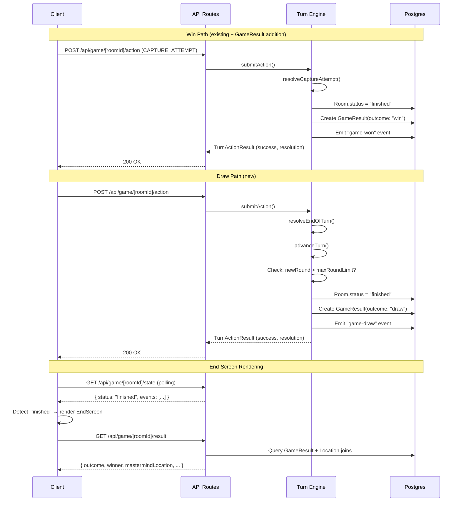
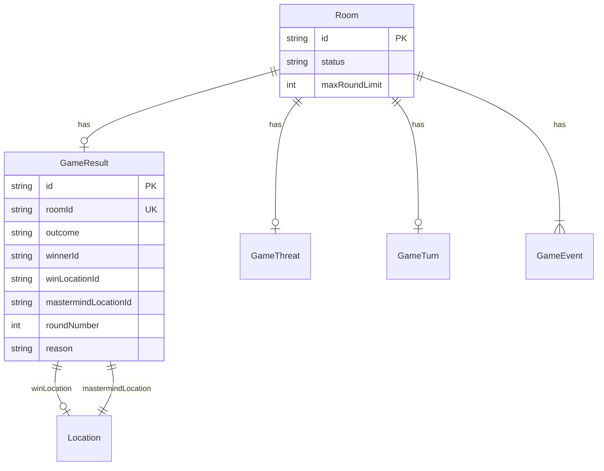

# Design Document: Win Detection & Game End

## Overview

This feature completes the Shadow Hunt game lifecycle by implementing two terminal conditions (win and draw), persisting game results, and rendering an end-screen UI. It hooks into the existing turn engine architecture — specifically `advanceTurn` and `resolveCaptureAttempt` — to detect game-ending conditions within the same Serializable transaction that processes turn actions.

**Key design goals:**
- Draw detection is evaluated at the round boundary inside `advanceTurn`, after the round counter is incremented
- A single `GameResult` record is created atomically (same transaction) when the game ends
- The existing `GAME_NOT_ACTIVE` guard in `submitAction` naturally rejects post-game actions for both win and draw — no new lock mechanism required
- The end-screen is data-driven from the existing polling endpoint + a new lightweight Game Result API

## Architecture

### High-Level Flow



### Module Boundaries

| Module | Responsibility | Does NOT own |
|--------|---------------|-------------|
| `lib/turn-engine/advance-turn.ts` | Draw detection, "game-draw" event emission, GameResult creation (draw) | Win detection |
| `lib/turn-engine/resolution/resolve-capture.ts` | Win detection, GameResult creation (win) | Draw detection |
| `lib/turn-engine/submit-action.ts` | Orchestration, transaction boundary, action rejection for finished games | Game-end logic |
| `lib/game/initialize-game.ts` | Setting `maxRoundLimit` on Room at initialization | Changing it mid-game |
| `app/api/game/[roomId]/result/route.ts` | Exposing GameResult via REST API | Game logic |
| `app/game/[roomId]/components/EndScreen.tsx` | Rendering win/draw outcomes | Data fetching orchestration |

## Components and Interfaces

### Modified: `advanceTurn`

```typescript
// lib/turn-engine/advance-turn.ts

/**
 * Extended to detect draw condition after round increment.
 * Returns a flag indicating whether the game ended in a draw.
 */
export async function advanceTurn(
  roomId: string,
  turnState: TurnState,
  tx: TransactionClient
): Promise<{ drawDetected: boolean }> {
  // ... existing round-robin logic ...

  // After computing newRound:
  // 1. Check if room is already finished (guard against double-end)
  // 2. If newRound > room.maxRoundLimit → trigger draw
  //    a. Set Room.status = "finished"
  //    b. Fetch mastermind locationId from GameThreat
  //    c. Create GameResult(outcome: "draw", roundNumber, mastermindLocationId)
  //    d. Emit "game-draw" event with { roundNumber, mastermindLocationId, reason: "max-rounds-exceeded" }
  //    e. Return { drawDetected: true }
  // 3. Otherwise, proceed with normal turn advancement
}
```

### Modified: `resolveCaptureAttempt`

```typescript
// lib/turn-engine/resolution/resolve-capture.ts

/**
 * Extended to create GameResult on successful capture.
 */
export async function resolveCaptureAttempt(
  roomId: string,
  playerId: string,
  playerLocationId: string,
  tx: TransactionClient
): Promise<CaptureAttemptOutcome> {
  // ... existing logic ...

  if (playerLocationId === threat.locationId) {
    // SUCCESS — existing: Room.status = "finished"
    // NEW: Create GameResult(outcome: "win", winnerId, winLocationId, mastermindLocationId, roundNumber)
    // NEW: Emit "game-won" event with { winnerId, locationId, mastermindLocationId }
  }
  // ... failure path unchanged ...
}
```

### Modified: `submitAction`

```typescript
// lib/turn-engine/submit-action.ts

// The existing room status check at line ~80:
//   if (!room || room.status !== "in-progress") → GAME_NOT_ACTIVE
// already covers both win and draw scenarios. No changes needed here
// except updating the advanceTurn call to handle draw return value.

// After advanceTurn returns { drawDetected: true }:
// - Skip further turn advancement (game is over)
// - Include draw info in the TurnActionResult resolution
```

### New: `getGameResult`

```typescript
// lib/turn-engine/game-result.ts

export interface GameResultWin {
  outcome: "win";
  winnerId: string;
  winnerDisplayName: string;
  winLocationId: string;
  winLocationName: string;
  mastermindLocationId: string;
  mastermindLocationName: string;
  roundNumber: number;
}

export interface GameResultDraw {
  outcome: "draw";
  roundNumber: number;
  reason: "max-rounds-exceeded";
  mastermindLocationId: string;
  mastermindLocationName: string;
}

export interface GameResultInProgress {
  outcome: "in-progress";
}

export type GameResultResponse = GameResultWin | GameResultDraw | GameResultInProgress;

/**
 * Queries the game result for a finished room.
 * Joins Location table to resolve location names.
 * Joins RoomPlayer to resolve winner display name.
 */
export async function getGameResult(
  roomId: string,
  playerId: string
): Promise<GameResultResponse> {
  // 1. Verify room exists → throw "Room not found" if not
  // 2. Verify player membership → throw "Access denied" if not member
  // 3. Check room status → return { outcome: "in-progress" } if not "finished"
  // 4. Query GameResult with Location joins
  // 5. Return typed response based on outcome
}
```

### New: Game Result API Route

```typescript
// app/api/game/[roomId]/result/route.ts

export async function GET(
  request: NextRequest,
  { params }: { params: Promise<{ roomId: string }> }
): Promise<NextResponse> {
  // 1. Extract playerId from cookie → 401 if missing
  // 2. Call getGameResult(roomId, playerId)
  // 3. Return appropriate status code:
  //    - 200 for success (finished or in-progress)
  //    - 401 for unauthenticated
  //    - 403 for access denied
  //    - 404 for room not found
}
```

### New: EndScreen Component

```typescript
// app/game/[roomId]/components/EndScreen.tsx
"use client";

interface EndScreenProps {
  roomId: string;
  playerId: string;
  events: GameEventData[];
}

/**
 * Renders the game end screen.
 * Determines outcome from Event Feed (game-won or game-draw event).
 * Fetches detailed result from /api/game/[roomId]/result for names.
 * 
 * Win view: winner name, capture location, mastermind location, visual indicator
 * Draw view: draw heading, reason, round number, mastermind location
 * Fallback: generic "game ended" if no end event found within 5s
 */
export function EndScreen({ roomId, playerId, events }: EndScreenProps) {
  // 1. Find "game-won" or "game-draw" event in events array
  // 2. Fetch /api/game/[roomId]/result for display names and location names
  // 3. Render appropriate view based on outcome
  // 4. Include "Return to Lobby" navigation link
  // 5. Show viewer-specific heading ("You won!" vs "[Name] found the target")
}
```

### Modified: Game Page Container

```typescript
// app/game/[roomId]/page.tsx

/**
 * Main game page. Polls for state.
 * When status === "finished", renders EndScreen instead of active game view.
 * On direct navigation to a finished game, renders EndScreen on initial load.
 */
export default function GamePage({ params }: { params: { roomId: string } }) {
  // If status === "finished" → <EndScreen />
  // Else → <ActiveGameView /> (future implementation)
}
```

## Data Models

### New: `GameResult` Prisma Model

```prisma
model GameResult {
  id                  String   @id @default(cuid())
  roomId              String   @unique  // Exactly one result per game
  outcome             String             // "win" | "draw"
  winnerId            String?            // Null for draw
  winLocationId       String?            // Where capture was made; null for draw
  mastermindLocationId String            // Always revealed on game end
  roundNumber         Int                // Round at which game ended
  reason              String?            // "max-rounds-exceeded" for draw; null for win
  createdAt           DateTime @default(now())

  room Room @relation(fields: [roomId], references: [id], onDelete: Cascade)

  @@map("game_results")
}
```

### Modified: `Room` Model

```prisma
model Room {
  // ... existing fields ...
  maxRoundLimit Int @default(20)  // Configurable, set at init, validated 1-100
  
  // ... existing relations ...
  gameResult GameResult?
}
```

### Modified: `GameEventData` Type

```typescript
// lib/turn-engine/types.ts — extend the type union
export interface GameEventData {
  // ... existing fields ...
  type:
    | "game-won"
    | "game-draw"        // NEW
    | "capture-failed"
    | "spy-captured-reward-collected"
    | "player-moved"
    | "card-used"
    | "player-skipped"
    | "turn-skipped";
}
```

### New Types in `types.ts`

```typescript
// Add to lib/turn-engine/types.ts

export interface DrawDetectionResult {
  drawDetected: boolean;
  drawEvent?: {
    roundNumber: number;
    mastermindLocationId: string;
  };
}
```

### Entity Relationship (Game End)



## Correctness Properties

*A property is a characteristic or behavior that should hold true across all valid executions of a system — essentially, a formal statement about what the system should do. Properties serve as the bridge between human-readable specifications and machine-verifiable correctness guarantees.*

### Property 1: Draw triggers exactly when round exceeds limit on an active game

*For any* game state where the room is "in-progress" and `advanceTurn` increments the round counter to a value exceeding `maxRoundLimit`, the system SHALL transition the room to "finished", create a GameResult with outcome "draw", and emit a "game-draw" event — all within the same operation.

**Validates: Requirements 1.1, 1.2, 1.3, 1.4**

### Property 2: Draw never fires on an already-finished game

*For any* game state where the room status is already "finished" (due to a prior successful capture), calling `advanceTurn` SHALL NOT emit a "game-draw" event, SHALL NOT create a GameResult, and SHALL NOT modify the room status.

**Validates: Requirements 1.7, 5.3**

### Property 3: maxRoundLimit validation

*For any* integer value provided as `maxRoundLimit`, the system SHALL accept it if and only if it is in the range [1, 100]. Values outside this range SHALL be rejected during game initialization.

**Validates: Requirements 1.6**

### Property 4: Win creates correct GameResult

*For any* successful capture attempt (player location matches mastermind location), the system SHALL create a GameResult with outcome "win", the capturing player's ID as winnerId, the capture location as winLocationId, the correct mastermindLocationId, and the current round number.

**Validates: Requirements 2.1**

### Property 5: Exactly one GameResult per finished game

*For any* finished game session (whether ended by win or draw), there SHALL exist exactly one GameResult record with that roomId. Attempting to create a second GameResult for the same roomId SHALL be prevented by the unique constraint.

**Validates: Requirements 2.3**

### Property 6: Action rejection after game end

*For any* valid action payload submitted to a room with status "finished" (regardless of whether it ended via win or draw), the system SHALL return a GAME_NOT_ACTIVE error and SHALL NOT modify any game state.

**Validates: Requirements 4.1, 4.2**

### Property 7: Event mutual exclusivity

*For any* finished game session, the Event Feed SHALL contain at most one of: a "game-won" event or a "game-draw" event. It SHALL never contain both for the same roomId.

**Validates: Requirements 5.3**

### Property 8: Game Result API returns correct shape based on outcome

*For any* finished game with a GameResult record, querying the Game Result API SHALL return all required fields for that outcome type: for "win" — winnerId, winnerDisplayName, winLocationId, winLocationName, mastermindLocationId, mastermindLocationName, roundNumber; for "draw" — roundNumber, reason, mastermindLocationId, mastermindLocationName.

**Validates: Requirements 2.5, 9.2, 9.3**

### Property 9: Mastermind location revealed on both outcomes

*For any* game-ending event (either "game-won" or "game-draw"), the event payload SHALL contain a non-null `mastermindLocationId` that matches the actual `GameThreat.locationId` for that room.

**Validates: Requirements 1.3, 3.1, 5.1, 5.2**

## Error Handling

### Draw Detection Errors

| Scenario | Handling |
|----------|----------|
| GameThreat record missing when draw triggers | Throw error — this indicates corrupted game state; transaction rolls back |
| Room already "finished" when draw check runs | Skip draw detection entirely (guard clause) |
| maxRoundLimit is null/undefined | Use default of 20 (schema default handles this) |

### Game Result API Errors

| Scenario | HTTP Status | Response |
|----------|-------------|----------|
| No session cookie | 401 | `{ error: "Authentication required" }` |
| Player not a room member | 403 | `{ error: "Access denied" }` |
| Room does not exist | 404 | `{ error: "Room not found" }` |
| Game still in progress | 200 | `{ outcome: "in-progress" }` |
| Internal error | 500 | `{ error: "Internal server error" }` |

### End-Screen Fallback

| Scenario | Handling |
|----------|----------|
| Game Result API timeout (>5s) | Display fallback message: "Result details unavailable. Please refresh." |
| Event Feed has no end event but status is "finished" | Display generic "Game Ended" message with lobby navigation |
| Location name resolution fails | Display locationId as fallback |

### Transaction Safety

All game-ending operations (status transition, GameResult creation, event emission) occur within the existing Serializable transaction in `submitAction`. If any step fails, the entire transaction rolls back — the game remains in-progress and the player can retry their action.

## Testing Strategy

### Property-Based Tests (fast-check)

The feature's pure logic (draw detection, validation, result creation) is well-suited for property-based testing. Each correctness property above maps to a property-based test.

**Library:** [fast-check](https://github.com/dubzzz/fast-check) (TypeScript PBT library)

**Configuration:**
- Minimum 100 iterations per property test
- Each test tagged with: `Feature: win-detection-game-end, Property {N}: {title}`

**Test targets:**
- Draw detection logic (isolated from DB via mock transaction client)
- maxRoundLimit validation function
- GameResult creation logic
- Event mutual exclusivity invariant
- API response shape based on outcome type

### Unit Tests (vitest)

- `advanceTurn` with round exceeding limit → verifies draw side effects
- `advanceTurn` when room already "finished" → verifies no draw fires
- `resolveCaptureAttempt` success → verifies GameResult creation
- Game Result API route: 401, 403, 404, in-progress, win, draw responses
- EndScreen component: renders win view, draw view, fallback view
- `initializeGame` validates maxRoundLimit range

### Integration Tests

- Full turn submission that triggers draw (end-to-end with test DB)
- Concurrent action submission to a just-finished game (verify GAME_NOT_ACTIVE)
- Event feed ordering after draw (sequence number monotonicity)
- Game Result API with real DB and location joins

### Component Tests (React Testing Library)

- EndScreen renders winner name + trophy indicator for win outcome
- EndScreen renders draw heading + reason for draw outcome
- EndScreen shows "You won!" vs "[Name] found the target" based on viewer
- EndScreen shows "Return to Lobby" navigation
- Game page auto-transitions to EndScreen when status changes to "finished"
- Fallback message renders when API times out
